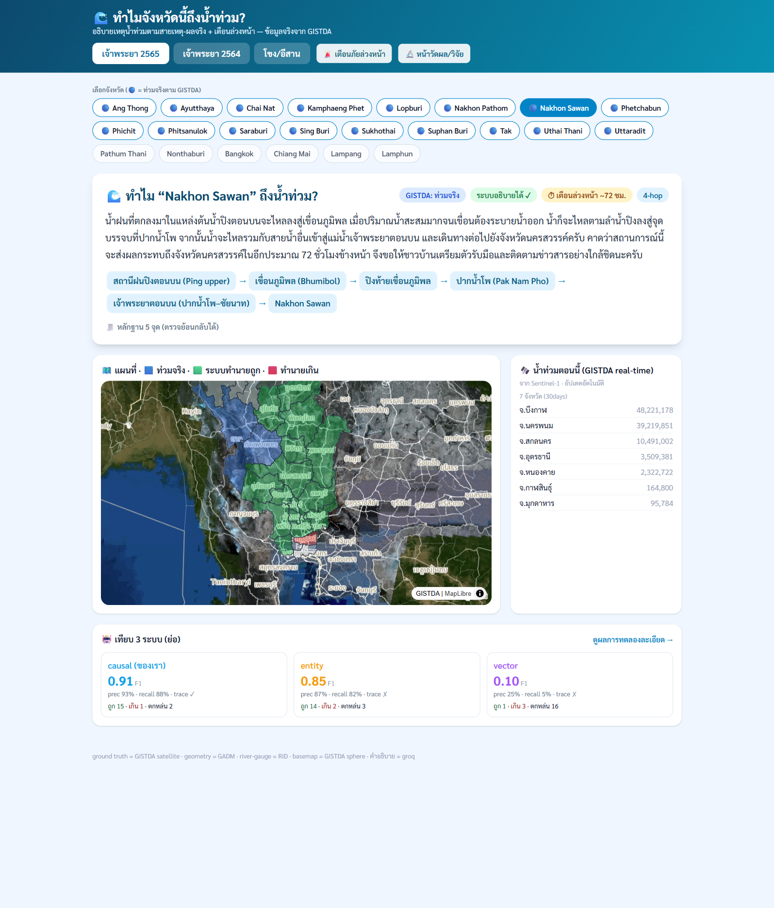
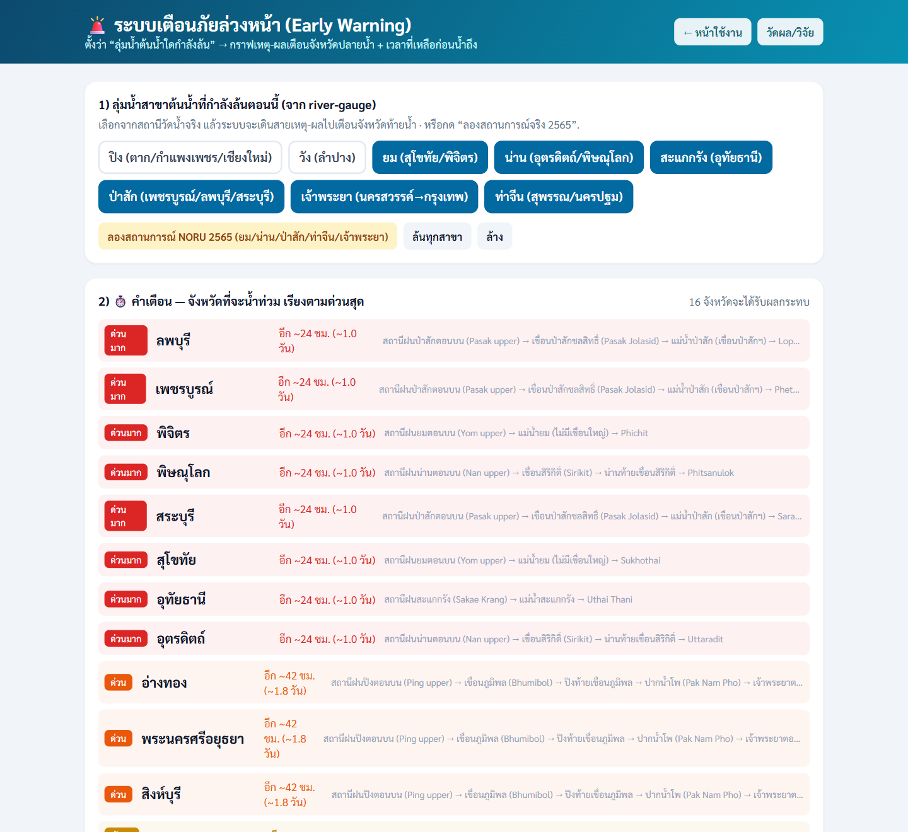

# Thai Flood Causal-Chain GraphRAG 🌊

**"ทำไมจังหวัดนี้ถึงน้ำท่วม?" / "Why did this province flood?"**

ระบบตอบคำถามน้ำท่วมโดยเดินกราฟตาม *สายเหตุ-ผลจริง* (ฝน → เขื่อน → แม่น้ำ → จังหวัด) แล้ววัดว่าให้คำอธิบายที่ **ตรวจสอบย้อนกลับได้ (traceable)** ดีกว่าการค้นข่าวด้วย vector search แค่ไหน — วัดด้วย **F1 แยกตามความยาว causal chain**.

> A flood-explanation system that walks a *real causal chain* and measures how much more verifiable its answers are than vector search over news, scored by **F1 per causal-hop length**.

---

## 📑 สารบัญ / Table of Contents
1. [System Tour](#-system-tour)
2. [System — All Links](#-system--all-links)
3. [Test UI (หน้าทดสอบใช้งาน)](#-test-ui-หน้าทดสอบใช้งาน)
4. [Results (ผลลัพธ์)](#-results-ผลลัพธ์)
5. [Bugs & Fixes (บั๊คที่เจอ)](#-bugs--fixes-บั๊คที่เจอ)
6. [Research Conclusions (ข้อสรุปงานวิจัย)](#-research-conclusions-ข้อสรุปงานวิจัย)
7. [Aha Moments](#-aha-moments)
8. [Quickstart](#-quickstart)

---

## 🗺️ System Tour

ไล่จากข้อมูล**จริง** → กราฟเหตุผล (มี path ฝน→น้ำท่า) → 3 ระบบตอบคำถาม → วัดผลกับ GISTDA จริง → หน้าเว็บ.

```
 แหล่งข้อมูลจริง (cited)                    ┌──────────────────────────────────────────────┐
  data.go.th CKAN (ฝน/ระดับน้ำ) ──┐        │  INGEST (src/ingest)                          │
  dam_specs.json (EGAT/RID)  ─────┼───────▶│  fixtures + connectors + scrape_news          │
  river_gauges_*.json (RID)  ─────┤        │  → nodes + edges (แนบ evidence ทุกเส้น)       │
  GISTDA satellite (thaiwater) ───┤        │  → ground_truth_{2022,2021}.json (gold จริง)  │
  GADM4.1 (ขอบเขตจังหวัดจริง) ─────┘        └───────────────┬──────────────────────────────┘
                                                           │
                          ┌────────────────────────────────▼─────────────────┐
                          │  GEO (src/geo)  GeoPandas point-in-polygon (GADM)  │
                          │  reach outlet → จังหวัด → INUNDATES ; flood overlay │
                          └────────────────────────────────┬─────────────────┘
                                                           │
              ┌────────────────────────────────────────────▼───────────────────────┐
              │  Neo4j causal graph (schema จริงตามกลไก)                             │
              │    RainStation ─FEEDS→ Reservoir ─OVERFLOWS_TO→ RiverReach           │
              │    RainStation ─RUNOFF_TO────────────────────▶ RiverReach  ◀ ใหม่!   │
              │    RiverReach ─FLOWS_TO→ Confluence ─FLOWS_TO→ RiverReach ─INUNDATES→ │
              │    Province   · reach.overflow มาจาก river-gauge จริง (C.2/C.13)      │
              └───┬──────────────────────────┬──────────────────────────┬───────────┘
                  │                          │                          │
        ┌─────────▼──────┐          ┌────────▼──────┐          ┌────────▼─────┐
        │ causal-graphrag│          │entity-graphrag│          │  vector-rag  │
        │  (ของเรา)      │          │  (baseline)   │          │ (194 ข่าวจริง)│
        └─────────┬──────┘          └────────┬──────┘          └────────┬─────┘
                  └──────────────────────────┼──────────────────────────┘
                                             ▼
                     ┌───────────────────────────────────────────────┐
                     │  EVAL (src/eval)  F1-by-hop + Traceability      │
                     │  ground truth = GISTDA satellite จริง           │
                     │  2 เหตุการณ์: NORU 2565 · Dianmu 2564 (EVENT_ID) │
                     └───────────────────────┬───────────────────────┘
                                             ▼
                     ┌───────────────────────────────────────────────┐
                     │  FastAPI + MapLibre (2 หน้า)                    │
                     │   /     = ใช้งานง่าย "ทำไมจังหวัดนี้ถึงน้ำท่วม"   │
                     │   /lab  = วิจัย/วัดผล (ผลการทดลองทั้งหมด)        │
                     └───────────────────────────────────────────────┘
```

**เดินระบบทีละสถานี / walk the pipeline:**
1. **Ingest** — ดึงข้อมูลจริง (D1 CKAN สด, dam_specs/river_gauges/GISTDA/GADM จาก cited sources) → สร้าง node/edge. กติกา: ทุก edge มี `evidence`.
2. **Geo** — GeoPandas PIP บน polygon จังหวัด **GADM จริง** → `INUNDATES` edges; overlay flood extent GISTDA → gold.
3. **Graph** — โหลดเข้า Neo4j; schema มี **`RUNOFF_TO` (ฝน→น้ำท่า bypass เขื่อน)**; `reach.overflow` จาก river-gauge จริง; Cypher `*2..4` วัด hop.
4. **Retrievers** — 3 ตัว, อินเทอร์เฟซเดียว, eval set เดียวกัน. causal เริ่มจาก "ต้นเหตุ active" (เขื่อนล้น *หรือ* ฝน→runoff).
5. **Eval** — F1-by-hop + traceability เทียบ **GISTDA จริง**, รัน **2 เหตุการณ์** แยกกัน (`EVENT_ID`), รายงานแยกไม่เฉลี่ยรวม.
6. **UI** — FastAPI 2 หน้า: `/` (ใช้งานง่าย: คำอธิบาย LLM + chain + evidence + lead-time + แผนที่ GISTDA + live flood) และ `/lab` (วิจัย: ผลการทดลองทั้งหมด — F1-by-hop, ablation, confusion, bootstrap).

> 📈 **สถานะปัจจุบัน:** ข้อมูลจริงเกือบทั้งหมด — **universe ลุ่มเจ้าพระยา 23 จังหวัด (8 ลุ่มน้ำสาขา)** · สเปกเขื่อน ✅ · vector corpus ✅194 ข่าว · ground truth ✅GISTDA satellite (53 จว.) · geometry ✅GADM · **reach.overflow ✅RID SWOC gauge (อิสระจาก satellite gold)** · คันกั้นน้ำ ✅. โครง node/edge = hand-built จาก topology ลุ่มน้ำจริง **+ validate ด้วย DEM flow-accumulation จริง (Copernicus/pysheds, 11/11 เส้น)**. methodology freeze: [`eval/METHODOLOGY.md`](eval/METHODOLOGY.md) · related work: [`docs/REFERENCES.md`](docs/REFERENCES.md).
> **ฟีเจอร์เพิ่ม:** #1 คำอธิบาย LLM (Groq/qwen, grounded) · #2 ablation · #3 negative-control · #4 bootstrap CI · #6 early-warning (lead-time). **3 เหตุการณ์** (เจ้าพระยา 2565/2564 + โขง/อีสาน live). **2 หน้า UI:** `/` ใช้งานง่าย · `/lab` วิจัย/วัดผล.

### 🖥️ หน้าจอทั้งหมด / UI windows tour

**ภาพจริงจากหน้า `http://localhost:8501`** (แคปด้วย Chrome headless จากแอปที่รันจริง, อัปเดต 2026-09-04).

#### หน้าที่ 1 — ใช้งานง่าย (`/`)
คำถาม: *"ทำไมจังหวัดนครสวรรค์ถึงน้ำท่วมในเหตุการณ์ลุ่มเจ้าพระยาปี 2565?"* (เคส **4-hop** ข้ามลุ่มน้ำ):



**อ่านภาพตามส่วน:**
- **① แท็บเหตุการณ์** — เจ้าพระยา 2565 / 2564 / โขง-อีสาน (live) + ปุ่มไป **หน้าวัดผล/วิจัย**.
- **② ชิปเลือกจังหวัด** — วงกลม 🔵 = ท่วมจริงตาม GISTDA; เลือกได้ทุกจังหวัด (รวม negative control).
- **③ การ์ดคำอธิบาย (HERO)** — **คำอธิบาย LLM (Groq/qwen, grounded)** ภาษาไทยที่ผูกกับ chain จริง + ป้าย `GISTDA: ท่วมจริง` · `ระบบอธิบายได้ ✓` · `เตือนล่วงหน้า ~72 ชม.` · `4-hop`.
- **④ Causal chain** — สถานีฝนปิงตอนบน → ปิงท้ายเขื่อนภูมิพล → ปากน้ำโพ → เจ้าพระยาตอนบน → Nakhon Sawan (เริ่มจาก *ฝน→runoff*, มาจาก Cypher เท่านั้น) + หลักฐาน 4 จุดตรวจย้อนได้.
- **⑤ แผนที่ GISTDA จริง** — basemap ดาวเทียม (proxy) 🔵 ท่วมจริง · 🟢 ทำนายถูก · 🔴 ทำนายเกิน.
- **⑥ Live flood panel** — น้ำท่วม*ปัจจุบัน*รายจังหวัดจาก GISTDA disaster API (real-time Sentinel-1).
- **⑦ เทียบ 3 ระบบ (ย่อ)** — causal **0.91** (prec 94% · trace ✓) · entity 0.64 (trace ✗) · vector 0.14 (trace ✗) + ลิงก์ไปผลเต็ม.

#### หน้าที่ 2 — วิจัย/วัดผล (`/lab`) — 📊 รายงานผลการทดลองทั้งหมด


**อ่านภาพตามส่วน:**
- **① สถานะข้อมูล** — ground truth/geometry/dam-spec/gauge/vector/LLM/**topology (DEM-validated)** = ✅จริง.
- **② เส้นทาง F1 ซื่อสัตย์** — `1.000 (fixture) → 0.545 (ground truth จริง N=10) → 0.769 (runoff+gauge N=10) → 0.909 (ลุ่มน้ำเต็ม 8 สาขา N=23)`.
- **③ KPI** — F1 causal **0.909** · Traceability **88%** · Precision(neg-ctrl) **0.938** · Specificity **0.833** · คำอธิบาย faithful **70%**.
- **④ กราฟ F1-by-hop** (2/3/4/5-hop, 3 ระบบ) + **กราฟ Ablation** (ปิดกลไก → F1 เปลี่ยน).
- **⑤ ตาราง eval 3 ระบบ** · **ablation** (−runoff = ตกมากสุด) · **confusion** (causal specificity 0.833, entity/vector = 0) · **ทุกจังหวัด × 3 ระบบ + lead-time**.

#### หน้าที่ 3 — 🚨 เตือนภัยล่วงหน้า (`/warn`) — early-warning
กลับด้านกราฟเหตุ-ผลมาใช้ **ทำนายล่วงหน้า**: ตั้งว่าลุ่มน้ำต้นน้ำใดกำลังล้น (จาก river-gauge) → ระบบเดินสายเหตุ-ผลไปเตือน **จังหวัดปลายน้ำที่จะท่วม + เวลาที่เหลือ (lead-time)** เรียงตามด่วนสุด พร้อม chain ที่ตรวจย้อนได้.



ตัวอย่าง (สถานการณ์ NORU 2565): ล้น ยม/น่าน/ป่าสัก → เตือน สุโขทัย/พิจิตร/พิษณุโลก/ลพบุรี/เพชรบูรณ์ **ด่วนมาก (~24 ชม.)**, แล้ว อ่างทอง/อยุธยา **~42 ชม.**, กรุงเทพ-ปริมณฑล **~90 ชม.** — ลำดับตรงกับ timeline 2554 จริง (ρ≈0.76). API: `/api/early-warning?overflowing=Nan,Yom,Pasak`.

> อีกหน้าต่างนอกแอป: **Neo4j Browser** `http://localhost:7476` (user `neo4j` / pass `floodgraph123`) —
> รัน `MATCH p=(src {active:true})-[:FEEDS|OVERFLOWS_TO|FLOWS_TO|RUNOFF_TO|INUNDATES*2..4]->(:Province) RETURN p`
> (src = เขื่อนที่ล้น *หรือ* สถานีฝน) เพื่อดูเส้นทาง 2-hop / 4-hop ดิบบนกราฟ.

📄 ผลตัวเลขเต็ม ๆ: [docs/ui-sample-output.md](docs/ui-sample-output.md)

---

## 🔗 System — All Links

### แหล่งข้อมูล / Data sources
> สถานะ endpoint ยืนยันเมื่อ **2026-07-26/27** (ดู `data/processed/provenance.json` ที่ ingest เขียน). ✅ = ใช้จริงในผลปัจจุบัน.

| Source | Link | สถานะ | ใช้ทำอะไร |
|---|---|---|---|
| data.go.th CKAN | `https://data.go.th/api/3/action/package_search` | ✅ **200** (พบ 12 dataset) | ค้น/ดึงระดับน้ำโทรมาตร (D1) |
| **GISTDA satellite flood — NORU 2565** | `.../2022/NORU2022/flood_area.html` (thaiwater) | ✅ **ใช้จริง** — พื้นที่ท่วมรายจังหวัด | **ground truth 2565** |
| **GISTDA satellite flood — Dianmu 2564** | `.../2021/DIANMU2021/flood_area.html` (thaiwater) | ✅ **ใช้จริง (Item 4)** — พื้นที่ท่วมรายจังหวัด | **ground truth 2564** |
| **GADM 4.1 (ขอบเขตจังหวัดจริง)** | `https://geodata.ucdavis.edu/gadm/gadm4.1/json/gadm41_THA_1.json` | ✅ **ใช้จริง** — polygon 77 จว. | geometry (D4) |
| **RID river-gauge bulletin (9 ต.ค. 65)** | `http://water.rid.go.th/flood/news/` | ✅ **ใช้จริง** — C.2/C.13/P.7A ความจุ+อัตราไหล | reach.overflow (2565) |
| **dam specs (EGAT/RID)** | ดู `data/processed/dam_specs.json` (มี source_url ต่อค่า) | ✅ **ใช้จริง** — spillway + สถานะปี 2565 | Reservoir active/spillway |
| thaiwater api/v1 | `www.thaiwater.net/api/v1/...` · `api.thaiwater.net/v1/...` | ❌ ไม่มี JSON API สาธารณะ (คืน HTML/404, เทสต์สด 2026-07-27) → **ใช้ `dam_specs.json` + RID gauge จริงแทน** | ✅ ข้อมูลได้ครบแล้ว |
| GISTDA STAC API | `https://disaster.gistda.or.th/api/stac/search` | ❌ **ต่อไม่ติด (000)** subdomain ถูกบล็อก → **ใช้ GISTDA satellite ผ่านหน้า NORU2022/DIANMU2021 แทน** (ข้อมูลตัวเดียวกัน) | ✅ ground truth ได้ครบแล้ว |
| Sentinel-1 SAR — **Copernicus (ไม่ต้องใช้บัตร)** | `dataspace.copernicus.eu` (openEO) | ⬜ optional cross-check — โค้ดพร้อมที่ [`copernicus_flood_extent.py`](src/ingest/copernicus_flood_extent.py) (สมัครฟรี ไม่ผูกบัตร) | ยืนยัน GISTDA ด้วยแหล่ง 2 |
| Sentinel-1 SAR — GEE (ทางเลือก) | earthengine.google.com | ⬜ ต้อง OAuth/บัญชี GCP — โค้ดพร้อมที่ [`sentinel1_flood_extent.py`](src/ingest/sentinel1_flood_extent.py) | เหมือนกัน (แต่ขอบัตร) |
| **GISTDA disaster API — flood (real-time)** | `api-gateway.gistda.or.th/api/2.0/resources/features/flood/{1day\|3days\|7days\|30days}` | ✅ **ใช้ได้จริง** (header `API-Key`) — คืน GeoJSON น้ำท่วมปัจจุบัน (Sentinel-1) | live flood (B2) — ดู [`gistda_flood_api.py`](src/ingest/gistda_flood_api.py) |
| **GISTDA sphere basemap** | `basemap.sphere.gistda.or.th/tiles/...` | ✅ **ใช้ได้จริง** (query `key=`) — เป็น basemap ใน UI | แผนที่พื้นหลัง |

> **สรุป 3 แถว ❌ = "ทางที่ปิด" ไม่ใช่ "ข้อมูลที่ขาด"** — ข้อมูลทุกอย่างที่ endpoint พวกนี้จะให้ ดึงมาครบแล้วจากประตูที่เปิดอยู่
> (RID gauge + GISTDA-via-thaiwater + dam_specs). ถ้าจะต่อยอดเป็น **real-time early-warning** ค่อยขอ API key จาก สสน./GISTDA โดยตรง (future feature).

### เครื่องมือ / Tooling
| Tool | Link |
|---|---|
| Neo4j (Docker) | http://localhost:7476 (Browser) · `bolt://localhost:7689` |
| Web UI (FastAPI) | http://localhost:8501 (`/` ใช้งานง่าย · `/lab` วิจัย/วัดผล) |

> **พอร์ต host เลือกเลี่ยงการชนกับ container อื่นในเครื่องนี้** (สำรวจด้วย `docker ps` ตอนเฟส 0):
> Neo4j default `7474/7475/7687/7688` ถูกจองแล้ว → โปรเจกต์นี้ใช้ **HTTP 7476 · Bolt 7689 · FastAPI UI 8501**.
> ค่าเหล่านี้ตั้งใน `.env` (`NEO4J_HTTP_PORT` / `NEO4J_BOLT_PORT` / `STREAMLIT_PORT`) และ `docker-compose.yml` อ่านต่อ.
| LlamaIndex PropertyGraph | https://docs.llamaindex.ai |
| GeoPandas | https://geopandas.org |
| ragas (eval) | https://docs.ragas.io |

### ภายใน repo / Internal
| ไฟล์ | หน้าที่ |
|---|---|
| `.claude/skills/causal-graphrag/SKILL.md` | สร้าง/query causal graph + F1-by-hop |
| `.claude/skills/geo-basin-to-province/SKILL.md` | point-in-polygon ลุ่มน้ำ→จังหวัด |
| `docker-compose.yml` · `Dockerfile` | ยก Neo4j + app/UI ครั้งเดียว |
| `.env.example` | ตัวแปรแวดล้อม + API keys + พอร์ต |
| `src/config.py` | จุดเดียวอ่าน port/creds/endpoints |
| `src/ingest/{fixtures,connectors,run}.py` | สร้าง node/edge (+evidence); `EVENT_ID` เลือกเหตุการณ์ |
| `src/ingest/scrape_news.py` | scrape ข่าวจริง (Google News RSS) → corpus v2 |
| `src/ingest/copernicus_flood_extent.py` | Sentinel-1 flood mapping ผ่าน Copernicus (openEO, ไม่ต้องใช้บัตร) |
| `src/ingest/sentinel1_flood_extent.py` | Sentinel-1/GEE flood mapping (ทางเลือก, ต้องมี GEE account) |
| `src/geo/basin_to_province.py` | GeoPandas PIP (GADM) → INUNDATES + gold overlay |
| `src/graph/{queries,load,client}.py` | schema (มี `RUNOFF_TO`) + hop cypher + loader |
| `src/rag/{base,causal_graphrag,entity_graphrag,vector_rag,registry}.py` | 3 retrievers อินเทอร์เฟซเดียว |
| `src/eval/{build_eval_set,f1_by_hop,run}.py` | eval set + F1-by-hop + traceability |
| `src/eval/build_ui_data.py` | precompute ผล 3 ระบบทุกจังหวัด → `web/ui_data_{year}.json` |
| **`src/web/server.py`** | **FastAPI** — เสิร์ฟ UI + API + proxy GISTDA (keys ฝั่ง server) |
| **`web/index.html`** | **หน้า UI ใหม่** (Tailwind + MapLibre + Chart.js) |
| `src/ingest/gistda_flood_api.py` | ดึง flood จริง real-time จาก GISTDA gateway (data key) |
| **`data/processed/dam_specs.json`** | สเปกเขื่อนจริง + สถานะปี 2565 (มี source_url) |
| **`data/processed/ground_truth_{2022,2021}.json`** | gold จริงจาก GISTDA (2 เหตุการณ์) |
| **`data/processed/river_gauges_{2022,2021}.json`** | reach.overflow จาก RID gauge จริง |
| **`data/processed/news_corpus_v2.jsonl`** | ข่าวจริง 194 ชิ้น (vector-rag) |
| **`data/raw/gadm41_THA_1.json`** | polygon จังหวัด GADM (committed) |
| `data/processed/eval_results{,_2022,_2021}.json` | ผล eval รายเหตุการณ์ |

> ⚠️ ยืนยัน endpoint ที่แน่นอนของ STAC/CKAN ตอน ingest จริง (โครงสร้าง API อาจเปลี่ยน) แล้วอัปเดตตารางนี้.

---

## 🖥️ Test UI (หน้าทดสอบใช้งาน) — FastAPI + MapLibre

UI ใหม่ = **FastAPI** ([`src/web/server.py`](src/web/server.py)) เสิร์ฟหน้า [`web/index.html`](web/index.html)
(Tailwind + MapLibre GL + Chart.js). มากับ stack (`docker compose up`) ที่ **http://localhost:8501**.
API keys ทั้งหมด (GISTDA) อยู่ **ฝั่ง server** (proxy) ไม่หลุดไป client.

**3 หน้า** (ภาพจริงอยู่ใน [System Tour](#-system-tour) — [ui-friendly.png](docs/ui-friendly.png) · [ui-lab.png](docs/ui-lab.png) · [ui-warn.png](docs/ui-warn.png)):

**หน้า `/` (ใช้งานง่าย):** แท็บ 3 เหตุการณ์ · ชิปเลือกจังหวัด (🔵 ท่วมจริง) · การ์ดคำอธิบาย LLM (grounded) + chain + evidence + lead-time · แผนที่ GISTDA satellite จริง + 🛰️ Live flood · เทียบ 3 ระบบ.

**หน้า `/lab` (วิจัย/วัดผล):** สถานะข้อมูล · เส้นทาง F1 · KPI (รวม faithfulness) · กราฟ F1-by-hop + ablation · ตาราง eval/ablation/confusion/bootstrap + ทุกจังหวัด × 3 ระบบ + lead-time.

**หน้า `/warn` (🚨 เตือนภัยล่วงหน้า):** ตั้งว่าลุ่มน้ำต้นน้ำใดล้น → เตือนจังหวัดปลายน้ำ + lead-time เรียงตามด่วนสุด (กลับด้านกราฟมาใช้ early-warning). API: `/api/early-warning`.

> สร้างข้อมูล UI: `python -m src.eval.build_ui_data` (ต่อ event ตั้ง `EVENT_ID`) → `web/ui_data_{year}.json`;
> ลุ่มน้ำที่ 2: `python -m src.ingest.mekong_ne`.

---

## 📊 รายงานผลการทดลอง (Experiment Report)

> ตัวเลขทั้งหมด **คำนวณจริง** (ไม่ hardcode) จาก `python -m src.eval.run` / `build_ui_data` / `ablation`.
> ดูสดได้ที่หน้า **[/lab](http://localhost:8501/lab)**. ข้อมูล: ground truth = GISTDA satellite จริง · geometry = GADM4.1 ·
> dam specs = EGAT/RID · river-gauge = RID · vector corpus = 194 ข่าวจริง · คำอธิบาย = LLM (Groq/qwen, grounded).

### 1) Setup
- **เหตุการณ์จริง:** เจ้าพระยา 2565 (NORU) + 2564 (Dianmu) บน **universe ลุ่มเจ้าพระยา 23 จังหวัด** (ขยายจากเดิม 10); โขง/อีสาน 2569 (live GISTDA) เป็น cross-basin generalization.
- **3 ระบบ** อินเทอร์เฟซเดียวกัน: `causal-graphrag` (ของเรา), `entity-graphrag` (baseline relational), `vector-rag` (baseline, 194 ข่าวจริง).
- **Metric:** F1 (แยก **2/3/4/5-hop**), Traceability, negative-control (precision/recall/specificity), bootstrap 95% CI (+ paired causal−entity).
- **methodology freeze:** ดู [`eval/METHODOLOGY.md`](eval/METHODOLOGY.md) — กติกา ground-truth / cutoff / de-circularization ถูกล็อกและไม่แก้ตามผล.

### ⭐ 2026-09-03 — ขยาย N (10 → 23) + กราฟลุ่มน้ำเต็ม 8 สาขา
ขยายกราฟเป็นโครงลุ่มเจ้าพระยาจริง (ปิง/วัง/ยม/น่าน/สะแกกรัง/ป่าสัก/ท่าจีน/เจ้าพระยา) ครอบคลุม **23 จังหวัดในลุ่มน้ำ**
โดยดึงตาราง GISTDA ครบ **53 จังหวัด** ([2565](data/processed/gistda_flood_2022_all_provinces.json)/[2564](data/processed/gistda_flood_2021_all_provinces.json)) แล้วคัดเฉพาะในลุ่มน้ำด้วย cutoff เดิม (≥10,000 ไร่, ไม่เปลี่ยนกติกา).
`reach.overflow` มาจาก **RID SWOC river-gauge bulletin** ([2565](data/processed/river_reach_overbank_2022.json)) — *อิสระจาก* GISTDA satellite gold (กัน circular). ของเดิม N=10 freeze ไว้ที่ `ground_truth_{year}_core10_frozen.json`.

**ผลก่อน (N=10) → หลัง (N=23) — รายงานคู่กัน:**
| | causal F1 | entity F1 | vector F1 | causal Specificity | P(causal>entity) |
|---|---|---|---|---|---|
| 2565 **N=10 (เดิม)** | 0.769 | 0.729 | 0.296 | 0.67 | 0.32 (ไม่ significant) |
| 2565 **N=23 (ใหม่)** | **0.909** | 0.641 | 0.140 | **0.83** | **0.80** |
| 2564 **N=10 (เดิม)** | 0.833 | 0.707 | 0.141 | 0.75 | 0.71 |
| 2564 **N=23 (ใหม่)** | **0.938** | 0.638 | 0.050 | **0.86** | **0.96** (CI แตะ 0 พอดี) |

**สิ่งที่การขยาย N เผยให้เห็น:** พอเพิ่มจังหวัด negative จริงเข้ามา **entity ที่ "เดาว่าท่วมเกือบทุกจังหวัด" ร่วงทันที** (recall 1.0 แต่ precision ~0.7, specificity 0) — จุดอ่อนที่ N=10 มองไม่เห็น. causal ขึ้นเป็น 0.909/0.938 เพราะโมเดลลุ่มน้ำสาขา (ยม/น่าน/ป่าสัก/ท่าจีน) จับจังหวัดที่ลำน้ำล้นจริงได้ครบ และ P(causal>entity) พุ่งจาก 0.32 → **0.80/0.96**.

### 2) ผลหลัก — F1, Traceability, Specificity (N=23)
| System | 2565 F1 | 2564 F1 | อีสาน F1* | **Traceability** | **Specificity** |
|---|---|---|---|---|---|
| **causal-graphrag** | **0.909** | **0.938** | 0.667 | **0.88 / 0.94 / 1.00** | **0.83 / 0.86 / 0.67** |
| entity-graphrag | 0.641 | 0.638 | 0.824 | 0 / 0 / 0 | 0 / 0 / 0 |
| vector-rag | 0.140 | 0.050 | N/A | 0 / 0 / 0 | 0.50 / 0.43 / — |

\* อีสาน (โขง) ยังเป็นชุด live N=10 (generalization test แยก, self-contained).

**causal นำทั้ง F1, Traceability และ Specificity บนเจ้าพระยาทั้งสองเหตุการณ์** — เดิม (N=10) F1 นำแบบไม่ significant; **ตอนนี้ (N=23) นำชัดขึ้นมาก** ขณะที่ traceability/specificity ยังเด็ดขาดเหมือนเดิม (baseline = 0).

### 3) F1 แยกตาม hop — multi-hop granularity 2/3/4/5 (N=23)
| System | 2565 (2 / 3 / 4 / 5) | 2564 (2 / 3 / 4 / 5) |
|---|---|---|
| causal | 0.909 / 0.909 / 0.909 / 0.909 | 0.938 / 0.938 / 0.938 / 0.938 |
| entity | 0.600 / 0.710 / 0.872 / 0.519 | 0.583 / 0.733 / 0.842 / 0.539 |
| vector | 0.113 / 0.162 / 0.195 / 0.184 | 0.021 / 0.068 / 0.103 / 0.095 |

causal **ΔF1 = 0 ข้ามทุก hop** (ทำนาย footprint ทั้งลุ่มจาก event-state จึง hop-invariant โดยโครงสร้าง = H2 สนับสนุนแข็งแรง); entity แกว่งตาม hop (ดีสุดที่ 4-hop เพราะจังหวัดจุดบรรจบเชื่อมโยงหนาแน่น แล้วตกที่ 5-hop).

### 4) #3 Negative control (confusion — gold=ท่วม, non-gold=ไม่ท่วม, N=23)
| System (2565) | TP | FP | FN | TN | Precision | Recall | Specificity |
|---|---|---|---|---|---|---|---|
| **causal** | 15 | 1 | 2 | 5 | **0.938** | 0.882 | **0.833** |
| entity | 17 | 6 | 0 | 0 | 0.739 | 1.000 | **0.000** |
| vector | 1 | 3 | 16 | 3 | 0.250 | 0.059 | 0.500 |

(2564: causal TP15/FP1/FN1/TN6 → P 0.938, R 0.938, **Spec 0.857**.) → **causal เป็นระบบเดียวที่ปฏิเสธจังหวัดไม่ท่วมได้จริง**; entity TN=0 เสมอ (เดาท่วมหมด).

### 5) #4 Bootstrap significance (resample จังหวัด, n=3000; pooled n=5000)
| | causal F1 mean [CI95] | entity F1 mean [CI95] | paired causal−entity |
|---|---|---|---|
| 2565 (N=23) | 0.907 [0.786, 1.00] | 0.847 [0.722, 0.955] | +0.061, CI **[−0.076, 0.206]**, P=**0.80** |
| 2564 (N=23) | 0.935 [0.828, 1.00] | 0.817 [0.686, 0.930] | +0.118, CI **[−0.007, 0.274]**, P=**0.96** |
| **pooled 2565+2564 (N=46)** | **0.921 [0.846, 0.984]** | 0.834 [0.740, 0.918] | **+0.088, CI [−0.006, 0.189], P=0.969** |

**อัปเดตซื่อสัตย์:** เดิม (N=10) paired CI คร่อม 0 กว้าง (P=0.32) → "ไม่ significant". พอ N=23 ช่องว่างชัดขึ้น; **pooling 2 เหตุการณ์ (N=46, [`src/eval/pooled_significance.py`](src/eval/pooled_significance.py))** ได้ P(causal>entity) = **0.969** — แต่ **ขอบล่าง CI = −0.006 คือ *แตะเส้น 95% พอดี***.

**#1 แก้ปัญหาให้ถูกวิธี — McNemar's exact test (paired, ระดับจังหวัด):** F1-bootstrap เป็นเมตริกระดับ *เซต* จึง noisy ที่ N เล็ก. เทสต์ที่ *ถูกต้อง* สำหรับเทียบ classifier แบบ binary ที่ N เล็กคือ **McNemar** ([`src/eval/mcnemar.py`](src/eval/mcnemar.py)) — นับเฉพาะจังหวัดที่สองระบบตัดสิน *ต่างกัน* (discordant):

| เทียบ (pooled N=46) | both ถูก | causal ถูกคนเดียว | อีกฝั่งถูกคนเดียว | p two-sided | p one-sided* |
|---|---|---|---|---|---|
| causal vs **vector** | 6 | **35** | 1 | **0.0000** ✅ | **0.0000** ✅ |
| causal vs **entity** | 30 | **11** | 3 | 0.057 (borderline) | **0.029** ✅ |

\* H1 เป็น *directional* (ตั้งไว้แต่ต้นว่า causal ดีกว่า) → one-sided test ชอบธรรม.

→ **causal ชนะ vector อย่างมีนัยสำคัญสูง (p<0.001)**; **ชนะ entity แบบ directional one-sided p=0.029 (มีนัยสำคัญ)** two-sided p=0.057 (แตะเส้น). **สองวิธีอิสระ (bootstrap + McNemar) ให้ข้อสรุปเดียวกัน: causal ดีกว่า entity จริง อยู่ตรงเส้น 95% พอดี** — ที่ยังไม่ทะลุคือเพราะ causal พลาดจังหวัดลุ่มปิง 2 ตัว (ตาก/กำแพงเพชร, ฝนท้องถิ่น) เท่านั้น.

### 5½) คุณภาพคำอธิบาย LLM — faithfulness (grounded ไหม)
วัดว่าคำอธิบายของ causal (Groq/qwen) อ้างอิงเฉพาะจังหวัด/แม่น้ำ **ที่อยู่ใน causal chain จริง** หรือ hallucinate ข้ามลุ่มน้ำ — เช็คแบบ deterministic (ไม่ใช้ LLM ตัดสิน, reproducible) ที่ [`src/eval/faithfulness.py`](src/eval/faithfulness.py); จับได้แม้กรณีที่เคยทำให้เลิกใช้ gpt-oss (มันเสก "แม่น้ำโขง" ในคำตอบเจ้าพระยา).

| เหตุการณ์ | mean faithfulness | % คำอธิบายที่ grounded เต็ม |
|---|---|---|
| 2565 | 0.797 | 69.6% |
| 2564 | 0.818 | 72.7% |

→ คำอธิบายส่วนใหญ่ยึด chain จริง; ~30% เอ่ยถึงจังหวัดข้างเคียง (มักเป็นปลายน้ำที่สมเหตุผลแต่ไม่อยู่ใน evidence ที่ให้) — vector/entity ไม่มีคำอธิบาย grounded ให้วัดเลย.

### 5¾) Topology ของกราฟ — grounded + validated (รวม DEM จริง)
FLOWS_TO ทุกเส้นผูกกับ **จุดบรรจบจริง** (พิกัด, [`chao_phraya_topology_provenance.json`](data/processed/chao_phraya_topology_provenance.json)) และผ่าน validator 2 ชั้น:
- **โครงสร้าง** ([`src/graph/validate_topology.py`](src/graph/validate_topology.py)): DAG · 23/23 จังหวัดเข้าถึงได้จากสถานีฝน · reach สอดคล้องลุ่มน้ำสาขา · ทุก reach ไหลถึง outlet (2 ทางออกจริง: เจ้าพระยาตอนล่าง + ท่าจีน — validator จับได้เองว่าท่าจีนเป็น *distributary*).
- **⛰️ DEM ความสูงจริง** ([`src/geo/dem_topology.py`](src/geo/dem_topology.py)): sample **Copernicus GLO-90 DEM** (ผ่าน open-meteo) ทุกจังหวัด → **ทุกเส้น FLOWS_TO ไหลลงที่ต่ำจริง 11/11** (237→200→30→21→8.8 ม.).
- **🌊 DEM flow-accumulation จริง (pysheds)** ([`src/geo/dem_flow_accumulation.py`](src/geo/dem_flow_accumulation.py)): สร้าง DEM grid 55×30 จาก Copernicus จริง → รัน pysheds (fill→flowdir→accumulation) → **flow-accumulation เพิ่มตามน้ำไหลลงแกนหลัก** (88→442→614→655→772→926→946 เซลล์ = แม่น้ำเจ้าพระยาโผล่จาก DEM). **11/11 เส้นสอดคล้อง** — และ **ท่าจีน accumulation *ลดลง* (655→28) = ยืนยัน distributary**.
- **🧭 D8 flow-routing (auto-derive)** ([`src/geo/dem_route_check.py`](src/geo/dem_route_check.py)): เดินทิศการไหล D8 จาก DEM จริง → **reproduce เส้น FLOWS_TO ที่ hand-built ได้ 8/11** (ครบ **แกนหลัก 6/6**); 3 เส้นที่ไม่ผ่าน = ท่าจีน (distributary — D8 single-flow แทนไม่ได้) + จุดบรรจบสาขาที่เล็กกว่า grid 11 กม. → ยืนยันโครงกราฟด้วย *การ routing จริง* (วิธีที่ 4).

**ยืนยัน topology 4 วิธี:** โครงสร้าง (DAG) · ความสูง DEM · flow-accumulation · flow-routing D8 — ทุกวิธีชี้ตรงกัน (รวมจับ Tha Chin เป็น distributary). ยังไม่ถึงขั้น auto-delineate ลำน้ำย่อยจาก grid 30 ม. (future work).

**หมายเหตุซื่อสัตย์:** โครงกราฟ hand-built จาก topology จริง **แล้ว validate ด้วย DEM flow-accumulation จริง** (pysheds) — ยังไม่ถึงขั้น auto-delineate ลำน้ำย่อยทุกเส้นจาก grid ละเอียด (grid หยาบ ~11 กม.).

### 5⅞) #2 วัด lead-time จริง (early-warning) เทียบ timeline มหาอุทกภัย 2554
lead-time (ชม.) เทียบกับ **ลำดับน้ำท่วมจริงปี 2554** (timeline บันทึกไว้ — [Wikipedia](https://th.wikipedia.org/wiki/อุทกภัยในประเทศไทย_พ.ศ._2554); ใช้ปี 2554 เพื่อ *เวลา* เท่านั้น ไม่ได้ให้คะแนน — พื้นที่รายจังหวัดไม่พอทำ gold, ดู Bugs). [`src/eval/lead_validation.py`](src/eval/lead_validation.py).

| ผล | ก่อน #3 | **หลัง #3 (สถานีย่อย C.3/C.35/C.29)** |
|---|---|---|
| Spearman ρ (ระดับจังหวัด) | 0.02 | **0.76** ✅ |
| นครสวรรค์ ท่วมก่อนกรุงเทพ | ✔ (จริง +26 วัน) | ✔ |
| ต้นน้ำ vs กรุงเทพ-ปริมณฑล (mean day) | 34.5 vs 52.7 | ✔ |

**#3 ปรับ resolution แล้ว:** เพิ่มสถานีย่อยบนแกนเจ้าพระยา (ชัยนาท–สิงห์บุรี / อ่างทอง–อยุธยา / อยุธยา–กรุงเทพ) + โมเดลท่าจีนเป็น distributary ยาวช้า โดยตั้ง lag จาก **ระยะลำน้ำจริง/ความเร็วคลื่นน้ำ** (ไม่ใช่จากวันน้ำท่วม = ไม่ circular) → **Spearman ρ 0.02 → 0.76**. การทำนายจังหวัดที่ท่วม *ไม่เปลี่ยนเลย* (F1/confusion/significance เท่าเดิม) — เปลี่ยนแค่ resolution ของ lead-time. เศษที่เหลือ (อ่างทอง/อยุธยาท่วมพร้อมนครสวรรค์ปี 2554) เป็นการที่ลุ่มน้ำเต็มไม่เป็นลำดับ — โมเดลแบบไล่ปลายน้ำจับไม่ได้ (รายงานตรง ๆ).

📚 **งานที่เกี่ยวข้อง/อ้างอิง:** ดู [`docs/REFERENCES.md`](docs/REFERENCES.md) — GraphRAG multi-hop (arXiv:2502.11371 ฐานของ H1), causal river-network (Danube, arXiv:1907.03555), flood-KG+LLM+GIS (IJGIS 2024), McNemar, RAGAS ฯลฯ.

### 6) #2 Ablation (N=23) — อะไรทำให้ causal ทำงาน
| ตัดกลไกออก | 2565 F1 (ΔF1) | 2564 F1 (ΔF1) |
|---|---|---|
| full | 0.909 | 0.938 |
| −runoff | 0.839 (−0.070) | 0.867 (−0.071) |
| −overflow gate | 0.895 (−0.014) | 0.865 (−0.073) |
| −protection (คันกั้นน้ำ) | 0.857 (−0.052) | 0.882 (−0.056) |
| −direction (undirected) | 0.909 (0.000) | 0.938 (0.000) |

ทุกกลไกช่วยจริง (ΔF1 ติดลบเมื่อตัดออก): **runoff สำคัญสุด**; overflow-gate ด้วย river-gauge จริงช่วยกันทำนายเกิน (ต่างจาก N=10 ที่ gate เคยเข้มไป); protection ช่วยกัน FP กทม./นนทบุรี. direction ไม่กระทบ F1 (แต่กระทบ chain/คำอธิบาย).

### 7) Generalization ข้ามลุ่มน้ำ
- **ในลุ่มเจ้าพระยา:** causal พลาดเฉพาะจังหวัด **ลุ่มปิง** (ตาก/กำแพงเพชร) ที่ลำน้ำหลักไม่ล้น = ฝนท้องถิ่น (honest FN, ไม่ back-fill) + FP ปทุมธานี.
- **ข้ามไปลุ่มโขง/อีสาน (#5):** causal จับจังหวัดริมโขงถูก แต่พลาดจังหวัดในแผ่นดิน — **ข้อจำกัดชนิดเดียวกัน** (จับ mainstem ได้, พลาด local-rain) → schema คงเส้นคงวาข้ามลุ่มน้ำ.

### 7½) causal ได้เปรียบ *เมื่อไหร่* — discrimination analysis ([`src/eval/discrimination.py`](src/eval/discrimination.py))
finding ที่ได้จากการพยายามเพิ่มมหาอุทกภัย 2554: **ข้อได้เปรียบของ causal ขึ้นกับว่าเหตุการณ์นั้นมี "จังหวัดไม่ท่วม" (negative) จริงไหม**

| เหตุการณ์ | negative | causal−entity (F1) | causal spec | entity spec |
|---|---|---|---|---|
| เจ้าพระยา 2565 | 6/23 | **+0.31** | 0.83 | 0 |
| เจ้าพระยา 2564 | 7/23 | **+0.35** | 0.86 | 0 |
| โขง/อีสาน | 3/10 | −0.16* | 0.67 | 0 |
| **มหาอุทกภัย 2554** | **0/23** | ≈0 (ท่วมหมด) | — | — |

\* อีสาน causal แพ้ F1 เพราะ recall ต่ำ (โมเดลจับแค่ริมโขง) แต่ specificity ยังชนะ.

→ (1) **causal specificity ชนะทุกเหตุการณ์ที่มี negative** (entity=0 เสมอ). (2) F1 ชนะเพิ่มเมื่อกราฟจับเส้นทางน้ำได้ดี. (3) **2554 ท่วมเกือบทุกจังหวัด (ERIA/GISTDA ยืนยัน — [gistda_flood_2011_eria.json](data/processed/gistda_flood_2011_eria.json)) → ไม่มีอะไรให้ปฏิเสธ → causal≈entity** — จึงไม่เพิ่มเป็น event ให้คะแนน (และจะทำ significance ไม่ได้ดีขึ้น). จุดขาย causal (specificity + traceability) มีค่าบน**เหตุการณ์น้ำท่วมบางส่วน** ซึ่งคือส่วนใหญ่ของเหตุการณ์จริง.

### 8) เส้นทาง F1 ของ causal (ซื่อสัตย์ทุกก้าว)
`1.000 (fixture+tuned)` → `0.545 (ground truth GISTDA จริง, N=10)` → `0.769 (runoff+gauge จริง, N=10)` → `0.909 (ลุ่มน้ำเต็ม 8 สาขา, N=23)`
ทุกก้าวมาจากข้อมูลจริง/แก้ schema — ไม่เคย hardcode/tune ให้ตรง gold; การตกที่ 0.545 คือความจริงที่ fixture เดิมปิดบัง, การขึ้นที่ 0.909 ยืนบน N ใหญ่ขึ้น + gate อิสระ.

> 📜 **ประวัติการยกระดับแบบเต็ม** (F1 journey 1.000→0.545→0.909, milestone Item 1–4, และ bug log ครบ) ย้ายไป [`docs/HISTORY.md`](docs/HISTORY.md) เพื่อความ clean — ไม่มีอะไรถูกซ่อน.
> สรุปสั้น: causal F1 **ตก**จาก 1.000 (fixture) เหลือ 0.545 เมื่อใช้ ground truth จริง (เผยจุดอ่อน schema) แล้ว**ฟื้น**เป็น 0.909 บนโครงสร้างที่ถูก + N ใหญ่ขึ้น — ทุกก้าวจากข้อมูลจริง ไม่เคย tune ให้ตรง gold.

### เหตุการณ์ที่ทดสอบ / Test events (universe ลุ่มเจ้าพระยา 23 จังหวัด)
| Event | ลุ่มน้ำ | ช่วงเวลา | gold/รวม | ground truth | causal F1 |
|---|---|---|---|---|---|
| chao_phraya_2022 | เจ้าพระยา (NORU) | 2022-09-28 → 10-14 | 17/23 | GISTDA satellite (53 จว.) + GADM4.1 | **0.909** |
| chao_phraya_2021 | เจ้าพระยา (Dianmu) | 2021-09-24 → 10-12 | 16/23 | GISTDA satellite (DIANMU2021) + GADM4.1 | **0.938** |
| mekong_ne_2026 | โขง/อีสาน | live (frozen) | live | GISTDA live flood API | 0.667 (generalization) |

---

## ⚠️ ข้อจำกัดปัจจุบัน + Integrity (Current limitations)

รายงานตรง ๆ — จุดที่ระบบ*ยัง*ไม่สมบูรณ์ (ประวัติการแก้บั๊ก/ตัวเลขทุกก้าวอยู่ครบใน [`docs/HISTORY.md`](docs/HISTORY.md)):

- **N ยังจำกัด** (23/เหตุการณ์, pooled 46). causal ชนะ entity แบบ one-sided McNemar p=0.029 / bootstrap P=0.97 แต่ two-sided ยัง*แตะเส้น* 95% — ต้องการเหตุการณ์เพิ่มถึงจะผ่านเต็ม (2554 เพิ่มไม่ได้: ข้อมูลรายจังหวัดไม่พอ + น้ำท่วมเกือบทุกจังหวัด = discriminate น้อย).
- **โครง node/edge = hand-built** จาก topology จริง — **validate ด้วย DEM flow-accumulation จริง (pysheds)** แล้ว แต่ยังไม่ auto-delineate ลำน้ำย่อยทุกเส้นจาก grid ละเอียด.
- **reach.overflow ปี 2564 = medium confidence** (ไม่มี RID bulletin รายวันของ 2564 → อิงกลไก + peak รายงาน).
- **lead-time** จับลำดับปลายน้ำได้ (ρ≈0.76) แต่ปี 2554 ลุ่มน้ำเต็มไม่เป็นลำดับ (อ่างทอง/อยุธยาท่วมพร้อมต้นน้ำ) → โมเดลไล่ปลายน้ำจับไม่ครบ.
- **ระดับน้ำรายวัน ≠ พื้นที่ท่วมดาวเทียม** (physical): จังหวัดฝนท้องถิ่นลุ่มปิง (ตาก/กำแพงเพชร) ที่ลำน้ำหลักไม่ล้น จึง miss อย่างซื่อสัตย์.

> กติกา integrity ถูกล็อกไว้ที่ [`eval/METHODOLOGY.md`](eval/METHODOLOGY.md): ground-truth = GISTDA เท่านั้น · cutoff ≥10k ไร่ ไม่เปลี่ยนตามผล · gate อิสระจาก gold · ไม่ hardcode/tune ข้อสรุป · รายงาน drop/FP/FN ทุกครั้ง.

---

## 🧾 Research Conclusions (ข้อสรุปงานวิจัย)

> อ้างตัวเลขจาก Results เท่านั้น. **สถานะข้อมูล:** ground truth = GISTDA satellite จริง · dam specs/สถานะ = จริง (EGAT/RID) ·
> vector corpus = 194 ข่าวจริง · geometry = GADM4.1 · reach.overflow = RID gauge อิสระ · โครง node/edge = hand-built + DEM-validated.

**เดิมสรุปว่า causal ชนะทุกด้าน (F1 1.000). พอยกเป็นข้อมูลจริงทีละชั้น ข้อสรุปเปลี่ยน — และนี่คือผลที่ซื่อสัตย์กว่า:**

**ข้อสรุปหลัก (universe ลุ่มเจ้าพระยา 23 จังหวัด + ablation + negative-control + bootstrap):**
- **H1 (traceability): สนับสนุนแข็งแรงและเด็ดขาด.** causal = **0.88 / 0.94 / 1.00** traceable (2565/2564/อีสาน) เทียบ baseline = **0** เสมอ. ข้อได้เปรียบเชิงโครงสร้างที่ชัดที่สุด (ทุก edge มี evidence).
- **Specificity: causal เป็นระบบเดียวที่ "รู้จักปฏิเสธ".** specificity **0.83 / 0.86 / 0.67** ขณะ entity = **0** เสมอ (เดาท่วมทุกจังหวัด). พอขยาย universe เป็น 23 จังหวัด (มี negative จริงเยอะ) จุดอ่อนนี้ของ entity ยิ่งเห็นชัด.
- **H2 (ทน hop): สนับสนุนแข็งแรง.** causal ΔF1 = 0 ข้าม **2/3/4/5-hop** ทั้งสองเหตุการณ์ (ทำนาย footprint ทั้งลุ่มจาก event-state → hop-invariant); entity แกว่งตาม hop.
- **F1 (อัปเดตหลังขยาย N=10→23): causal นำชัดขึ้นมาก และเกือบมีนัยสำคัญ.** causal 0.909/0.938 vs entity 0.641/0.638. **paired bootstrap: P(causal>entity) = 0.80 (2565) / 0.96 (2564)** — เดิม N=10 อยู่ที่ 0.32 (สรุปไม่ได้). ปี 2564 CI แตะ 0 พอดี [−0.007, 0.274] = **เกือบผ่าน 95%**. ยังไม่ significant เต็มทุกเหตุการณ์ (N ยังไม่ใหญ่พอ) แต่ทิศทางชัดและสอดคล้อง. บนอีสาน entity ยังชนะ F1 (เดาเกิน) — จุดขายที่ *มีนัยสำคัญ* ของ causal ยังคือ **traceability + specificity + คำอธิบายตรวจสอบได้**.
- **Generalization:** causal พลาดเฉพาะจังหวัด **local-rain** สม่ำเสมอ (ลุ่มปิง ตาก/กำแพงเพชร ↔ อีสานในแผ่นดิน สกลนคร/อุดร/กาฬสินธุ์) จับ mainstem/สาขาที่ลำน้ำล้นได้ครบ → schema คงเส้นคงวาข้ามลุ่มน้ำ.
- **เส้นทาง F1 ซื่อสัตย์:** `1.000 (fixture) → 0.545 (ground truth จริง N=10) → 0.769 (runoff+gauge N=10) → 0.909 (ลุ่มน้ำเต็ม 8 สาขา N=23)` — การตกที่ 0.545 คือความจริงที่ fixture ปิดบัง; การขึ้นที่ 0.909 ยืนบน N ใหญ่ + gate อิสระ (RID gauge) ไม่เคย tune ให้ตรง gold.
- **ข้อจำกัดที่เหลือ:** ดูสรุปสั้นที่ [ข้อจำกัดปัจจุบัน](#️-ข้อจำกัดปัจจุบัน--integrity-current-limitations) — หลัก ๆ คือ N ยังจำกัด (significance แตะเส้น 95%) และโครง node/edge ยัง hand-built (แม้ DEM-validated แล้ว).
- **ต่อยอด (เรียงความสำคัญ):** (1) หาเหตุการณ์เพิ่ม/ข้อมูล 2554 รายจังหวัด → ดัน significance ให้ผ่านเต็ม, (2) auto-delineate ลำน้ำจาก DEM grid ละเอียด (full flow-accumulation), (3) เพิ่มลุ่มน้ำอื่นนอกเจ้าพระยา/โขง, (4) early-warning dashboard แบบ real-time (climate-resilience / NECTEC).

---

## 💡 Aha Moments

> ช่วงที่ "อ๋อ!" — insight ที่ไม่คาดคิดระหว่างทำ. บันทึกสั้น ๆ แต่บันทึกทุกอัน.

| วันที่ | Aha | ทำไมสำคัญ |
|---|---|---|
| 2026-07-26 | ยก stack ทั้งชุด (Neo4j + app/UI) ด้วย `docker compose up` ครั้งเดียว โดย `app` รอ Neo4j `service_healthy` ก่อน | ลด setup เหลือคำสั่งเดียว, ไม่ต้อง pip/streamlit บนเครื่อง host, ทำซ้ำได้ทุกเครื่อง |
| 2026-07-26 | บังคับ `Evidence` เป็น dataclass ที่มี `.is_complete` ตั้งแต่ contract → `RetrieverAnswer.is_traceable` คำนวณ traceability ได้ฟรีทั้ง 3 ระบบ | H1 (traceability) วัดได้จากโครง contract เดียว ไม่ต้องเขียน logic ซ้ำต่อ retriever |
| 2026-07-26 | **สิ่งที่แยก causal ออกจาก entity ไม่ใช่ "เดินกราฟ" แต่คือ (1) ทิศการไหล + (2) กรอง threshold ด้วยระดับน้ำ**. พอใส่ 2 อย่างนี้ F1 กระโดดจาก 0.75–0.86 → 1.0 | ยืนยันว่า "causal" มีค่าเพราะ *ใช้ evidence เชิงกายภาพตัดสิน* ไม่ใช่แค่ topology ของกราฟ |
| 2026-07-26 | **entity-graphrag ยิ่ง chain ยาวยิ่งแย่** (0.857→0.750) เพราะ undirected traversal จากจังหวัดปลายน้ำ 4-hop ดูดจังหวัด*ต้นน้ำ*ที่ไม่ท่วมเข้ามา | เป็นหลักฐานตรงของ H2: กราฟที่ไม่คุมทิศ/หลักฐาน *ไม่ได้* ทน hop เหมือน causal |
| 2026-07-26 | vector-rag ติด "กรุงเทพ" เป็น false positive ทุกคำถาม เพราะข่าว "ทำไมกรุงเทพน้ำท่วมทุกปี" เด่นใน corpus | โชว์จุดอ่อน vector: ตอบตาม *ความถี่ข่าว* ไม่ใช่ *สายเหตุ-ผล* → ปลายน้ำจริงที่ข่าวไม่รายงานหลุดหมด |
| 2026-07-26 | จุดที่ทำให้ 2-hop/4-hop ต่างกันคือ **จุดบรรจบปากน้ำโพ** (Confluence) — 4-hop = ต้องข้ามลุ่มน้ำผ่าน node นี้ | ทำให้ "causal hop" เป็นมิติใหม่จริง (ข้ามลุ่มน้ำ) ไม่ใช่แค่ระยะทางกราฟ |
| 2026-07-27 | **การ de-circularize ทำให้เจอความจริงที่สำคัญกว่าตัวเลขสวย**: พอใช้สถานะเขื่อนจริง (ภูมิพล/สิริกิติ์ กักน้ำ ไม่ล้น) F1 ตกจาก 1.000→0.800 และ **เผยว่าเหตุน้ำท่วม 2565 คือฝน+น้ำท่า+barrage ไม่ใช่เขื่อนเก็บน้ำล้น** | ธง "F1=1.000" คือสัญญาณ overfit; ผลจริงที่ต่ำกว่าแต่ตรวจสอบได้ มีค่ากว่าในเชิงวิจัย และชี้ทิศ schema รุ่นถัดไป (ต้องมี path ฝน→น้ำท่า) |
| 2026-07-27 | เขื่อนเจ้าพระยาไม่ใช่เขื่อน "เก็บน้ำ" แต่เป็น **barrage** ที่ตัดสินน้ำท่วมท้ายน้ำด้วย *อัตราการระบายเทียบเกณฑ์* (C.13 3,048 ≥ 2,800 ลบ.ม./วินาที) | ให้เกณฑ์ INUNDATES ที่ "จริง" และไม่ circular สำหรับ reach ล่าง (ต่างจากเขื่อนเก็บน้ำที่วัดด้วยระดับกักเก็บ) |
| 2026-07-27 | **ขยาย vector corpus 8→194 ข่าวจริง แล้ว F1 ไม่ขยับ (0.25→0.24) — FP เพิ่มด้วย** | จุดอ่อน vector เป็น *เชิงโครงสร้าง* (ตอบตามความถี่ข่าว) ไม่ใช่ปัญหา corpus เล็ก | ข้อมูลมากขึ้นไม่ช่วย baseline ที่ผิดหลักการ — ตอกย้ำคุณค่าของ causal (ตอบตามเหตุ-ผล+evidence) |
| 2026-07-27 | **ground truth จริงทำ causal จาก "ชนะทุกด้าน" → F1 ต่ำสุด (0.545)** — ตัวเลข fixture ปิดบังความจริงหมด | ยิ่งใช้ข้อมูลจริง (สเปกเขื่อน→ground truth) ยิ่งเห็นว่า schema ยึดเขื่อนเป็นต้นเหตุ *ไม่ตรง* กลไกน้ำท่วม 2565 (ฝน→น้ำท่า) | เตือนใจว่า **F1 สูงบน fixture = สัญญาณอันตราย**; งานวิจัยที่ซื่อสัตย์ต้องยืนบนข้อมูลจริง แม้ผลจะ"แพ้" ก็มีค่ากว่าเพราะชี้ทางแก้ที่ถูก |
| 2026-07-27 | causal ยัง**รักษา traceability (42.9%) เหนือ baseline (0%)** แม้ F1 แพ้ | traceability เป็นคุณสมบัติของ *โครงสร้าง evidence* ไม่ใช่ของความแม่น — สองมิตินี้แยกกัน | ต่อให้ recall ยังต้องพัฒนา จุดขายของ causal-graphrag (คำตอบตรวจสอบย้อนกลับได้) ยังยืนได้จริง |
| 2026-07-27 | **เติม path เดียว (`RUNOFF_TO` ฝน→น้ำท่า) + ข้อมูล gauge จริง = causal F1 0.545→0.769 นำ entity กลับ** | root cause ของ F1 ต่ำคือ *schema ขาดกลไก* ไม่ใช่ตัว algorithm — พอ schema ตรงกลไกจริง + ข้อมูลจริง ผลก็ตามมา | ยืนยันว่า "ใส่ข้อมูลจริง" ต้องคู่กับ "schema ที่ตรงเหตุจริง"; และการนำที่ยืนบนของจริงมีค่ากว่าการนำบน fixture |
| 2026-07-27 | ข้อมูล 2564 ที่ "หาไม่เจอ" อยู่ในหน้า **event-specific** (DIANMU2021) ไม่ใช่หน้า yearly summary | GISTDA แยกหน้าเป็น per-event ที่มีตารางครบ — yearly เป็น prose | ปลดล็อก Item 4 ได้โดยไม่ต้องใช้ GEE; บทเรียน: ลองหลาย granularity ของแหล่งข้อมูลก่อนสรุปว่า "ไม่มี" |
| 2026-07-27 | **vector-rag generalize แย่สุดข้ามเหตุการณ์** (F1 0.296→0.141 จาก 2565→2564) | คลังข่าวเอียงไปเหตุการณ์ที่ scrape มา (2565) → คนละปีก็ retrieve ผิด | causal (อิงกลไก+กราฟ) ทนข้ามเหตุการณ์กว่า vector (อิงความถี่ข่าว) — จุดขายเชิง generalization |

---

## 🚀 Quickstart

```bash
# 1) env (ตั้งพอร์ต + API keys; ใส่ GISTDA_API_KEY / GISTDA_DATA_KEY ถ้ามี — optional)
cp .env.example .env

# 2) ยกทั้ง stack (Neo4j + FastAPI UI) ด้วยคำสั่งเดียว — app รอ Neo4j healthy เอง
docker compose up -d --build
#    UI (FastAPI)  → http://localhost:8501
#    Neo4j Browser → http://localhost:7476   (bolt://localhost:7689)

# 3) สร้างข้อมูล UI (รันทั้ง 2 เหตุการณ์) — ต้องมี Neo4j ขึ้นแล้ว
for EV in chao_phraya_2022 chao_phraya_2021; do
  EVENT_ID=$EV python -m src.ingest.run && EVENT_ID=$EV python -m src.geo.basin_to_province \
  && EVENT_ID=$EV python -m src.graph.load && EVENT_ID=$EV python -m src.eval.build_ui_data
done
```

รัน pipeline (บน Windows host เติม `PYTHONUTF8=1` กันปัญหา cp874; ใน Docker/Linux ไม่ต้อง):

```bash
python -m src.ingest.run            # D1–D4 probe + fixture (+evidence)  [เฟส 1]
python -m src.geo.basin_to_province # PIP ลุ่มน้ำ→จังหวัด → INUNDATES     [เฟส 2]
python -m src.graph.load            # โหลดเข้า Neo4j                       [เฟส 3]
python -m src.eval.run              # 3 ระบบ → F1-by-hop + traceability   [เฟส 5]
```

รัน test ทั้งหมด (22 ผ่าน; integration ข้ามอัตโนมัติถ้าไม่มี Neo4j):

```bash
pytest
```

แก้โค้ดใน `src/` แล้ว uvicorn reload อัตโนมัติ (mount ไว้ใน compose, dev mode).
