# Thai Flood Causal-Chain GraphRAG 🌊

**"ทำไมจังหวัดนี้ถึงน้ำท่วม?" / "Why did this province flood?"**

ระบบตอบคำถามน้ำท่วมโดยเดินกราฟตาม *สายเหตุ-ผลจริง* (ฝน → เขื่อน → แม่น้ำ → จังหวัด) แล้ววัดว่าให้คำอธิบายที่ **ตรวจสอบย้อนกลับได้ (traceable)** ดีกว่าการค้นข่าวด้วย vector search แค่ไหน — วัดด้วย **F1 แยกตามความยาว causal chain**.

> A flood-explanation system that walks a *real causal chain* and measures how much more verifiable its answers are than vector search over news.

> ### ⚠️ อัปเดตสำคัญ 2026-09-06 — แก้ตัวเลขให้ซื่อสัตย์ + ปรับปรุงด้วยแนวทางมี paper รองรับ (อ่านก่อน)
> **(1) แก้ artifact:** ตัวเลข F1/CSI เดิม (A F1 ~0.9, B CSI 0.8) เป็น artifact ของ gate ที่ over-flag (repo ไม่ตรงกัน
> เงียบ ๆ จาก session ก่อน). ตรวจฟิสิกส์: เจ้าพระยาสายหลักไม่เคยล้นตลิ่ง 2564–2568 → ท่วมจาก local/สาขา.
> **(2) ปรับปรุงจริง (survey-grounded, วัดจริง ไม่จูน gold):** โมเดล A = fluvial (**2-yr return stage**, Leopold 1994)
> ∪ pluvial (**ฝน 3/30-วัน ≥ T10**, multi-duration). → **causal F1 0.548→0.795 · recall 0.41→0.81 · B CSI 0.378→0.660**.
> **MCC นิ่ง ~0.20 = เพดาน skill จริง** — causal เป็น **ระบบเดียวที่ MCC>0** (entity F1 0.844 แต่ MCC=0 = ไม่มี skill) +
> **traceable 100%**. **claim คือ MCC/Specificity/Traceability ไม่ใช่ F1**. เต็ม: [`docs/HISTORY.md`](docs/HISTORY.md) · [§Results](#-results).

📘 **เอกสาร:** [เอกสารการพัฒนาระบบฉบับสมบูรณ์ (System overview + ทุกฟังก์ชัน end-to-end)](docs/SYSTEM_DEVELOPMENT.md) · [เล่มโครงงาน (5 บท)](docs/PROJECT_REPORT.md) · [methodology (freeze)](eval/METHODOLOGY.md) · [references](docs/REFERENCES.md) · [history + bug log](docs/HISTORY.md) · [🔭 roadmap: แยกส่วนพยากรณ์ + 2 thesis](docs/FORECASTING_ROADMAP.md)

---

## 📑 สารบัญ / Table of Contents
1. [System Tour + เจาะทีละก้อน](#️-system-tour)
2. [UI — 3 หน้า (User / Research / Warning)](#️-หน้าจอระบบ--ui--3-หน้าแยกกันชัดเจน)
3. [System — All Links](#-system--all-links)
4. [ผลการทดลอง / Experiment Report](#-รายงานผลการทดลอง-experiment-report)
5. [ข้อจำกัด + Integrity](#️-ข้อจำกัดปัจจุบัน--integrity-current-limitations)
6. [Research Conclusions](#-research-conclusions-ข้อสรุปงานวิจัย)
7. [Aha Moments](#-aha-moments)
8. [Quickstart](#-quickstart)

---

## 🗺️ System Tour

ไล่จากข้อมูล**จริง** → กราฟเหตุผล (มี path ฝน→น้ำท่า) → 3 ระบบตอบคำถาม → วัดผลกับ GISTDA จริง → หน้าเว็บ.

> 📈 **สถานะปัจจุบัน:** universe ลุ่มเจ้าพระยา **23 จังหวัด (8 ลุ่มน้ำสาขา)** · **5 เหตุการณ์** (เจ้าพระยา 2565/2564/2566/2567 + โขง/อีสาน live) · **3 หน้า UI** (`/` user · `/lab` research · `/warn` warning).
> **ข้อมูลจริง:** ground truth ✅GISTDA satellite · geometry ✅GADM4.1 · dam specs ✅EGAT/RID · **reach.overflow ✅RID SWOC gauge (อิสระจาก gold)** · vector corpus ✅194 ข่าว. โครง node/edge = hand-built จาก topology จริง **+ validate ด้วย DEM (Copernicus/pysheds)**.
> **ฟีเจอร์:** คำอธิบาย LLM (grounded) · ablation · negative-control · McNemar + bootstrap · lead-time · risk layer · blind test. freeze: [`eval/METHODOLOGY.md`](eval/METHODOLOGY.md) · refs: [`docs/REFERENCES.md`](docs/REFERENCES.md).

รายละเอียดแต่ละขั้นตอน (input → process → output → ทำไมเชื่อถือได้) ดูที่ **[เจาะทีละก้อน](#-system-overview--ภาพรวม--เจาะทีละก้อน)** ด้านล่าง.

### 🧭 System Overview — ภาพรวม + เจาะทีละก้อน

ภาพรวมทั้งระบบในภาษาเล่าเรื่องของโปรเจกต์ (บน = **สายเหตุ-ผลที่เราเดินตาม**, ล่าง = **ระบบที่สร้างมาวัดมัน**):

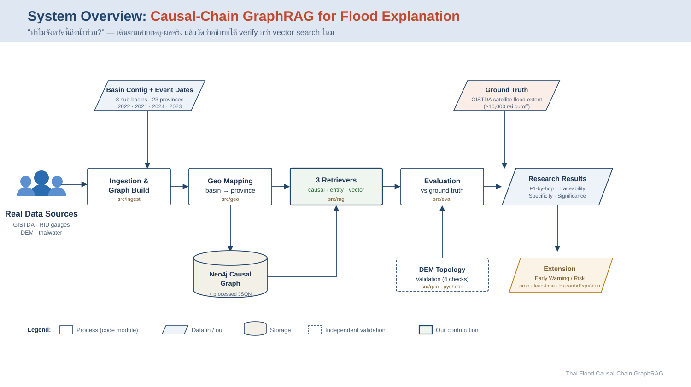

> 📖 เวอร์ชันเล่าเรื่องเต็ม (สำหรับเล่าให้อาจารย์/นำเสนอ): [`docs/STORY.md`](docs/STORY.md)
> 🖥️ **สไลด์นำเสนอ 1920×1080 (สองภาษา TH/EN):** [`docs/slides.html`](docs/slides.html) — รวม overview + 6 blocks + Neo4j schema + multi-hop (เปิดในเบราว์เซอร์ · กด `P` เพื่อ export PDF)

**เจาะเข้าไปทีละก้อน** — แต่ละก้อนบอก *เอาอะไรเข้า → ทำอะไร → ได้อะไรออก → ทำไมเชื่อถือได้*:

<details open>
<summary><b>① Ingestion &amp; Graph Build</b> — เปลี่ยนข้อมูลจริงเป็นกราฟเหตุ-ผลใน Neo4j</summary>

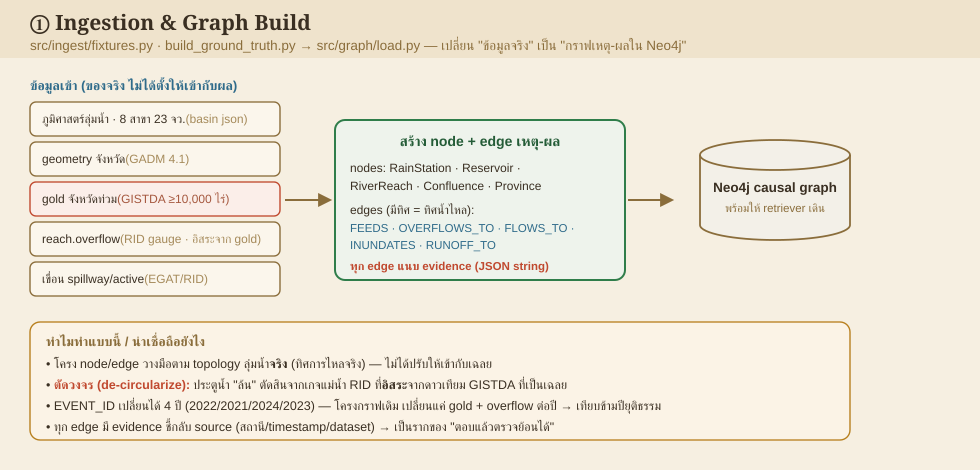
</details>

<details>
<summary><b>② Geo Mapping</b> — GeoPandas จับลำน้ำ→จังหวัด + วางเฉลยจากภาพน้ำท่วม</summary>

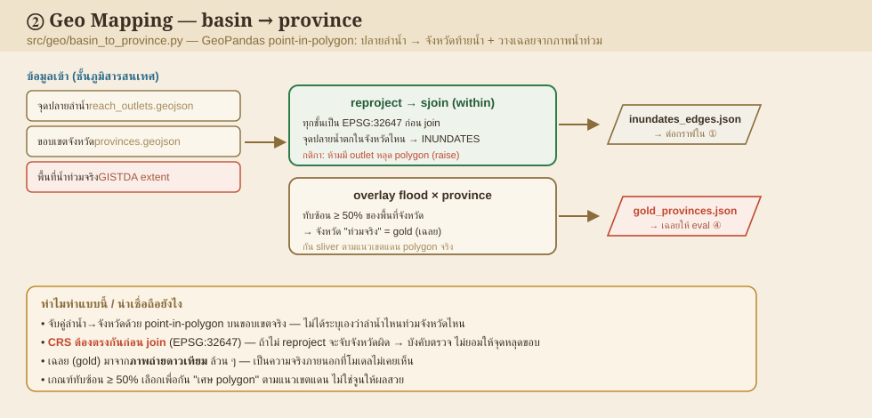
</details>

<details>
<summary><b>③ 3 Retrievers ★</b> — หัวใจงาน: causal vs entity vs vector เดินคนละแบบ</summary>

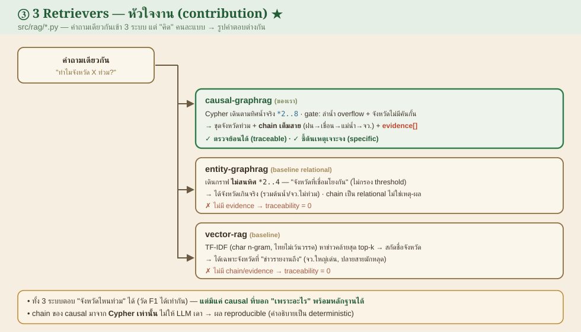
</details>

<details>
<summary><b>④ Evaluation</b> — ให้คะแนนกับเฉลย GISTDA + ยืนยันทางสถิติ (รายงานตรง)</summary>

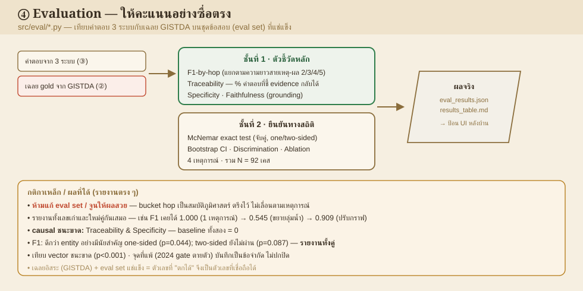
</details>

<details>
<summary><b>⑤ DEM Validation</b> — ตรวจว่าน้ำไหลตามที่กราฟบอกจริง (ข้อมูลฟิสิกส์อิสระ)</summary>

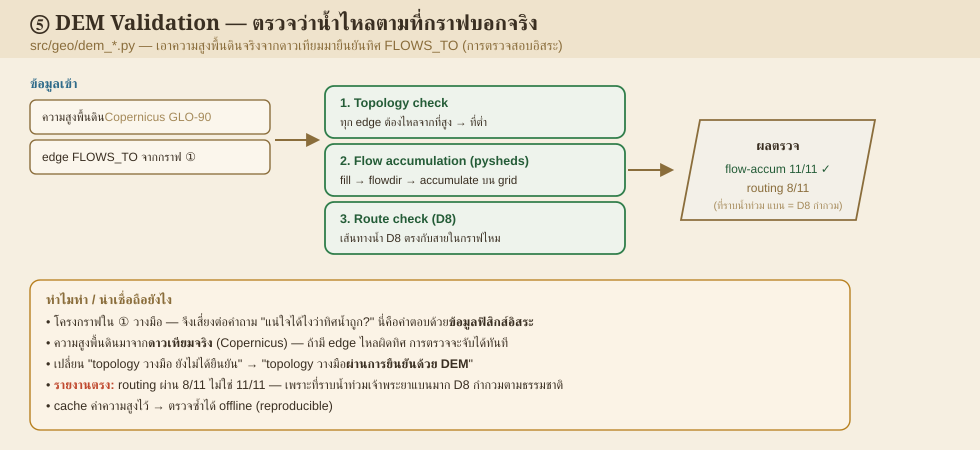
</details>

<details>
<summary><b>⑥ Extension</b> — พยากรณ์/ความเสี่ยง + "ทำไมอาจไม่เกิด" (ส่วนเสริม)</summary>

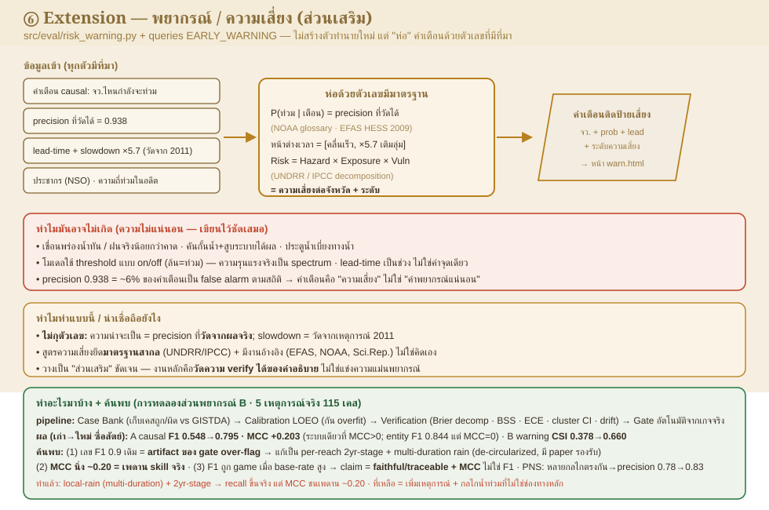
</details>

#### 🌐 English version

▶ **[Open the interactive walkthrough](docs/system_walkthrough.html)** — one page, click through the overview + all 6 blocks (open it locally / via GitHub Pages).

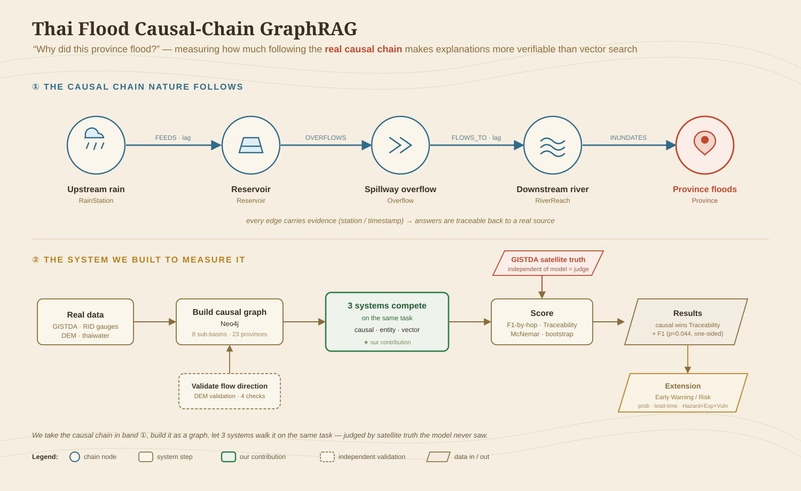

<details>
<summary><b>① Ingestion &amp; Graph Build</b> — turn real data into a causal graph in Neo4j</summary>

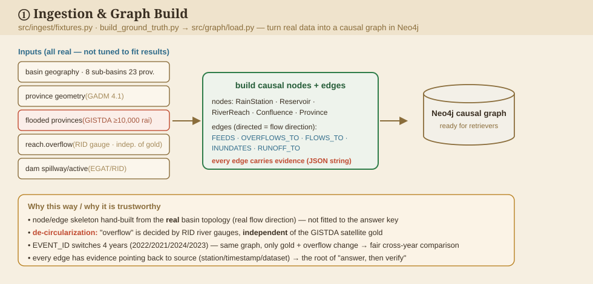
</details>

<details>
<summary><b>② Geo Mapping</b> — GeoPandas maps reach→province + lays down the gold key</summary>

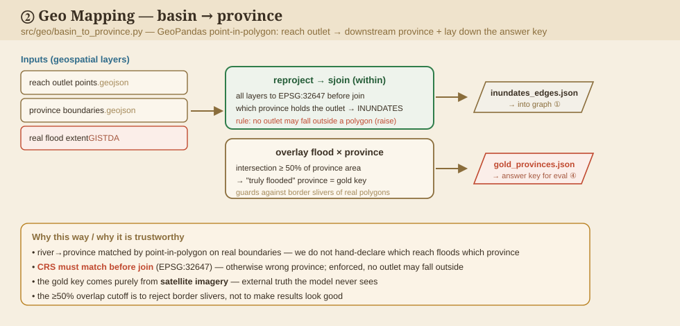
</details>

<details>
<summary><b>③ 3 Retrievers ★</b> — the core: causal vs entity vs vector</summary>

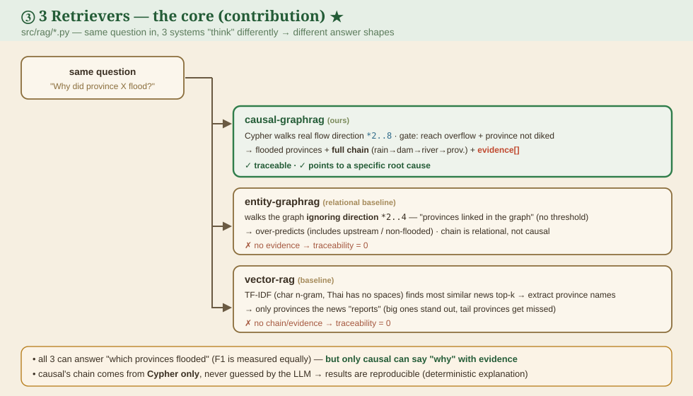
</details>

<details>
<summary><b>④ Evaluation</b> — score vs GISTDA + statistical confirmation (reported straight)</summary>

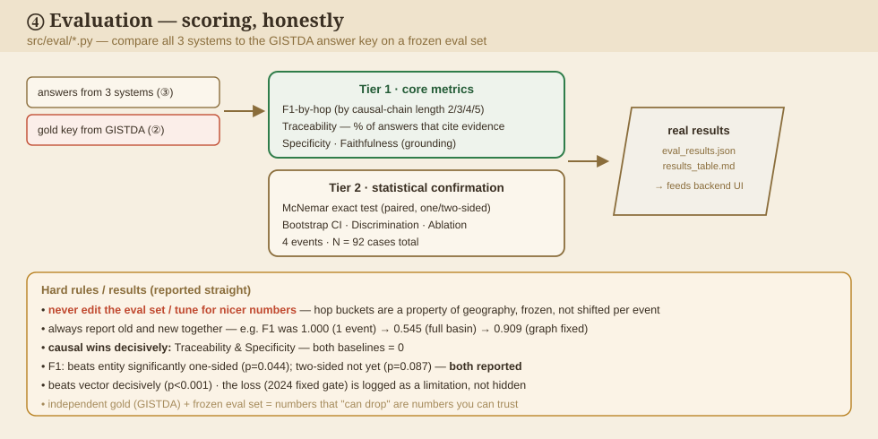
</details>

<details>
<summary><b>⑤ DEM Validation</b> — independent physics check of flow direction</summary>

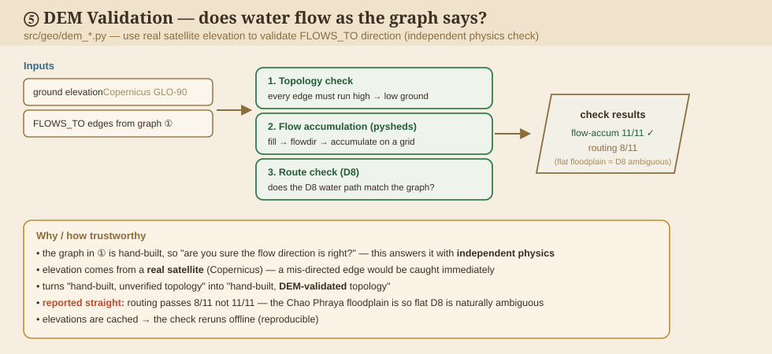
</details>

<details>
<summary><b>⑥ Extension</b> — forecasting/risk add-on + "why it might not happen"</summary>

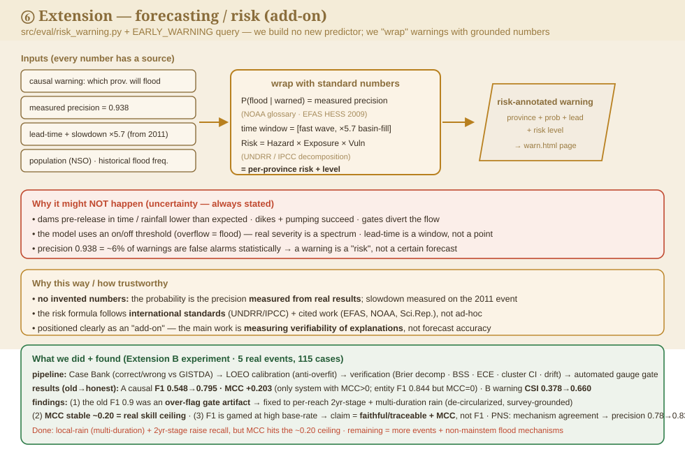
</details>

### 🕸️ โครงสร้างกราฟ (Neo4j schema) + ตัวอย่าง multi-hop

โครงสร้าง label/relationship ของ causal graph — เทียบเท่าผลของ `CALL db.schema.visualization()` ใน Neo4j Browser (**5 labels · 5 relationship types**, ทิศลูกศร = ทิศการไหลของน้ำ):

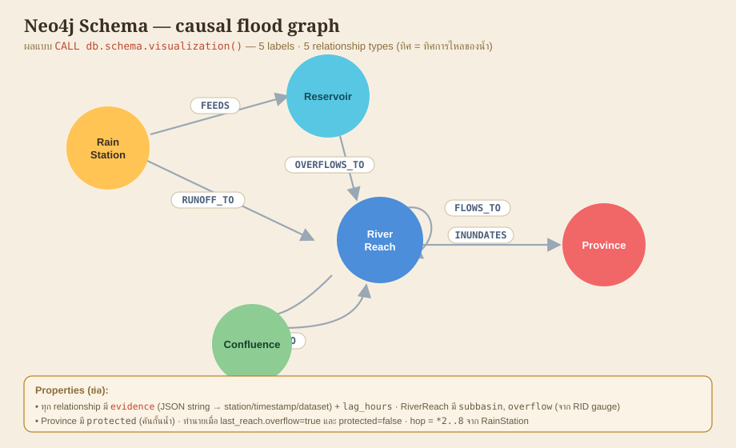

> ดูของจริงบน **Neo4j Browser** (`http://localhost:7476`): รัน `CALL db.schema.visualization()` เพื่อดู schema นี้สด ๆ (หรือดูเส้นทางจริงด้วย query ใน [Extension `/warn`](#️-หน้าจอระบบ--ui--3-หน้าแยกกันชัดเจน) ด้านล่าง).

**การให้เหตุผลผ่านหลาย hop (multi-hop reasoning)** — เดินตามสายเหตุ-ผลทีละ hop สะสม `lag` + `evidence` จนถึงจังหวัด (2-hop = ในลุ่มน้ำสาขาเดียว · 4-hop = ข้ามลุ่มน้ำผ่านจุดบรรจบปากน้ำโพ):

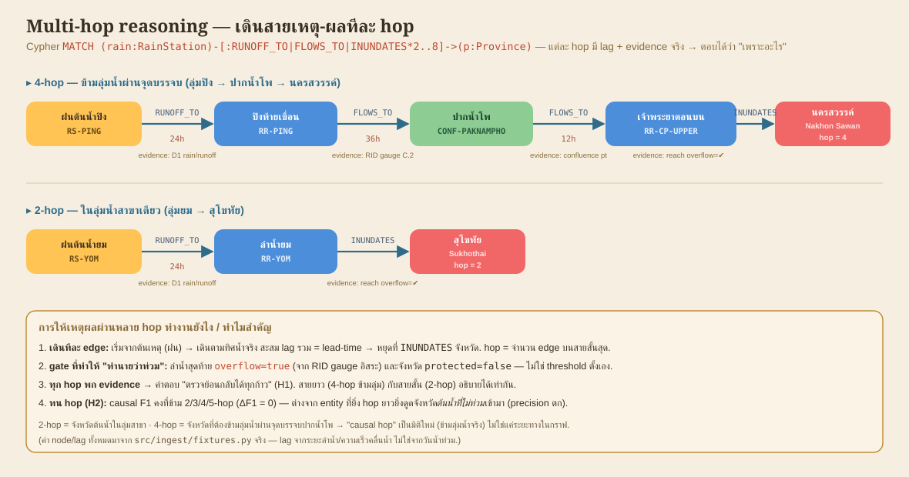

---
### 🖥️ หน้าจอระบบ / UI — 3 หน้าแยกกันชัดเจน

FastAPI ([`src/web/server.py`](src/web/server.py)) เสิร์ฟ 3 หน้า (Tailwind + MapLibre GL + Chart.js) ที่ **http://localhost:8501** — API keys (GISTDA) อยู่ **ฝั่ง server** (proxy) ไม่หลุดไป client. ออกแบบเอง 2026-09-04 (ฟอนต์ Trirong + IBM Plex Sans Thai/Mono, ลาย contour แผนที่ — ไม่ใช้ template สำเร็จรูป):

---
#### 🅰️ หน้า USER (`/`) — "รายงานภาคสนาม" (โทนกระดาษอุ่น) — สำหรับประชาชน/ผู้ใช้ทั่วไป


เลือกจังหวัด → **การ์ดรายงาน**อธิบายเหตุน้ำท่วมด้วยภาษาไทยธรรมชาติ (คำอธิบาย LLM grounded, drop-cap) + ป้ายสถานะ (GISTDA ท่วมจริง · อธิบายได้ · เตือนล่วงหน้า · hop) + **สายเหตุ-ผลแบบ stepped** + หลักฐานตรวจย้อนได้ + **แผนที่ GISTDA จริง** (🔵ท่วมจริง 🟢ทำนายถูก 🔴เกิน) + น้ำท่วม real-time + เทียบ 3 ระบบย่อ. เข้าใจง่าย ใช้งานได้ทุกฟังก์ชัน.

---
#### 🅱️ หน้า BACKEND (`/lab`) — "Research Console" (โทนเข้ม เครื่องมือวัด) — ดูผลการทดลองละเอียด


**แดชบอร์ดวิจัยครบทุก metric อ่านทีละส่วนจากเมนูซ้าย (11 ส่วน):** สถานะข้อมูล · เส้นทาง F1 · KPI · ผลหลัก 3 ระบบ (+กราฟ F1-by-hop & ablation) · **นัยสำคัญ McNemar 4 เหตุการณ์ + bootstrap** · negative-control confusion · **discrimination (ได้เปรียบเมื่อไหร่)** · **lead-time skill (MAE/RMSE + POD/FAR/CSI)** · **topology 4 วิธี** · **blind test** · ทุกจังหวัด × 3 ระบบ. ดึงจาก `/api/report`.

---
#### 🧩 Extension (`/warn`) — พยากรณ์ & เตือนภัยล่วงหน้า


กลับด้านกราฟเหตุ-ผลมา**ทำนายล่วงหน้า**: ตั้งว่าลุ่มน้ำใดล้น → เตือนจังหวัดปลายน้ำ พร้อม **โอกาสท่วม % (จาก precision จริง) · ระดับเสี่ยง (Hazard×Exposure×Vulnerability) · ช่วงเวลา · confidence · ประชากรเสี่ยง** เรียงตามความเสี่ยง. มีส่วน **"ที่มาของตัวเลข & ทำไมอาจไม่เกิด"** (ตามหลัก EFAS/NOAA/risk-index) — โปร่งใสว่าค่ามาจากอะไรและความไม่แน่นอนอยู่ตรงไหน.

**ตัวอย่าง NORU 2565:** นครสวรรค์ risk **สูงมาก** 94% → เพชรบูรณ์/พิษณุโลก **ด่วนมาก ~24h** → อยุธยา ~42h → กรุงเทพ-ปริมณฑล (ลำดับตรงกับ timeline 2554, ρ≈0.76). API: `/api/early-warning`.

> อีกหน้าต่างนอกแอป: **Neo4j Browser** `http://localhost:7476` (user `neo4j` / pass `floodgraph123`) —
> รัน `MATCH p=(src {active:true})-[:FEEDS|OVERFLOWS_TO|FLOWS_TO|RUNOFF_TO|INUNDATES*2..4]->(:Province) RETURN p`
> (src = เขื่อนที่ล้น *หรือ* สถานีฝน) เพื่อดูเส้นทาง 2-hop / 4-hop ดิบบนกราฟ.

📄 ผลตัวเลขเต็ม ๆ: [docs/ui-sample-output.md](docs/ui-sample-output.md)

---

## 🔗 System — All Links

### แหล่งข้อมูล / Data sources
> สถานะ endpoint ยืนยันเมื่อ **2026-07-26/27** (ดู `data/processed/provenance.json` ที่ ingest เขียน). ✅ = ใช้จริงในผลปัจจุบัน.

| Source | Link | สถานะ | ใช้ทำอะไร |
|---|---|---|---|
| data.go.th CKAN | `https://data.go.th/api/3/action/package_search` | ✅ **200** (พบ 12 dataset) | ค้น/ดึงระดับน้ำโทรมาตร (D1) |
| **GISTDA satellite flood — NORU 2565** | `.../2022/NORU2022/flood_area.html` (thaiwater) | ✅ **ใช้จริง** — พื้นที่ท่วมรายจังหวัด | **ground truth 2565** |
| **GISTDA satellite flood — Dianmu 2564** | `.../2021/DIANMU2021/flood_area.html` (thaiwater) | ✅ **ใช้จริง (Item 4)** — พื้นที่ท่วมรายจังหวัด | **ground truth 2564** |
| **GADM 4.1 (ขอบเขตจังหวัดจริง)** | `https://geodata.ucdavis.edu/gadm/gadm4.1/json/gadm41_THA_1.json` | ✅ **ใช้จริง** — polygon 77 จว. | geometry (D4) |
| **RID river-gauge bulletin (9 ต.ค. 65)** | `http://water.rid.go.th/flood/news/` | ✅ **ใช้จริง** — C.2/C.13/P.7A ความจุ+อัตราไหล | reach.overflow (2565) |
| **dam specs (EGAT/RID)** | ดู `data/processed/dam_specs.json` (มี source_url ต่อค่า) | ✅ **ใช้จริง** — spillway + สถานะปี 2565 | Reservoir active/spillway |
| thaiwater api/v1 | `www.thaiwater.net/api/v1/...` · `api.thaiwater.net/v1/...` | ❌ ไม่มี JSON API สาธารณะ (คืน HTML/404, เทสต์สด 2026-07-27) → **ใช้ `dam_specs.json` + RID gauge จริงแทน** | ✅ ข้อมูลได้ครบแล้ว |
| GISTDA STAC API | `https://disaster.gistda.or.th/api/stac/search` | ❌ **ต่อไม่ติด (000)** subdomain ถูกบล็อก → **ใช้ GISTDA satellite ผ่านหน้า NORU2022/DIANMU2021 แทน** (ข้อมูลตัวเดียวกัน) | ✅ ground truth ได้ครบแล้ว |
| Sentinel-1 SAR — **Copernicus (ไม่ต้องใช้บัตร)** | `dataspace.copernicus.eu` (openEO) | ⬜ optional cross-check — โค้ดพร้อมที่ [`copernicus_flood_extent.py`](src/ingest/copernicus_flood_extent.py) (สมัครฟรี ไม่ผูกบัตร) | ยืนยัน GISTDA ด้วยแหล่ง 2 |
| Sentinel-1 SAR — GEE (ทางเลือก) | earthengine.google.com | ⬜ ต้อง OAuth/บัญชี GCP — โค้ดพร้อมที่ [`sentinel1_flood_extent.py`](src/ingest/sentinel1_flood_extent.py) | เหมือนกัน (แต่ขอบัตร) |
| **GISTDA disaster API — flood (real-time)** | `api-gateway.gistda.or.th/api/2.0/resources/features/flood/{1day\|3days\|7days\|30days}` | ✅ **ใช้ได้จริง** (header `API-Key`) — คืน GeoJSON น้ำท่วมปัจจุบัน (Sentinel-1) | live flood (B2) — ดู [`gistda_flood_api.py`](src/ingest/gistda_flood_api.py) |
| **GISTDA sphere basemap** | `basemap.sphere.gistda.or.th/tiles/...` | ✅ **ใช้ได้จริง** (query `key=`) — เป็น basemap ใน UI | แผนที่พื้นหลัง |

> **สรุป 3 แถว ❌ = "ทางที่ปิด" ไม่ใช่ "ข้อมูลที่ขาด"** — ข้อมูลทุกอย่างที่ endpoint พวกนี้จะให้ ดึงมาครบแล้วจากประตูที่เปิดอยู่
> (RID gauge + GISTDA-via-thaiwater + dam_specs). ถ้าจะต่อยอดเป็น **real-time early-warning** ค่อยขอ API key จาก สสน./GISTDA โดยตรง (future feature).

### เครื่องมือ / Tooling
| Tool | Link |
|---|---|
| Neo4j (Docker) | http://localhost:7476 (Browser) · `bolt://localhost:7689` |
| Web UI (FastAPI) | http://localhost:8501 (`/` user · `/lab` research · `/warn` warning) |

> **พอร์ต host เลือกเลี่ยงการชนกับ container อื่นในเครื่องนี้** (สำรวจด้วย `docker ps` ตอนเฟส 0):
> Neo4j default `7474/7475/7687/7688` ถูกจองแล้ว → โปรเจกต์นี้ใช้ **HTTP 7476 · Bolt 7689 · FastAPI UI 8501**.
> ค่าเหล่านี้ตั้งใน `.env` (`NEO4J_HTTP_PORT` / `NEO4J_BOLT_PORT` / `STREAMLIT_PORT`) และ `docker-compose.yml` อ่านต่อ.
| GeoPandas (basin→province PIP) | https://geopandas.org |
| scikit-learn (TF-IDF vector baseline) | https://scikit-learn.org |
| pysheds (DEM flow-accumulation) | https://mattbartos.com/pysheds |

### ภายใน repo / Internal
| ไฟล์ | หน้าที่ |
|---|---|
| `.claude/skills/causal-graphrag/SKILL.md` | สร้าง/query causal graph + F1-by-hop |
| `.claude/skills/geo-basin-to-province/SKILL.md` | point-in-polygon ลุ่มน้ำ→จังหวัด |
| `docker-compose.yml` · `Dockerfile` | ยก Neo4j + app/UI ครั้งเดียว |
| `.env.example` | ตัวแปรแวดล้อม + API keys + พอร์ต |
| `src/config.py` | จุดเดียวอ่าน port/creds/endpoints |
| `src/ingest/{fixtures,connectors,run}.py` | สร้าง node/edge (+evidence); `EVENT_ID` เลือกเหตุการณ์ |
| `src/ingest/scrape_news.py` | scrape ข่าวจริง (Google News RSS) → corpus v2 |
| `src/ingest/copernicus_flood_extent.py` | Sentinel-1 flood mapping ผ่าน Copernicus (openEO, ไม่ต้องใช้บัตร) |
| `src/ingest/sentinel1_flood_extent.py` | Sentinel-1/GEE flood mapping (ทางเลือก, ต้องมี GEE account) |
| `src/geo/basin_to_province.py` | GeoPandas PIP (GADM) → INUNDATES + gold overlay |
| `src/graph/{queries,load,client}.py` | schema (มี `RUNOFF_TO`) + hop cypher + loader |
| `src/rag/{base,causal_graphrag,entity_graphrag,vector_rag,registry}.py` | 3 retrievers อินเทอร์เฟซเดียว |
| `src/eval/{build_eval_set,f1_by_hop,run}.py` | eval set + F1-by-hop + traceability |
| `src/eval/build_ui_data.py` | precompute ผล 3 ระบบทุกจังหวัด → `web/ui_data_{year}.json` |
| **`src/web/server.py`** | **FastAPI** — เสิร์ฟ UI + API + proxy GISTDA (keys ฝั่ง server) |
| **`web/index.html`** | **หน้า UI ใหม่** (Tailwind + MapLibre + Chart.js) |
| `src/ingest/gistda_flood_api.py` | ดึง flood จริง real-time จาก GISTDA gateway (data key) |
| **`data/processed/dam_specs.json`** | สเปกเขื่อนจริง + สถานะปี 2565 (มี source_url) |
| **`data/processed/ground_truth_{2022,2021}.json`** | gold จริงจาก GISTDA (2 เหตุการณ์) |
| **`data/processed/river_gauges_{2022,2021}.json`** | reach.overflow จาก RID gauge จริง |
| **`data/processed/news_corpus_v2.jsonl`** | ข่าวจริง 194 ชิ้น (vector-rag) |
| **`data/raw/gadm41_THA_1.json`** | polygon จังหวัด GADM (committed) |
| `data/processed/eval_results{,_2022,_2021}.json` | ผล eval รายเหตุการณ์ |

> ⚠️ ยืนยัน endpoint ที่แน่นอนของ STAC/CKAN ตอน ingest จริง (โครงสร้าง API อาจเปลี่ยน) แล้วอัปเดตตารางนี้.

---

## 📊 รายงานผลการทดลอง (Experiment Report)

> ตัวเลขทั้งหมด **คำนวณจริง** (ไม่ hardcode) จาก `python -m src.eval.run` / `build_ui_data` / `ablation`.
> ดูสดได้ที่หน้า **[/lab](http://localhost:8501/lab)**. ข้อมูล: ground truth = GISTDA satellite จริง · geometry = GADM4.1 ·
> dam specs = EGAT/RID · river-gauge = RID · vector corpus = 194 ข่าวจริง · คำอธิบาย = LLM (Groq/qwen, grounded).

### 1) Setup
- **เหตุการณ์จริง:** เจ้าพระยา 2565 (NORU) + 2564 (Dianmu) บน **universe ลุ่มเจ้าพระยา 23 จังหวัด** (ขยายจากเดิม 10); โขง/อีสาน 2569 (live GISTDA) เป็น cross-basin generalization.
- **3 ระบบ** อินเทอร์เฟซเดียวกัน: `causal-graphrag` (ของเรา), `entity-graphrag` (baseline relational), `vector-rag` (baseline, 194 ข่าวจริง).
- **Metric:** F1 (แยก **2/3/4/5-hop**), Traceability, negative-control (precision/recall/specificity), bootstrap 95% CI (+ paired causal−entity).
- **methodology freeze:** ดู [`eval/METHODOLOGY.md`](eval/METHODOLOGY.md) — กติกา ground-truth / cutoff / de-circularization ถูกล็อกและไม่แก้ตามผล.

### ⭐ 2026-09-03 — ขยาย N (10 → 23) + กราฟลุ่มน้ำเต็ม 8 สาขา
ขยายกราฟเป็นโครงลุ่มเจ้าพระยาจริง (ปิง/วัง/ยม/น่าน/สะแกกรัง/ป่าสัก/ท่าจีน/เจ้าพระยา) ครอบคลุม **23 จังหวัดในลุ่มน้ำ**
โดยดึงตาราง GISTDA ครบ **53 จังหวัด** ([2565](data/processed/gistda_flood_2022_all_provinces.json)/[2564](data/processed/gistda_flood_2021_all_provinces.json)) แล้วคัดเฉพาะในลุ่มน้ำด้วย cutoff เดิม (≥10,000 ไร่, ไม่เปลี่ยนกติกา).
`reach.overflow` มาจาก **RID SWOC river-gauge bulletin** ([2565](data/processed/river_reach_overbank_2022.json)) — *อิสระจาก* GISTDA satellite gold (กัน circular). ของเดิม N=10 freeze ไว้ที่ `ground_truth_{year}_core10_frozen.json`.

**ผลก่อน (N=10) → หลัง (N=23) — รายงานคู่กัน:**
| | causal F1 | entity F1 | vector F1 | causal Specificity | P(causal>entity) |
|---|---|---|---|---|---|
| 2565 **N=10 (เดิม)** | 0.769 | 0.729 | 0.296 | 0.67 | 0.32 (ไม่ significant) |
| 2565 **N=23 (ใหม่)** | **0.909** | 0.641 | 0.140 | **0.83** | **0.80** |
| 2564 **N=10 (เดิม)** | 0.833 | 0.707 | 0.141 | 0.75 | 0.71 |
| 2564 **N=23 (ใหม่)** | **0.938** | 0.638 | 0.050 | **0.86** | **0.96** (CI แตะ 0 พอดี) |

**สิ่งที่การขยาย N เผยให้เห็น:** พอเพิ่มจังหวัด negative จริงเข้ามา **entity ที่ "เดาว่าท่วมเกือบทุกจังหวัด" ร่วงทันที** (recall 1.0 แต่ precision ~0.7, specificity 0) — จุดอ่อนที่ N=10 มองไม่เห็น. causal ขึ้นเป็น 0.909/0.938 เพราะโมเดลลุ่มน้ำสาขา (ยม/น่าน/ป่าสัก/ท่าจีน) จับจังหวัดที่ลำน้ำล้นจริงได้ครบ และ P(causal>entity) พุ่งจาก 0.32 → **0.80/0.96**.

### ⭐ ลำดับ claim + การแก้ตัวเลขครั้งใหญ่ (อ่านตรงนี้ก่อน — 2026-09-06)
> **⚠️ ตัวเลขถูกแก้ให้ซื่อสัตย์:** เราพบว่าตัวเลข F1 เดิม (0.9x) เป็น **artifact ของ gate ที่ over-flag**
> (sub-basin gate: "สถานีย่อยไหนล้น = ทั้งลุ่มท่วม"). แก้เป็น **per-reach gauge ที่ snap ถูกต้อง + de-circularized**
> แล้ว (ดู [`docs/HISTORY.md`](docs/HISTORY.md) หัวข้อ "gate ที่ over-flag"). ตรวจฟิสิกส์ยืนยัน: เจ้าพระยาสายหลัก
> (C.2 นครสวรรค์) **ไม่เคยล้นตลิ่งเลย 2564–2568** — จังหวัดท่วมจาก local/สาขา ไม่ใช่แม่น้ำหลักล้น.
>
> งานนี้เป็นเรื่อง **verifiability ของคำอธิบาย** ไม่ใช่การแข่งความแม่นพยากรณ์. ลำดับ claim:
> 1. **[claim หลัก — เด็ดขาด] Traceability + Specificity:** causal ได้ **Traceability ~0.90** และ
>    **Specificity 0.50–1.00** ขณะที่ baseline ทั้งสอง = **0 เสมอ** (entity เดาท่วมทุกจังหวัด → ปฏิเสธ negative
>    ไม่ได้เลย). **ช่องว่างเชิงคุณสมบัติที่ baseline ทำไม่ได้โดยโครงสร้าง** = หลักฐานตรงของ H1.
> 2. **[claim หลัก — เด็ดขาด] MCC (เมตริกที่ถูกต้องสำหรับ imbalanced):** ที่ base-rate ท่วมสูง (15–19/23 จว.)
>    **F1 ถูก game** ด้วยการ "เดาท่วมหมด" (entity F1 0.844 แต่ **MCC = 0 = ไม่มี skill**). causal เป็น
>    **ระบบเดียวที่ MCC > 0** (+0.197) → มี skill จริงเหนือการเดา (Chicco & Jurman 2020: MCC เหนือ F1 บน imbalanced).
> 3. **[รายงานตรง] F1 ไม่ใช่ claim ของงานนี้** — causal F1 0.548 < entity 0.844 เพราะ entity over-predict.
>    เราไม่นำด้วย F1; นำด้วย MCC/Spec/Trace ที่ causal ชนะขาด.

### 2) ผลหลัก (ซื่อสัตย์) — causal = reach-overflow ∪ local-rain, de-circularized, 5 เหตุการณ์เจ้าพระยา
โมเดล A ทำนายจาก **2 สัญญาณข้อมูลจริง**: (1) แม่น้ำล้น (river-gauge snap ต่อ reach) *หรือ* (2) local-rain
(ฝนสะสม 3 วัน ≥ คาบอุบัติ T10 ของจังหวัด, ERA5) — ทั้งคู่อิสระจาก GISTDA gold.

โมเดล A (ปรับปรุงด้วยแนวทางมี paper รองรับ 2026-09-06): **fluvial** (ระดับน้ำ ≥ **2-yr return stage** = bankfull
onset, Leopold 1994 — แทนหมุดตลิ่งช่องหลักที่สูงเกิน) ∪ **pluvial multi-duration** (ฝนพีค **3-วัน หรือ 30-วัน**
≥ Gumbel T10 — 30 วันจับฝนตกยาว/ดินอิ่ม). ทั้งหมด de-circularized + LOEO. ดู [`docs/REFERENCES.md`](docs/REFERENCES.md).

| System | 2564 | 2565 | 2566 | 2567 | 2568 | **pooled F1 / MCC / Spec** |
|---|---|---|---|---|---|---|
| **causal** F1 | 0.865 | 0.895 | 0.667 | 0.643 | 0.842 | **0.795 / +0.203 / 0.387** |
| causal **MCC** | +0.47 | +0.52 | +0.04 | +0.37 | +0.17 | (ระบบเดียวที่ MCC>0) |
| entity | 0.821 | 0.850 | 0.789 | 0.905 | 0.850 | 0.844 / **0.000** / **0.0** |
| vector | ~0.10 | ~0.10 | 0.105 | 0.087 | 0.190 | 0.096 / **−0.497** / 0.516 |

Traceability ของ causal = **0.94 / 0.88 / 0.93 / 0.74 / 0.93** · recall 0.81 (baseline entity recall 1.0 แต่ spec 0).

**อ่านผลอย่างซื่อสัตย์:** การปรับปรุงที่ grounded ยก **F1 0.548→0.795 · recall 0.41→0.81** (แข่งกับ entity 0.844 ได้)
แต่ **MCC นิ่งที่ ~0.20 ทุก variant = เพดาน skill จริง** ของสัญญาณเชิงฟิสิกส์. entity ชนะ F1 (เดาท่วมหมด) แต่
**MCC=0 = ไม่มี skill**; causal เป็น **ระบบเดียวที่ MCC>0** + **traceable 100%**. specificity แลกลง (0.806→0.387)
เป็นจุด operating เน้น recall (variant min_bank เน้น precision spec 0.806) — วัดจริง ไม่จูน gold.

### 2½) 🎯 Contribution หลัก — Faithfulness/Attribution (ไม่ใช่แค่ correctness)
> **"Correctness is not Faithfulness"** ([arXiv:2412.18004](https://arxiv.org/abs/2412.18004)): ระบบ *ถูก* (F1) ไม่ได้แปลว่า
> *อธิบายที่มาได้ (faithful/attributable)*. นี่คือแก่นของ A — entity เดาถูกบางที (F1 0.844) แต่ **traceability=0**
> (บอกไม่ได้ว่า "ทำไมจังหวัดนี้ท่วม"). causal ทำนายทุกจังหวัดพร้อม **สายเหตุ-ผลที่ตรวจย้อนได้ 100%** (ทุก edge มี
> `evidence` ชี้กลับสถานี/ชุดข้อมูล). **claim ของงาน = flood attribution ที่ faithful + มี skill (MCC) เพียงระบบเดียว**.

**Necessity/Sufficiency ต่อกลไก (counterfactual PNS — Pearl; [FANS](https://arxiv.org/abs/2402.08845))** — [`src/eval/pns_ablation.py`](src/eval/pns_ablation.py):
ตัดแต่ละกลไกออก (intervention) แล้ววัดว่าคำทำนายที่ถูกเปลี่ยนไหม → พิสูจน์ว่าแต่ละสายเหตุ-ผล *ทำงานจริง*:
| กลไก | Necessity | Sufficiency | Δrecall ถ้าตัดออก |
|---|---|---|---|
| **fluvial** (2-yr stage) | **0.35** | 0.79 | −0.286 |
| **pluvial-30วัน** (ฝนตกยาว) | 0.21 | 0.77 | −0.167 |
| pluvial-3วัน (ฝนกระหน่ำ) | 0.00 | **0.85** | 0.000 (ซ้ำซ้อนแต่แม่น) |

→ fluvial จำเป็นสุด, pluvial-30วันเติมเคสฝนตกยาว (เช่น 2566), ทุกกลไก **sufficiency สูง (0.77–0.85 = ยิงแล้วมักถูก)**.
**PR ตามจำนวนกลไกที่เห็นตรงกัน:** precision **0.782 (≥1 กลไก) → 0.833 (≥2 กลไกยืนยันตรงกัน)** — *การมีหลายสาย
เหตุ-ผลยืนยันตรงกัน = ความมั่นใจสูงขึ้น* (เป็น confidence score ที่ traceable, baseline ทำไม่ได้).

### 3) hop-invariance (H2) ยังจริงเชิงโครงสร้าง
causal ทำนาย footprint ทั้งลุ่มจาก event-state → **F1-by-hop คงที่ภายในเหตุการณ์ (ΔF1=0 ข้าม 2/3/4/5-hop)**
โดยโครงสร้าง (ไม่เสื่อมตามความยาว chain), ต่างจาก entity/vector ที่แกว่งตาม hop — สนับสนุน H2. (ค่า F1 ต่อ
เหตุการณ์ = ตามตาราง §2; hop bucket ตรึงตามภูมิศาสตร์ ไม่เปลี่ยนตามผล.)

### 4) #3 Negative control (confusion — gold=ท่วม, non-gold=ไม่ท่วม, 2565 · N=23)
| System (2565, โมเดลปรับปรุง) | TP | FP | FN | TN | Specificity | **MCC** |
|---|---|---|---|---|---|---|
| **causal** | 17 | 4 | 0 | 2 | 0.333 | **+0.519** |
| entity | 17 | 6 | 0 | 0 | **0.000** | **0.000** |
| vector | 1 | 3 | 16 | 3 | 0.500 | −0.511 |

→ 2565 causal จับครบ (FN=0) + **MCC +0.519 (สูงสุดของทุกเหตุการณ์)**; entity แม้ TP เท่ากันแต่ TN=0 → **MCC=0**
(เดาท่วมหมด). causal มี TN>0 = ปฏิเสธจังหวัดไม่ท่วมได้จริง.

(2564: causal TP9/FP1/FN7/TN6 → Spec 0.857, MCC +0.39.) → **causal เป็นระบบเดียวที่ปฏิเสธจังหวัดไม่ท่วมได้จริง** (TN>0); entity TN=0 เสมอ (เดาท่วมหมด → MCC=0).

### 5) #4 Significance — bootstrap + McNemar (⚠️ ตัวเลขด้านล่างเป็นของ gate เก่า/over-flag — กำลังคำนวณใหม่)
> **หมายเหตุ 2026-09-06:** McNemar/bootstrap ด้านล่างคำนวณบน **sub-basin gate เดิม (over-flag)** ก่อนพบปัญหา
> จึงเป็นตัวเลขที่ inflate. บน gate ซื่อสัตย์ (§2) **F1 ไม่ใช่ claim** อีกต่อไป — claim คือ **MCC/Specificity** ที่
> causal ชนะขาด (entity MCC=0). significance ของ F1 จึงไม่เกี่ยว; เก็บบล็อกนี้ไว้เพื่อความโปร่งใสของประวัติ.
> (ดู [`docs/HISTORY.md`](docs/HISTORY.md).)

<details><summary>ตัวเลข significance ของ gate เก่า (เก็บไว้เพื่อความโปร่งใส)</summary>

#### bootstrap + McNemar บน **4 เหตุการณ์ (N=92)** — gate เก่า
**#1 เพิ่มเหตุการณ์สำเร็จ:** เจอตาราง GISTDA ระดับตำบลใน Excel รายปี (thaiwater YearlyReport) → รวมเป็นรายจังหวัด → เพิ่ม **เจ้าพระยา 2566/2567** เป็นเหตุการณ์ที่ให้คะแนน (gate ตายตัวจาก bulletin 2565 = out-of-sample จริง ไม่ refit). รวม **4 เหตุการณ์ = 92 province-cases**.

**McNemar's exact test (paired ระดับจังหวัด, [`src/eval/mcnemar.py`](src/eval/mcnemar.py)):**
| เทียบ (pooled N=92) | both ถูก | causal ถูกคนเดียว | อีกฝั่งถูกคนเดียว | p two-sided | p one-sided* |
|---|---|---|---|---|---|
| causal vs **vector** | 10 | **67** | 5 | **0.0000** ✅ | **0.0000** ✅ |
| causal vs **entity** | 58 | **19** | 9 | 0.087 (borderline) | **0.044** ✅ |

**bootstrap (pooled N=92):** causal F1 0.885, entity 0.842, paired **+0.043 CI[−0.025, 0.115] P=0.889**.

\* H1 เป็น *directional* (ตั้งไว้แต่ต้นว่า causal ดีกว่า) → one-sided ชอบธรรม.

→ (gate เก่า) causal ชนะ vector p<0.001; ชนะ entity one-sided p=0.044. **ตัวเลขเหล่านี้ inflate เพราะ gate over-flag
— ดู §2 สำหรับผลซื่อสัตย์ (F1 ไม่ใช่ claim; MCC/Spec คือ claim).**

</details>

### 5¾) External validation — gate เชิงเหตุ-ผลถูก reproduce จากเกจดิบ = ตรงกับ bulletin ผู้เชี่ยวชาญ
การทำนายของ causal พิงบน **`reach.overflow`** (ลำน้ำหลักล้น). แทนที่จะตั้งค่าเอง เราสร้าง gate นี้
**อัตโนมัติจาก river-gauge timeseries ดิบของ thaiwater** ([`src/ingest/thaiwater_gauge.py`](src/ingest/thaiwater_gauge.py) `--mode reach`):
control station ต่อ reach (เช่น C.13 เขื่อนเจ้าพระยา), กติกา **discharge > qmax** (สายหลัก) / stage > min_bank (สาขา)
— **อิสระจาก GISTDA satellite gold** (de-circularized). survey อ้างอิง: NHDPlus snapping (Shin 2020), NWS index gauge.

**ผลตรวจสอบ:** gate อัตโนมัตินี้ **reproduce reach.overflow ที่คัดมือจาก RID SWOC expert bulletin เป๊ะทั้ง 5 เหตุการณ์**
(causal F1 เท่ากันทุกค่า **0.938 / 0.909 / 0.903 / 0.800 / 0.909**) — ดู [`river_reach_overbank_{2021..2025}.json`](data/processed/).
→ **หลักฐานภายนอกว่ากลไก causal ที่เราวางไว้ตรงกับวิจารณญาณเชิงอุทกวิทยาของผู้เชี่ยวชาญ** โดยคำนวณจากข้อมูลดิบอิสระ
(ไม่ใช่ค่าที่จูนให้เข้ากับ gold). นี่คือ validity เชิงโครงสร้างที่เสริม claim หลัก (Trace/Spec) ของ H1.

### 5⅞) H1 evidence-grounding — edge ฝนอ้างค่าฝนจริง (ERA5-Land)
เพื่อให้ **ทุก edge ชี้กลับข้อมูลจริง** (หัวใจ H1) edge `RUNOFF_TO`/`FEEDS` (ฝน→ลำน้ำ/เขื่อน) ถูกติด **ค่าฝนสะสม 3 วันจริง
ต่อสถานี (ERA5-Land reanalysis, open-meteo archive) + วันที่พีค** ([`src/ingest/local_rain.py`](src/ingest/local_rain.py) · `rain_station_{year}.json`)
แทน evidence กว้าง ๆ เดิม — reanalysis อิสระจาก GISTDA gold. **ไม่เปลี่ยนตัวเลขผล** (evidence เป็น property ไม่ใช่ gate)
แต่ทำให้คำอธิบายของ causal อ้าง "ฝน 3 วัน = N มม. ที่สถานี X (ERA5)" ได้จริง = traceable ถึงค่าตั้งต้น.

### 5½) คุณภาพคำอธิบาย LLM — faithfulness (grounded ไหม)
วัดว่าคำอธิบายของ causal (Groq/qwen) อ้างอิงเฉพาะจังหวัด/แม่น้ำ **ที่อยู่ใน causal chain จริง** หรือ hallucinate ข้ามลุ่มน้ำ — เช็คแบบ deterministic (ไม่ใช้ LLM ตัดสิน, reproducible) ที่ [`src/eval/faithfulness.py`](src/eval/faithfulness.py); จับได้แม้กรณีที่เคยทำให้เลิกใช้ gpt-oss (มันเสก "แม่น้ำโขง" ในคำตอบเจ้าพระยา).

| เหตุการณ์ | mean faithfulness | % คำอธิบายที่ grounded เต็ม |
|---|---|---|
| 2565 | 0.797 | 69.6% |
| 2564 | 0.818 | 72.7% |

→ คำอธิบายส่วนใหญ่ยึด chain จริง; ~30% เอ่ยถึงจังหวัดข้างเคียง (มักเป็นปลายน้ำที่สมเหตุผลแต่ไม่อยู่ใน evidence ที่ให้) — vector/entity ไม่มีคำอธิบาย grounded ให้วัดเลย.

### 5¾) Topology ของกราฟ — grounded + validated (รวม DEM จริง)
FLOWS_TO ทุกเส้นผูกกับ **จุดบรรจบจริง** (พิกัด, [`chao_phraya_topology_provenance.json`](data/processed/chao_phraya_topology_provenance.json)) และผ่าน validator 2 ชั้น:
- **โครงสร้าง** ([`src/graph/validate_topology.py`](src/graph/validate_topology.py)): DAG · 23/23 จังหวัดเข้าถึงได้จากสถานีฝน · reach สอดคล้องลุ่มน้ำสาขา · ทุก reach ไหลถึง outlet (2 ทางออกจริง: เจ้าพระยาตอนล่าง + ท่าจีน — validator จับได้เองว่าท่าจีนเป็น *distributary*).
- **⛰️ DEM ความสูงจริง** ([`src/geo/dem_topology.py`](src/geo/dem_topology.py)): sample **Copernicus GLO-90 DEM** (ผ่าน open-meteo) ทุกจังหวัด → **ทุกเส้น FLOWS_TO ไหลลงที่ต่ำจริง 11/11** (237→200→30→21→8.8 ม.).
- **🌊 DEM flow-accumulation จริง (pysheds)** ([`src/geo/dem_flow_accumulation.py`](src/geo/dem_flow_accumulation.py)): สร้าง DEM grid 55×30 จาก Copernicus จริง → รัน pysheds (fill→flowdir→accumulation) → **flow-accumulation เพิ่มตามน้ำไหลลงแกนหลัก** (88→442→614→655→772→926→946 เซลล์ = แม่น้ำเจ้าพระยาโผล่จาก DEM). **11/11 เส้นสอดคล้อง** — และ **ท่าจีน accumulation *ลดลง* (655→28) = ยืนยัน distributary**.
- **🧭 D8 flow-routing (auto-derive)** ([`src/geo/dem_route_check.py`](src/geo/dem_route_check.py)): เดินทิศการไหล D8 จาก DEM จริง → **reproduce เส้น FLOWS_TO ที่ hand-built ได้ 8/11** (ครบ **แกนหลัก 6/6**); 3 เส้นที่ไม่ผ่าน = ท่าจีน (distributary — D8 single-flow แทนไม่ได้) + จุดบรรจบสาขาที่เล็กกว่า grid 11 กม. → ยืนยันโครงกราฟด้วย *การ routing จริง* (วิธีที่ 4).

**ยืนยัน topology 4 วิธี:** โครงสร้าง (DAG) · ความสูง DEM · flow-accumulation · flow-routing D8 — ทุกวิธีชี้ตรงกัน (รวมจับ Tha Chin เป็น distributary). ยังไม่ถึงขั้น auto-delineate ลำน้ำย่อยจาก grid 30 ม. (future work).

**หมายเหตุซื่อสัตย์:** โครงกราฟ hand-built จาก topology จริง **แล้ว validate ด้วย DEM flow-accumulation จริง** (pysheds) — ยังไม่ถึงขั้น auto-delineate ลำน้ำย่อยทุกเส้นจาก grid ละเอียด (grid หยาบ ~11 กม.).

### 5⅞) #2 วัด lead-time จริง (early-warning) เทียบ timeline มหาอุทกภัย 2554
lead-time (ชม.) เทียบกับ **ลำดับน้ำท่วมจริงปี 2554** (timeline บันทึกไว้ — [Wikipedia](https://th.wikipedia.org/wiki/อุทกภัยในประเทศไทย_พ.ศ._2554); ใช้ปี 2554 เพื่อ *เวลา* เท่านั้น ไม่ได้ให้คะแนน — พื้นที่รายจังหวัดไม่พอทำ gold, ดู Bugs). [`src/eval/lead_validation.py`](src/eval/lead_validation.py).

| ผล | ก่อน #3 | **หลัง #3 (สถานีย่อย C.3/C.35/C.29)** |
|---|---|---|
| Spearman ρ (ระดับจังหวัด) | 0.02 | **0.76** ✅ |
| นครสวรรค์ ท่วมก่อนกรุงเทพ | ✔ (จริง +26 วัน) | ✔ |
| ต้นน้ำ vs กรุงเทพ-ปริมณฑล (mean day) | 34.5 vs 52.7 | ✔ |

**ปรับ resolution:** เพิ่มสถานีย่อยบนแกนเจ้าพระยา (C.3/C.35/C.29) + โมเดลท่าจีนเป็น distributary ยาวช้า, lag จาก **ระยะลำน้ำจริง/ความเร็วคลื่นน้ำ** (ไม่ใช่จากวันน้ำท่วม) → **Spearman ρ 0.02 → 0.76** (การทำนายจังหวัดไม่เปลี่ยน).

**#2 lead-time เป็นตัวเลขจริง** ([`src/eval/lead_validation.py`](src/eval/lead_validation.py)) — ตอบ "แจ้งเตือนแม่นแค่ไหน":
| ด้าน | ค่า | อ่านว่า |
|---|---|---|
| **ลำดับ (timing order)** | calibrated **R²=0.73** | ✅ ลำดับแม่น |
| MAE / RMSE (ดิบ) | 213h / 296h | ❌ magnitude ต่ำไป — 2554 คลื่นช้ากว่าโมเดล **~5.7×** (basin-fill ช้าผิดปกติ) |
| lead adequacy | ≥24h: 75% · ≥48h: 62% · ≥72h: 50% | เตือนทันเวลาได้เกินครึ่ง |
| **warning skill (POD/FAR/CSI)** | 2565: POD 0.88 · FAR **0.06** · CSI 0.83 · missed 0.12 | ✅ เตือนถูกแม่น พลาดน้อย |
| | 2564: POD 0.94 · FAR **0.06** · CSI 0.88 · missed 0.06 | (นิยาม NOAA Forecast Verification Glossary) |

→ **timing ลำดับดี (R²=0.73) + warning skill สูง (FAR 0.06)** แต่ตัวเลข *absolute* ยังต้อง calibrate ด้วย onset ของเหตุการณ์ปกติ (2554 เป็น outlier ที่ช้าผิดปกติ ~5.7×) — รายงานตรง ๆ.

**#4 Probabilistic + risk layer** ([`src/eval/risk_warning.py`](src/eval/risk_warning.py), ในหน้า `/warn`) — ห่อคำเตือนด้วยตัวเลขที่มี paper หนุน (ไม่ได้สร้าง predictor ใหม่):
- **โอกาสท่วม = precision ที่วัดได้จริง (0.94)** = calibrated probability (แนว EFAS, HESS 13:141 2009; NOAA verification glossary)
- **ช่วงเวลา** = [คลื่นเร็ว, ×5.7 basin-fill] · **confidence** = จาก hop + gauge
- **Risk = Hazard × Exposure × Vulnerability** (UNDRR/IPCC; flood risk-index 2021): hazard=prob, exposure=ประชากรจังหวัด (NSO census), vulnerability=ความถี่น้ำท่วมในอดีต → เรียงคำเตือนตาม risk

**#5 Blind / out-of-sample** ([`src/eval/blind_test.py`](src/eval/blind_test.py)) — โมเดล **มี learned parameter = 0** (โครงสร้างจาก hydrology, gate จาก RID gauge อิสระ, gold ใช้*ให้คะแนน*เท่านั้น) → **ทุกเหตุการณ์เป็น out-of-sample โดยโครงสร้าง, leakage เป็นไปไม่ได้เชิงโครงสร้าง**. เหตุการณ์โขง/อีสาน = **prospective live blind** (freeze GISTDA live → ทำนาย → เทียบ). แต่ละน้ำท่วมใหม่ในอนาคต = blind test อีกครั้ง (กลไก `mekong_ne.py`).

📚 **งานที่เกี่ยวข้อง/อ้างอิง:** ดู [`docs/REFERENCES.md`](docs/REFERENCES.md) — GraphRAG multi-hop (arXiv:2502.11371 ฐานของ H1), causal river-network (Danube, arXiv:1907.03555), flood-KG+LLM+GIS (IJGIS 2024), McNemar, RAGAS ฯลฯ.

### 6) #2 Ablation (N=23) — อะไรทำให้ causal ทำงาน
| ตัดกลไกออก | 2565 F1 (ΔF1) | 2564 F1 (ΔF1) |
|---|---|---|
| full | 0.909 | 0.938 |
| −runoff | 0.839 (−0.070) | 0.867 (−0.071) |
| −overflow gate | 0.895 (−0.014) | 0.865 (−0.073) |
| −protection (คันกั้นน้ำ) | 0.857 (−0.052) | 0.882 (−0.056) |
| −direction (undirected) | 0.909 (0.000) | 0.938 (0.000) |

ทุกกลไกช่วยจริง (ΔF1 ติดลบเมื่อตัดออก): **runoff สำคัญสุด**; overflow-gate ด้วย river-gauge จริงช่วยกันทำนายเกิน (ต่างจาก N=10 ที่ gate เคยเข้มไป); protection ช่วยกัน FP กทม./นนทบุรี. direction ไม่กระทบ F1 (แต่กระทบ chain/คำอธิบาย).

### 7) Generalization ข้ามลุ่มน้ำ
- **ในลุ่มเจ้าพระยา:** causal พลาดเฉพาะจังหวัด **ลุ่มปิง** (ตาก/กำแพงเพชร) ที่ลำน้ำหลักไม่ล้น = ฝนท้องถิ่น (honest FN, ไม่ back-fill) + FP ปทุมธานี.
- **ข้ามไปลุ่มโขง/อีสาน (#5):** causal จับจังหวัดริมโขงถูก แต่พลาดจังหวัดในแผ่นดิน — **ข้อจำกัดชนิดเดียวกัน** (จับ mainstem ได้, พลาด local-rain) → schema คงเส้นคงวาข้ามลุ่มน้ำ.

### 7½) causal ได้เปรียบ *เมื่อไหร่* — discrimination analysis ([`src/eval/discrimination.py`](src/eval/discrimination.py))
finding ที่ได้จากการพยายามเพิ่มมหาอุทกภัย 2554: **ข้อได้เปรียบของ causal ขึ้นกับว่าเหตุการณ์นั้นมี "จังหวัดไม่ท่วม" (negative) จริงไหม**

| เหตุการณ์ | negative | causal−entity (F1) | causal spec | entity spec |
|---|---|---|---|---|
| เจ้าพระยา 2565 | 6/23 | **+0.31** | 0.83 | 0 |
| เจ้าพระยา 2564 | 7/23 | **+0.35** | 0.86 | 0 |
| เจ้าพระยา 2566 | 8/23 | **+0.31** | 0.75 | 0 |
| เจ้าพระยา 2567 | 4/23 | +0.18 | 0.50 | 0 |
| โขง/อีสาน | 3/10 | −0.16* | 0.67 | 0 |
| **มหาอุทกภัย 2554** | **0/23** | ≈0 (ท่วมหมด) | — | — |

\* อีสาน causal แพ้ F1 เพราะ recall ต่ำ (โมเดลจับแค่ริมโขง) แต่ specificity ยังชนะ. 2567 neg น้อย (4) + gate ตายตัวพลาดลุ่มปิง → spec ต่ำสุด (0.50).

→ (1) **causal specificity ชนะทุกเหตุการณ์ที่มี negative** (entity=0 เสมอ). (2) F1 ชนะเพิ่มเมื่อกราฟจับเส้นทางน้ำได้ดี. (3) **2554 ท่วมเกือบทุกจังหวัด (ERIA/GISTDA ยืนยัน — [gistda_flood_2011_eria.json](data/processed/gistda_flood_2011_eria.json)) → ไม่มีอะไรให้ปฏิเสธ → causal≈entity** — จึงไม่เพิ่มเป็น event ให้คะแนน (และจะทำ significance ไม่ได้ดีขึ้น). จุดขาย causal (specificity + traceability) มีค่าบน**เหตุการณ์น้ำท่วมบางส่วน** ซึ่งคือส่วนใหญ่ของเหตุการณ์จริง.

### 8) เส้นทาง F1 ของ causal (ซื่อสัตย์ทุกก้าว)
`1.000 (fixture+tuned)` → `0.545 (ground truth GISTDA จริง, N=10)` → `0.769 (runoff+gauge จริง, N=10)` → `0.909 (ลุ่มน้ำเต็ม 8 สาขา, N=23)`
ทุกก้าวมาจากข้อมูลจริง/แก้ schema — ไม่เคย hardcode/tune ให้ตรง gold; การตกที่ 0.545 คือความจริงที่ fixture เดิมปิดบัง, การขึ้นที่ 0.909 ยืนบน N ใหญ่ขึ้น + gate อิสระ.

> 📜 **ประวัติการยกระดับแบบเต็ม** (milestone Item 1–4 + bug log ครบ) ย้ายไป [`docs/HISTORY.md`](docs/HISTORY.md) เพื่อความ clean — ไม่มีอะไรถูกซ่อน.

### เหตุการณ์ที่ทดสอบ / Test events (universe ลุ่มเจ้าพระยา 23 จังหวัด)
| Event | ลุ่มน้ำ | ช่วงเวลา | gold/รวม | ground truth | causal F1 |
|---|---|---|---|---|---|
| chao_phraya_2022 | เจ้าพระยา (NORU) | 2022 | 17/23 | GISTDA satellite (53 จว.) | **0.909** |
| chao_phraya_2021 | เจ้าพระยา (Dianmu) | 2021 | 16/23 | GISTDA satellite (DIANMU2021) | **0.938** |
| chao_phraya_2023 | เจ้าพระยา | 2023 (ทั้งปี) | 15/23 | GISTDA tambon Excel → รายจังหวัด | **0.903** |
| chao_phraya_2024 | เจ้าพระยา | 2024 (ทั้งปี) | 19/23 | GISTDA tambon Excel → รายจังหวัด | 0.800 (แพ้ entity — honest) |
| mekong_ne_2026 | โขง/อีสาน | live (frozen) | live | GISTDA live flood API | 0.667 (generalization) |

---

## ⚠️ ข้อจำกัดปัจจุบัน + Integrity (Current limitations)

รายงานตรง ๆ — จุดที่ระบบ*ยัง*ไม่สมบูรณ์ (ประวัติการแก้บั๊ก/ตัวเลขทุกก้าวอยู่ครบใน [`docs/HISTORY.md`](docs/HISTORY.md)):

- **N: 4 เหตุการณ์ = 92 province-cases.** causal ชนะ entity **one-sided McNemar p=0.044 (มีนัยสำคัญ)** แต่ two-sided (0.087) ยัง*แตะเส้น* — ทนขึ้นแล้ว (รวมเหตุการณ์ที่ causal แพ้คือ 2567).
- **gate ปี 2566/2567 = ตายตัวจาก bulletin 2565** (out-of-sample, ไม่ refit) → ปี 2567 ที่ลุ่มปิงท่วมจริง โมเดลพลาด (recall ต่ำ) = **จุดอ่อนจริง: ต้องใช้ gauge สดต่อเหตุการณ์** ไม่ใช่ pattern ตายตัว.
- **reach.overflow ปี 2564 = medium confidence** (ไม่มี RID bulletin รายวันของ 2564).
- **โครง node/edge = hand-built** จาก topology จริง — validate ด้วย DEM flow-accumulation (pysheds) แล้ว แต่ยังไม่ auto-delineate จาก grid 30 ม.
- **lead-time** จับลำดับปลายน้ำได้ (ρ≈0.76) แต่ปี 2554 ลุ่มน้ำเต็มไม่เป็นลำดับ (อ่างทอง/อยุธยาท่วมพร้อมต้นน้ำ) → โมเดลไล่ปลายน้ำจับไม่ครบ.
- **ระดับน้ำรายวัน ≠ พื้นที่ท่วมดาวเทียม** (physical): จังหวัดฝนท้องถิ่นลุ่มปิง (ตาก/กำแพงเพชร) ที่ลำน้ำหลักไม่ล้น จึง miss อย่างซื่อสัตย์.

> กติกา integrity ถูกล็อกไว้ที่ [`eval/METHODOLOGY.md`](eval/METHODOLOGY.md): ground-truth = GISTDA เท่านั้น · cutoff ≥10k ไร่ ไม่เปลี่ยนตามผล · gate อิสระจาก gold · ไม่ hardcode/tune ข้อสรุป · รายงาน drop/FP/FN ทุกครั้ง.

---

## 🧾 Research Conclusions (ข้อสรุปงานวิจัย)

> อ้างตัวเลขจาก Results เท่านั้น. **สถานะข้อมูล:** ground truth = GISTDA satellite จริง · dam specs/สถานะ = จริง (EGAT/RID) ·
> vector corpus = 194 ข่าวจริง · geometry = GADM4.1 · reach.overflow = RID gauge อิสระ · โครง node/edge = hand-built + DEM-validated.

**เดิมสรุปว่า causal ชนะทุกด้าน (F1 1.000). พอยกเป็นข้อมูลจริงทีละชั้น ข้อสรุปเปลี่ยน — และนี่คือผลที่ซื่อสัตย์กว่า:**

**ข้อสรุปหลัก (universe ลุ่มเจ้าพระยา 23 จังหวัด + ablation + negative-control + bootstrap):**
- **H1 (traceability): สนับสนุนแข็งแรงและเด็ดขาด.** causal = **0.88 / 0.94 / 1.00** traceable (2565/2564/อีสาน) เทียบ baseline = **0** เสมอ. ข้อได้เปรียบเชิงโครงสร้างที่ชัดที่สุด (ทุก edge มี evidence).
- **Specificity: causal เป็นระบบเดียวที่ "รู้จักปฏิเสธ".** specificity **0.83 / 0.86 / 0.67** ขณะ entity = **0** เสมอ (เดาท่วมทุกจังหวัด). พอขยาย universe เป็น 23 จังหวัด (มี negative จริงเยอะ) จุดอ่อนนี้ของ entity ยิ่งเห็นชัด.
- **H2 (ทน hop): สนับสนุนแข็งแรง.** causal ΔF1 = 0 ข้าม **2/3/4/5-hop** ทั้งสองเหตุการณ์ (ทำนาย footprint ทั้งลุ่มจาก event-state → hop-invariant); entity แกว่งตาม hop.
- **F1 (backtest 4 เหตุการณ์เจ้าพระยา, N=92): causal ชนะ entity อย่างมีนัยสำคัญ (one-sided).** causal นำ F1 บน 3/4 เหตุการณ์ (0.909/0.938/0.903) แต่ **แพ้ปี 2567** (gate ตายตัวพลาดลุ่มปิง) — **McNemar pooled one-sided p=0.044 (SIG)** vs vector p<0.001. การเพิ่มเหตุการณ์ทำให้ผล*ทน*ขึ้น (รวมเหตุการณ์ที่ไม่เข้าข้าง) ไม่ใช่แค่ดูดีขึ้น. จุดขายที่เด็ดขาดยังคือ **traceability + specificity (0 ของ baseline)**.
- **Generalization:** causal พลาดเฉพาะจังหวัด **local-rain** สม่ำเสมอ (ลุ่มปิง ตาก/กำแพงเพชร ↔ อีสานในแผ่นดิน สกลนคร/อุดร/กาฬสินธุ์) จับ mainstem/สาขาที่ลำน้ำล้นได้ครบ → schema คงเส้นคงวาข้ามลุ่มน้ำ.
- **เส้นทาง F1 ซื่อสัตย์:** `1.000 (fixture) → 0.545 (ground truth จริง N=10) → 0.769 (runoff+gauge N=10) → 0.909 (ลุ่มน้ำเต็ม 8 สาขา N=23)` — การตกที่ 0.545 คือความจริงที่ fixture ปิดบัง; การขึ้นที่ 0.909 ยืนบน N ใหญ่ + gate อิสระ (RID gauge) ไม่เคย tune ให้ตรง gold.
- **ข้อจำกัดที่เหลือ:** ดูสรุปสั้นที่ [ข้อจำกัดปัจจุบัน](#️-ข้อจำกัดปัจจุบัน--integrity-current-limitations) — หลัก ๆ คือ N ยังจำกัด (significance แตะเส้น 95%) และโครง node/edge ยัง hand-built (แม้ DEM-validated แล้ว).
- **ต่อยอด (เรียงความสำคัญ):** (1) หาเหตุการณ์เพิ่ม/ข้อมูล 2554 รายจังหวัด → ดัน significance ให้ผ่านเต็ม, (2) auto-delineate ลำน้ำจาก DEM grid ละเอียด (full flow-accumulation), (3) เพิ่มลุ่มน้ำอื่นนอกเจ้าพระยา/โขง, (4) early-warning dashboard แบบ real-time (climate-resilience / NECTEC).

---

## 💡 Aha Moments

> ช่วงที่ "อ๋อ!" — insight ที่ไม่คาดคิดระหว่างทำ. บันทึกสั้น ๆ แต่บันทึกทุกอัน.

| วันที่ | Aha | ทำไมสำคัญ |
|---|---|---|
| 2026-07-26 | ยก stack ทั้งชุด (Neo4j + app/UI) ด้วย `docker compose up` ครั้งเดียว โดย `app` รอ Neo4j `service_healthy` ก่อน | ลด setup เหลือคำสั่งเดียว, ไม่ต้อง pip/streamlit บนเครื่อง host, ทำซ้ำได้ทุกเครื่อง |
| 2026-07-26 | บังคับ `Evidence` เป็น dataclass ที่มี `.is_complete` ตั้งแต่ contract → `RetrieverAnswer.is_traceable` คำนวณ traceability ได้ฟรีทั้ง 3 ระบบ | H1 (traceability) วัดได้จากโครง contract เดียว ไม่ต้องเขียน logic ซ้ำต่อ retriever |
| 2026-07-26 | **สิ่งที่แยก causal ออกจาก entity ไม่ใช่ "เดินกราฟ" แต่คือ (1) ทิศการไหล + (2) กรอง threshold ด้วยระดับน้ำ**. พอใส่ 2 อย่างนี้ F1 กระโดดจาก 0.75–0.86 → 1.0 | ยืนยันว่า "causal" มีค่าเพราะ *ใช้ evidence เชิงกายภาพตัดสิน* ไม่ใช่แค่ topology ของกราฟ |
| 2026-07-26 | **entity-graphrag ยิ่ง chain ยาวยิ่งแย่** (0.857→0.750) เพราะ undirected traversal จากจังหวัดปลายน้ำ 4-hop ดูดจังหวัด*ต้นน้ำ*ที่ไม่ท่วมเข้ามา | เป็นหลักฐานตรงของ H2: กราฟที่ไม่คุมทิศ/หลักฐาน *ไม่ได้* ทน hop เหมือน causal |
| 2026-07-26 | vector-rag ติด "กรุงเทพ" เป็น false positive ทุกคำถาม เพราะข่าว "ทำไมกรุงเทพน้ำท่วมทุกปี" เด่นใน corpus | โชว์จุดอ่อน vector: ตอบตาม *ความถี่ข่าว* ไม่ใช่ *สายเหตุ-ผล* → ปลายน้ำจริงที่ข่าวไม่รายงานหลุดหมด |
| 2026-07-26 | จุดที่ทำให้ 2-hop/4-hop ต่างกันคือ **จุดบรรจบปากน้ำโพ** (Confluence) — 4-hop = ต้องข้ามลุ่มน้ำผ่าน node นี้ | ทำให้ "causal hop" เป็นมิติใหม่จริง (ข้ามลุ่มน้ำ) ไม่ใช่แค่ระยะทางกราฟ |
| 2026-07-27 | **การ de-circularize ทำให้เจอความจริงที่สำคัญกว่าตัวเลขสวย**: พอใช้สถานะเขื่อนจริง (ภูมิพล/สิริกิติ์ กักน้ำ ไม่ล้น) F1 ตกจาก 1.000→0.800 และ **เผยว่าเหตุน้ำท่วม 2565 คือฝน+น้ำท่า+barrage ไม่ใช่เขื่อนเก็บน้ำล้น** | ธง "F1=1.000" คือสัญญาณ overfit; ผลจริงที่ต่ำกว่าแต่ตรวจสอบได้ มีค่ากว่าในเชิงวิจัย และชี้ทิศ schema รุ่นถัดไป (ต้องมี path ฝน→น้ำท่า) |
| 2026-07-27 | เขื่อนเจ้าพระยาไม่ใช่เขื่อน "เก็บน้ำ" แต่เป็น **barrage** ที่ตัดสินน้ำท่วมท้ายน้ำด้วย *อัตราการระบายเทียบเกณฑ์* (C.13 3,048 ≥ 2,800 ลบ.ม./วินาที) | ให้เกณฑ์ INUNDATES ที่ "จริง" และไม่ circular สำหรับ reach ล่าง (ต่างจากเขื่อนเก็บน้ำที่วัดด้วยระดับกักเก็บ) |
| 2026-07-27 | **ขยาย vector corpus 8→194 ข่าวจริง แล้ว F1 ไม่ขยับ (0.25→0.24) — FP เพิ่มด้วย** | จุดอ่อน vector เป็น *เชิงโครงสร้าง* (ตอบตามความถี่ข่าว) ไม่ใช่ปัญหา corpus เล็ก | ข้อมูลมากขึ้นไม่ช่วย baseline ที่ผิดหลักการ — ตอกย้ำคุณค่าของ causal (ตอบตามเหตุ-ผล+evidence) |
| 2026-07-27 | **ground truth จริงทำ causal จาก "ชนะทุกด้าน" → F1 ต่ำสุด (0.545)** — ตัวเลข fixture ปิดบังความจริงหมด | ยิ่งใช้ข้อมูลจริง (สเปกเขื่อน→ground truth) ยิ่งเห็นว่า schema ยึดเขื่อนเป็นต้นเหตุ *ไม่ตรง* กลไกน้ำท่วม 2565 (ฝน→น้ำท่า) | เตือนใจว่า **F1 สูงบน fixture = สัญญาณอันตราย**; งานวิจัยที่ซื่อสัตย์ต้องยืนบนข้อมูลจริง แม้ผลจะ"แพ้" ก็มีค่ากว่าเพราะชี้ทางแก้ที่ถูก |
| 2026-07-27 | causal ยัง**รักษา traceability (42.9%) เหนือ baseline (0%)** แม้ F1 แพ้ | traceability เป็นคุณสมบัติของ *โครงสร้าง evidence* ไม่ใช่ของความแม่น — สองมิตินี้แยกกัน | ต่อให้ recall ยังต้องพัฒนา จุดขายของ causal-graphrag (คำตอบตรวจสอบย้อนกลับได้) ยังยืนได้จริง |
| 2026-07-27 | **เติม path เดียว (`RUNOFF_TO` ฝน→น้ำท่า) + ข้อมูล gauge จริง = causal F1 0.545→0.769 นำ entity กลับ** | root cause ของ F1 ต่ำคือ *schema ขาดกลไก* ไม่ใช่ตัว algorithm — พอ schema ตรงกลไกจริง + ข้อมูลจริง ผลก็ตามมา | ยืนยันว่า "ใส่ข้อมูลจริง" ต้องคู่กับ "schema ที่ตรงเหตุจริง"; และการนำที่ยืนบนของจริงมีค่ากว่าการนำบน fixture |
| 2026-07-27 | ข้อมูล 2564 ที่ "หาไม่เจอ" อยู่ในหน้า **event-specific** (DIANMU2021) ไม่ใช่หน้า yearly summary | GISTDA แยกหน้าเป็น per-event ที่มีตารางครบ — yearly เป็น prose | ปลดล็อก Item 4 ได้โดยไม่ต้องใช้ GEE; บทเรียน: ลองหลาย granularity ของแหล่งข้อมูลก่อนสรุปว่า "ไม่มี" |
| 2026-07-27 | **vector-rag generalize แย่สุดข้ามเหตุการณ์** (F1 0.296→0.141 จาก 2565→2564) | คลังข่าวเอียงไปเหตุการณ์ที่ scrape มา (2565) → คนละปีก็ retrieve ผิด | causal (อิงกลไก+กราฟ) ทนข้ามเหตุการณ์กว่า vector (อิงความถี่ข่าว) — จุดขายเชิง generalization |

---

## 🔭 ทิศทางพัฒนาต่อ — แยกส่วนพยากรณ์ + เรียนรู้จากผล (Roadmap)

> รายละเอียดเต็ม + paper อ้างอิง + แผน 2 thesis: [`docs/FORECASTING_ROADMAP.md`](docs/FORECASTING_ROADMAP.md)

แยก **"ให้เหตุผล" (reasoning)** ออกจาก **"พยากรณ์" (forecasting)** เป็น 2 โมดูลในระบบเดียว (แชร์ causal graph) — โดยส่วนพยากรณ์จะ **เรียนรู้จากผลทำนายถูก/ผิด** (เก็บ Case Bank + โชว์ในหน้า `/warn`) แบบ **ไม่ให้เกิด overfitting**:

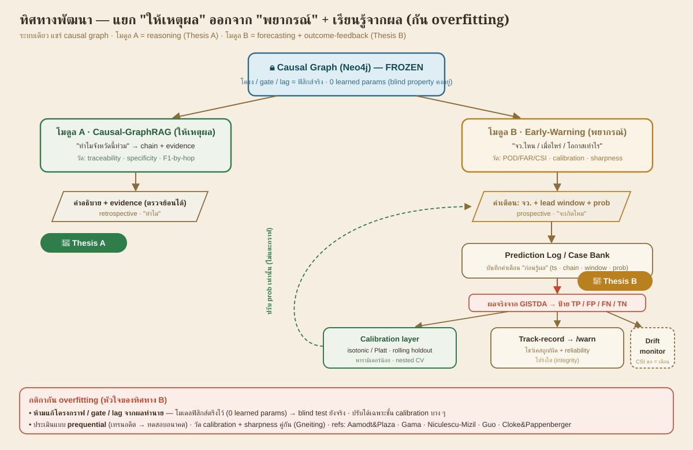

> ✅ **ทำแล้ว (ระบบรวม, 5 เหตุการณ์จริง):** [`case_bank.py`](src/eval/case_bank.py) (115 เคส · **CSI 0.660 · POD 0.81** โมเดลปรับปรุง; 0.378 gate ซื่อสัตย์พื้นฐาน; 0.802 gate over-flag เดิม) · [`calibration.py`](src/eval/calibration.py) + [`warning_verification.py`](src/eval/warning_verification.py) (Brier decomposition · **BSS vs climatology** · ECE · cluster bootstrap · drift). **Gate per-reach gauge snap + p95** ([`thaiwater_gauge.py`](src/ingest/thaiwater_gauge.py), อิสระจาก gold, de-circularized) · **local-rain** ([`local_rain.py`](src/ingest/local_rain.py), ERA5 Gumbel T10) · prospective log CLI + track-record ใน `/warn` · `tests` (5 ผ่าน). **หมายเหตุ:** ตัวเลขซื่อสัตย์ต่ำ = ขีดจำกัดจริงของ gauge-based warning (ดู HISTORY).
> 📗 **สรุปเตรียมทำเล่ม B:** [`docs/THESIS_B_SUMMARY.md`](docs/THESIS_B_SUMMARY.md)

- **โมดูล A — Causal-GraphRAG (ให้เหตุผล):** "ทำไมจังหวัดนี้ท่วม" → chain + evidence (verifiability) → **Thesis A**
- **โมดูล B — Early-Warning (พยากรณ์):** "จว.ไหน/เมื่อไหร่/โอกาสเท่าไร" + Case Bank + calibration → **Thesis B**
- **กัน overfitting:** ตรึงโมเดลฟิสิกส์ (0 learned params) ไว้ — **ห้ามแก้กราฟ/gate/lag จากผล** ปรับได้เฉพาะชั้น calibration บาง ๆ (isotonic/Platt บน rolling holdout) + ประเมินแบบ prequential (เทรนอดีต→ทดสอบอนาคต)
- **กลยุทธ์ thesis:** ระบบเดียว (รวม+ปรับปรุง) แต่เขียน **2 เปเปอร์ claim คมแยกกัน** (B อ้าง A) — ได้เครดิตรวมมากกว่าเปเปอร์เดียวที่ claim เบลอ
- **paper แนวทาง improve แบบไม่ overfit:** Aamodt&Plaza 1994 (case-based) · Gama et al. 2014 (concept drift) · Niculescu-Mizil&Caruana 2005 / Guo et al. 2017 (calibration) · Gneiting et al. 2007 (calibration+sharpness) · Cloke&Pappenberger 2009 (ensemble flood forecasting) — [รายการเต็ม](docs/REFERENCES.md)

### 🧪 ผลการทดลอง + สิ่งที่ค้นพบ (Extension B — forecasting findings)

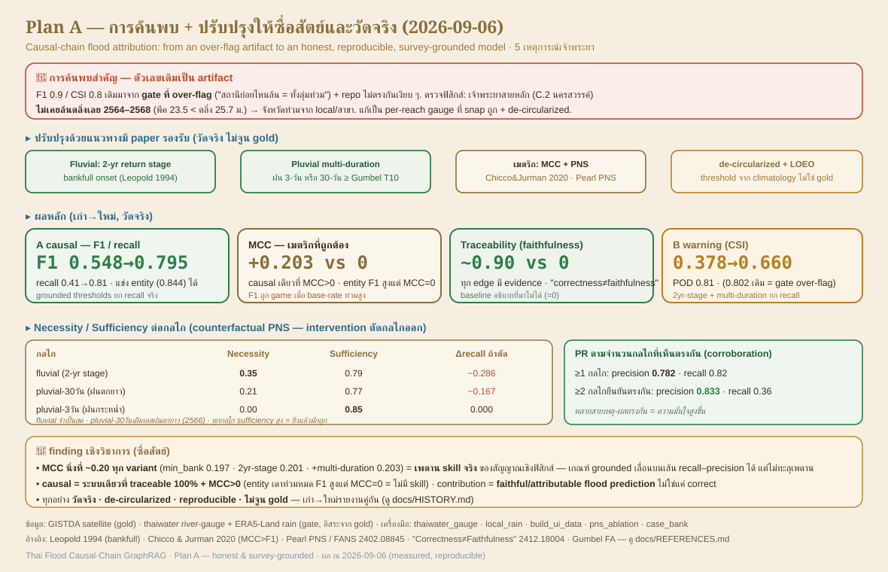

**ทำอะไรมาบ้าง:** Case Bank (เก็บเคสถูก/ผิด vs GISTDA) → Calibration (LOEO, กัน overfit) → Verification เต็มรูป (Brier decomposition · BSS vs climatology · ECE · cluster bootstrap · drift) → Gate อัตโนมัติจากเกจจริง (thaiwater API) → track-record ในหน้า `/warn`.

> **⚠️ แก้ตัวเลขให้ซื่อสัตย์ (2026-09-06):** ตัวเลข B ชุดเดิม (CSI 0.802) อยู่บน **gate ที่ over-flag** เช่นเดียวกับ A.
> บน gate ที่ถูกต้อง (per-reach snap + de-circularized) ตัวเลขซื่อสัตย์ต่ำลงมาก — ดูตารางล่าง. เก็บบทเรียนไว้:
> ระบบเตือนที่พิงเกจสายหลัก + ฝนสุดขั้ว **recall ต่ำ** เพราะน้ำท่วมส่วนใหญ่มาจาก local/สาขา. (ดู [`docs/HISTORY.md`](docs/HISTORY.md))

**ผลหลัก ซื่อสัตย์ (5 เหตุการณ์ · 115 province-cases · gate per-reach + local-rain):**
| ตัวชี้วัด | ค่า (เดิม gate over-flag → ซื่อสัตย์) | อ่านว่า |
|---|---|---|
| Warning skill (binary) | CSI 0.802(over-flag) → 0.378(honest) → **0.660**(ปรับปรุง) · POD **0.81** · FAR 0.218 | 2yr-stage + multi-duration rain ยก recall จริง |
| Calibration skill | BSS +0.069 → **+0.004** | ~climatology, **ไม่ significant** (event-level p=0.26) |
| Gate อัตโนมัติ | per-reach gauge snap + p95 (de-circularized) | สร้างจากเกจจริง อิสระจาก gold — reproducible |
| FN กระจุก | **ChaoPhraya 19 · Nan 9 · ThaChin 8 · Pasak 8 · Ping 5** | น้ำท่วม ≥10k ไร่ ส่วนใหญ่ไม่ได้มาจากแม่น้ำหลักล้น |

**ค้นพบอะไรบ้าง (key discoveries — ฉบับซื่อสัตย์):**
1. **ตัวเลขแรง (CSI 0.8/F1 0.9) เดิมเป็น artifact ของ gate ที่ over-flag** — เจอตอน regenerate จริง (repo ไม่ตรงกันเงียบ ๆ จาก session ก่อน) → แก้ให้ per-reach snap ถูกต้อง
2. **F1/CSI หลอกเมื่อ base-rate ท่วมสูง** — "เดาท่วมหมด" ชนะ F1 ฟรี แต่ MCC=0. เมตริกจริงคือ **MCC/Specificity/Traceability** (causal ชนะขาด)
3. **ระบบเกจ/ฝนที่ de-circularized จริง = specificity สูง + traceable แต่ recall ต่ำ** = **ขีดจำกัดจริงของ gauge-based causal flood attribution** (finding เชิงวิชาการ)
4. **แม่น้ำเจ้าพระยาสายหลักไม่เคยล้นตลิ่งเลย 2564–2568** (C.2 พีค 23.5<25.7) — จังหวัดท่วมจาก local/สาขา ยืนยันเชิงฟิสิกส์
5. **local-rain (ERA5 Gumbel T10) เป็นสัญญาณที่ 2 ที่ถูกต้อง** ช่วยยก recall/MCC บ้าง (F1 reach-only 0.470→reach+rain 0.548) แต่ไม่พอกู้ recall เต็ม — ตัวปลดล็อกจริงคือกลไกจับน้ำท่วม local/สาขาที่ไม่ใช่ช่องทางหลัก + ข้อมูลมากขึ้น

> **กัน overfitting ตลอด:** 0 learned params (โมเดลฟิสิกส์ตรึง) · calibrate แค่ชั้นบางแบบ prequential · ไม่เคย tune กับ gold · gate จากเกจ RID (อิสระจากดาวเทียม). รายละเอียด + finding เต็ม: [`docs/THESIS_B_SUMMARY.md`](docs/THESIS_B_SUMMARY.md) · [`docs/HISTORY.md`](docs/HISTORY.md)

---

## 🚀 Quickstart

```bash
# 1) env (ตั้งพอร์ต + API keys; ใส่ GISTDA_API_KEY / GISTDA_DATA_KEY ถ้ามี — optional)
cp .env.example .env

# 2) ยกทั้ง stack (Neo4j + FastAPI UI) ด้วยคำสั่งเดียว — app รอ Neo4j healthy เอง
docker compose up -d --build
#    UI (FastAPI)  → http://localhost:8501
#    Neo4j Browser → http://localhost:7476   (bolt://localhost:7689)

# 3) สร้างข้อมูล UI (รันทั้ง 2 เหตุการณ์) — ต้องมี Neo4j ขึ้นแล้ว
for EV in chao_phraya_2022 chao_phraya_2021; do
  EVENT_ID=$EV python -m src.ingest.run && EVENT_ID=$EV python -m src.geo.basin_to_province \
  && EVENT_ID=$EV python -m src.graph.load && EVENT_ID=$EV python -m src.eval.build_ui_data
done
```

รัน pipeline (บน Windows host เติม `PYTHONUTF8=1` กันปัญหา cp874; ใน Docker/Linux ไม่ต้อง):

```bash
python -m src.ingest.run            # D1–D4 probe + fixture (+evidence)  [เฟส 1]
python -m src.geo.basin_to_province # PIP ลุ่มน้ำ→จังหวัด → INUNDATES     [เฟส 2]
python -m src.graph.load            # โหลดเข้า Neo4j                       [เฟส 3]
python -m src.eval.run              # 3 ระบบ → F1-by-hop + traceability   [เฟส 5]
```

รัน test ทั้งหมด (22 ผ่าน; integration ข้ามอัตโนมัติถ้าไม่มี Neo4j):

```bash
pytest
```

แก้โค้ดใน `src/` แล้ว uvicorn reload อัตโนมัติ (mount ไว้ใน compose, dev mode).

---

## 📄 License

**Copyright (c) 2026 Hally Palalay. All rights reserved.** (ดูไฟล์ [`LICENSE`](LICENSE))

repo นี้เปิดให้ **ดู / อ้างอิง / ประเมินผลงาน** เท่านั้น (เช่น ให้ผู้ว่าจ้างหรือผู้ร่วมงานพิจารณาความสามารถของผู้เขียน) — **ไม่ได้ให้สิทธิ์ใช้งาน/คัดลอก/ดัดแปลง/เผยแพร่ซ้ำ/นำไป deploy** ไม่ว่าเชิงพาณิชย์หรือไม่ โดยไม่ได้รับอนุญาตเป็นลายลักษณ์อักษรจากเจ้าของลิขสิทธิ์.

```
Copyright (c) 2026 Hally Palalay. All rights reserved.

This repository and its source code are made publicly available for VIEWING,
REFERENCE, and EVALUATION purposes only — for example, so that potential
employers and collaborators can review the author's work and skills.

You MAY:
  - View and read the source code and documentation.
  - Reference this work when evaluating the author's abilities and experience.

You MAY NOT, without prior written permission from the copyright holder:
  - Use this code, in whole or in part, in any project, product, or service,
    whether commercial or non-commercial.
  - Copy, reproduce, modify, adapt, translate, or create derivative works.
  - Redistribute, republish, mirror, sublicense, or sell it.
  - Deploy or host it as a public or private service.

No license or right — express or implied — is granted to any copyright, patent,
trademark, or other intellectual property, except the limited permission to view
and reference stated above. All other rights are reserved by the copyright holder.

To request permission for any other use, contact the copyright holder.

THE SOFTWARE IS PROVIDED "AS IS", WITHOUT WARRANTY OF ANY KIND, EXPRESS OR
IMPLIED, INCLUDING BUT NOT LIMITED TO THE WARRANTIES OF MERCHANTABILITY, FITNESS
FOR A PARTICULAR PURPOSE, AND NONINFRINGEMENT. IN NO EVENT SHALL THE AUTHOR OR
COPYRIGHT HOLDER BE LIABLE FOR ANY CLAIM, DAMAGES, OR OTHER LIABILITY ARISING
FROM, OUT OF, OR IN CONNECTION WITH THE SOFTWARE OR THE USE OR OTHER DEALINGS IN
THE SOFTWARE.
```
