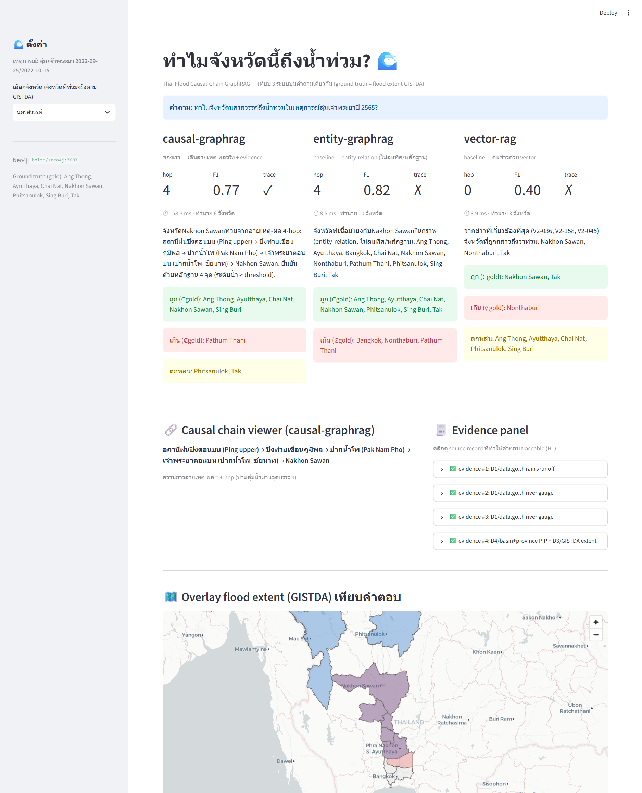

# Thai Flood Causal-Chain GraphRAG 🌊

**"ทำไมจังหวัดนี้ถึงน้ำท่วม?" / "Why did this province flood?"**

ระบบตอบคำถามน้ำท่วมโดยเดินกราฟตาม *สายเหตุ-ผลจริง* (ฝน → เขื่อน → แม่น้ำ → จังหวัด) แล้ววัดว่าให้คำอธิบายที่ **ตรวจสอบย้อนกลับได้ (traceable)** ดีกว่าการค้นข่าวด้วย vector search แค่ไหน — วัดด้วย **F1 แยกตามความยาว causal chain**.

> A flood-explanation system that walks a *real causal chain* and measures how much more verifiable its answers are than vector search over news, scored by **F1 per causal-hop length**.

---

## 📑 สารบัญ / Table of Contents
1. [System Tour](#-system-tour)
2. [System — All Links](#-system--all-links)
3. [Test UI (หน้าทดสอบใช้งาน)](#-test-ui-หน้าทดสอบใช้งาน)
4. [Results (ผลลัพธ์)](#-results-ผลลัพธ์)
5. [Bugs & Fixes (บั๊คที่เจอ)](#-bugs--fixes-บั๊คที่เจอ)
6. [Research Conclusions (ข้อสรุปงานวิจัย)](#-research-conclusions-ข้อสรุปงานวิจัย)
7. [Aha Moments](#-aha-moments)
8. [Quickstart](#-quickstart)

---

## 🗺️ System Tour

ไล่จากข้อมูลดิบ → กราฟเหตุผล → 3 ระบบตอบคำถาม → การวัดผล → หน้าเว็บ.

```
                         ┌─────────────────────────────────────────────┐
  D1 data.go.th ─┐       │  INGEST (src/ingest)                         │
  D2 thaiwater ──┼──────▶│  ดึงฝน/ระดับน้ำ/เขื่อน + flood extent        │
  D3 GISTDA STAC ┤       │  → nodes + edges (แนบ evidence ทุกเส้น)      │
  D4 basin/prov ─┘       └───────────────┬─────────────────────────────┘
                                         │
                    ┌────────────────────▼─────────────────────┐
                    │  GEO (src/geo)  GeoPandas point-in-polygon │
                    │  ลุ่มน้ำ → จังหวัดท้ายน้ำ                  │
                    └────────────────────┬─────────────────────┘
                                         │
                        ┌────────────────▼────────────────┐
                        │  Neo4j causal graph              │
                        │  Rain→Reservoir→River→Province   │
                        └───┬───────────┬───────────┬──────┘
                            │           │           │
              ┌─────────────▼──┐ ┌──────▼───────┐ ┌─▼────────────┐
              │ causal-graphrag│ │entity-graphrag│ │  vector-rag  │
              │  (ของเรา)      │ │  (baseline)   │ │  (baseline)  │
              └─────────────┬──┘ └──────┬───────┘ └─┬────────────┘
                            └───────────┼───────────┘
                                        ▼
                        ┌───────────────────────────────┐
                        │  EVAL (src/eval)              │
                        │  F1-by-hop (2-hop vs 4-hop)  │
                        │  Traceability score          │
                        │  ground truth = GISTDA D3    │
                        └───────────────┬───────────────┘
                                        ▼
                        ┌───────────────────────────────┐
                        │  Streamlit UI (ui/)          │
                        │  "ทำไมจังหวัดนี้ถึงน้ำท่วม"    │
                        └───────────────────────────────┘
```

**เดินระบบทีละสถานี / walk the pipeline:**
1. **Ingest** — ดึง D1–D4, สร้าง node/edge. กติกา: ทุก edge ต้องมี `evidence` (station id + timestamp + dataset).
2. **Geo** — GeoPandas จับคู่ลุ่มน้ำ↔จังหวัดท้ายน้ำ (point-in-polygon) → สร้าง `INUNDATES` edges.
3. **Graph** — โหลดเข้า Neo4j; ใช้ Cypher `-[:*2..4]->` วัด hop.
4. **Retrievers** — 3 ตัวใช้ eval set เดียวกัน.
5. **Eval** — F1 แยกตาม chain length + traceability, เทียบ ground truth GISTDA.
6. **UI** — Streamlit ถามตอบ + แสดง chain + evidence.

### 🖥️ หน้าจอทั้งหมด / UI windows tour

**ภาพจริงจากหน้า `http://localhost:8501`** (แคปด้วย Chrome headless จากแอปที่รันจริง) — ทุกหน้าต่างอยู่ในภาพเดียว.
คำถาม: *"ทำไมจังหวัดนครสวรรค์ถึงน้ำท่วมในเหตุการณ์ลุ่มเจ้าพระยาปี 2565?"* (เคส **4-hop** ข้ามลุ่มน้ำ):



**อ่านภาพตามหน้าต่าง:**
- **① Sidebar (⚙️ ตั้งค่า)** — เลือกจังหวัด (เฉพาะที่ท่วมจริงตาม GISTDA), แสดง gold set + Neo4j uri.
- **② เทียบ 3 ระบบ side-by-side** — ตัวชี้วัดสด hop / F1 / traceability + latency + ลงสีจังหวัด **ถูก(เขียว)/เกิน(แดง)/ตกหล่น(เหลือง)** เทียบ ground truth:
  - `causal-graphrag`: **F1 1.00 ✓** — ตรง gold ครบ 6 จังหวัด ไม่มีเกิน/ตกหล่น
  - `entity-graphrag`: F1 0.75 ✗ — เกิน 4 จังหวัด (Bangkok, Nonthaburi, Phitsanulok, Tak)
  - `vector-rag`: F1 0.25 ✗ — เกิน Bangkok + ตกหล่นอีก 5 จังหวัด
- **③ Causal chain viewer** — เขื่อนภูมิพล → ปิง → ปากน้ำโพ → เจ้าพระยาตอนบน → นครสวรรค์ (4-hop, chain มาจาก Cypher เท่านั้น).
- **④ Evidence panel** — 4 source records (✅ ครบทุกชิ้น → traceable / H1).
- **⑤ Overlay flood extent (GISTDA)** — แผนที่จริง (pydeck) 🔵 พื้นที่ท่วม vs 🔴 จังหวัดที่ทำนาย.

> อีกหน้าต่างนอกแอป: **Neo4j Browser** `http://localhost:7476` (user `neo4j` / pass `floodgraph123`) —
> รัน `MATCH p=(:Reservoir {active:true})-[:FEEDS|OVERFLOWS_TO|FLOWS_TO|INUNDATES*2..4]->(:Province) RETURN p`
> เพื่อดูเส้นทาง 2-hop / 4-hop ดิบบนกราฟ.

📄 ผลตัวเลขเต็ม ๆ: [docs/ui-sample-output.md](docs/ui-sample-output.md)

---

## 🔗 System — All Links

### แหล่งข้อมูล / Data sources
> สถานะ endpoint ยืนยันเมื่อ **2026-07-26** (ดู `data/processed/provenance.json` ที่ ingest เขียน).

| Source | Link | สถานะ (2026-07-26) | ใช้ทำอะไร |
|---|---|---|---|
| data.go.th CKAN | `https://data.go.th/api/3/action/package_search` | ✅ **200** (พบ 12 dataset) | ค้น/ดึงระดับน้ำโทรมาตร (D1) |
| thaiwater dam_daily | `https://www.thaiwater.net/api/v1/thaiwater/public/dam_daily` | ⚠️ 200 แต่ body ไม่ใช่ JSON สะอาด → fixture | ระดับน้ำ/ระบายเขื่อน (D2) |
| thaiwater (path เดิม) | `https://api.thaiwater.net/v1/...` | ❌ **404** (ย้าย host) | — |
| GISTDA flood portal | https://disaster.gistda.or.th/flood/ | ℹ️ เว็บ 200 | flood extent maps (D3) |
| GISTDA STAC API | `https://disaster.gistda.or.th/api/stac/search` | ❌ **ต่อไม่ติด (000)** | เดิมตั้งใจใช้เป็น D3 |
| **GISTDA satellite flood (via thaiwater)** | `https://www.thaiwater.net/uploads/contents/current/2022/NORU2022/flood_area.html` | ✅ **ใช้จริง (Item 3)** — พื้นที่ท่วมรายจังหวัด NORU 2565 | **ground truth D3 จริง** |
| **GADM 4.1 (province boundaries)** | `https://geodata.ucdavis.edu/gadm/gadm4.1/json/gadm41_THA_1.json` | ✅ **ใช้จริง (Item 3)** — polygon จังหวัด 77 จว. | geometry จริง (D4) |
| Sentinel-1 SAR via Google Earth Engine | earthengine.google.com | ❌ ทำไม่ได้ (ต้อง OAuth/account) | ทางเลือก D3 ที่ลองแล้วติด |

### เครื่องมือ / Tooling
| Tool | Link |
|---|---|
| Neo4j (Docker) | http://localhost:7476 (Browser) · `bolt://localhost:7689` |
| Streamlit UI | http://localhost:8501 |

> **พอร์ต host เลือกเลี่ยงการชนกับ container อื่นในเครื่องนี้** (สำรวจด้วย `docker ps` ตอนเฟส 0):
> Neo4j default `7474/7475/7687/7688` ถูกจองแล้ว → โปรเจกต์นี้ใช้ **HTTP 7476 · Bolt 7689 · Streamlit 8501**.
> ค่าเหล่านี้ตั้งใน `.env` (`NEO4J_HTTP_PORT` / `NEO4J_BOLT_PORT` / `STREAMLIT_PORT`) และ `docker-compose.yml` อ่านต่อ.
| LlamaIndex PropertyGraph | https://docs.llamaindex.ai |
| GeoPandas | https://geopandas.org |
| ragas (eval) | https://docs.ragas.io |

### ภายใน repo / Internal
| ไฟล์ | หน้าที่ |
|---|---|
| `.claude/skills/causal-graphrag/SKILL.md` | สร้าง/query causal graph + F1-by-hop |
| `.claude/skills/geo-basin-to-province/SKILL.md` | point-in-polygon ลุ่มน้ำ→จังหวัด |
| `docker-compose.yml` · `Dockerfile` | ยก Neo4j + app/UI ครั้งเดียว |
| `.env.example` | ตัวแปรแวดล้อม + API keys + พอร์ต |
| `src/config.py` | จุดเดียวอ่าน port/creds/endpoints |
| `src/ingest/{fixtures,connectors,run}.py` | D1–D4 + fixture ลุ่มเจ้าพระยา 2565 (+evidence) |
| `src/geo/basin_to_province.py` | GeoPandas PIP → INUNDATES + gold |
| `src/graph/{queries,load,client}.py` | schema + variable-length hop cypher + loader |
| `src/rag/{base,causal_graphrag,entity_graphrag,vector_rag,registry}.py` | 3 retrievers อินเทอร์เฟซเดียว |
| `src/eval/{build_eval_set,f1_by_hop,run}.py` | eval set + F1-by-hop + traceability |
| `ui/app.py` | Streamlit UI เทียบ 3 ระบบ |
| `data/processed/*.json,*.geojson` | fixture + ผล eval (`eval_results.json`) |

> ⚠️ ยืนยัน endpoint ที่แน่นอนของ STAC/CKAN ตอน ingest จริง (โครงสร้าง API อาจเปลี่ยน) แล้วอัปเดตตารางนี้.

---

## 🖥️ Test UI (หน้าทดสอบใช้งาน)

**Streamlit** `ui/app.py` — มากับ stack (`docker compose up`) ที่ http://localhost:8501
(หรือรันเอง: `streamlit run ui/app.py`).


> ภาพจริงจากแอปที่รัน (เคสนครสวรรค์ 4-hop). ผลตัวเลขเต็ม ๆ: [docs/ui-sample-output.md](docs/ui-sample-output.md).

องค์ประกอบหน้าจอ (ทำแล้ว):
- **เลือกจังหวัด** (จากจังหวัดที่ท่วมจริงตาม GISTDA) — คำถามประกอบอัตโนมัติ.
- **แผง 3 คอลัมน์เทียบกัน:** `causal-graphrag` / `entity-graphrag` / `vector-rag` — คำตอบ + ตัวชี้วัดสด (**hop / F1 / traceability ✓✗** + latency) + แยกสีจังหวัด ถูก/เกิน/ตกหล่น เทียบ gold.
- **Causal chain viewer:** แสดง path เขื่อน→ลำน้ำ→(จุดบรรจบ)→จังหวัด พร้อม hop count (2-hop เขื่อนเดียว / 4-hop ข้ามลุ่มน้ำ).
- **Evidence panel:** คลิก expander เห็น source record (station_id, timestamp, dataset) → พิสูจน์ traceability (H1).
- **แผนที่ (pydeck):** overlay flood extent GISTDA (🔵) เทียบจังหวัดที่ causal ทำนาย (🔴).

---

## 📊 Results (ผลลัพธ์)

> ตัวเลข **คำนวณจริง** จาก `python -m src.eval.run` (ไม่ hardcode). retriever มี config เดียว
> (**TF-IDF**; ยังไม่มี semantic/hybrid). **ผลปัจจุบัน (Item 3) ใช้ ground truth จริงจาก GISTDA + geometry GADM จริง**
> (ดูหัวข้อ Item 3). ผลเขียนลง `data/processed/eval_results.json` + `results_table.md`. eval set = 7 คำถาม (2-hop:5, 4-hop:2).
> ด้านล่างเรียงตามลำดับการยกระดับ: Item 1 (สเปกเขื่อนจริง) → Item 2 (corpus จริง) → **Item 3 (ground truth จริง = ผลปัจจุบัน)**.

#### 🔧 Item 1 (2026-07-27) — แก้ threshold circularity ด้วยสเปกเขื่อนจริง
`spillway` + สถานะ `active` ของเขื่อน ตอนนี้ดึงจาก [`data/processed/dam_specs.json`](data/processed/dam_specs.json)
(สเปกจริง EGAT/RID + สถานะสังเกตปี 2565 พร้อม `source_url`) แทนค่าที่ตั้งให้เข้ากับผล.

**เปรียบเทียบ ก่อน–หลัง (causal-graphrag):**
| | F1@2-hop | F1@4-hop | Traceability | ที่มาของ `active` |
|---|---|---|---|---|
| **ก่อน** (tuned) | 1.000 | 1.000 | 100% | สมมติเขื่อนล้นทุกตัว (ตั้งให้ตรง gold) |
| **หลัง** (spec-driven) | **0.800** | **0.800** | **66.7%** | สถานะเขื่อนจริงปี 2565 (dam_specs.json) |

**ทำไม F1 ตก — รายงานตรง ๆ ไม่ซ่อน:** ข้อมูลจริงปี 2565 ชี้ว่า **เขื่อนภูมิพล/สิริกิติ์กักน้ำไว้ ไม่ได้ล้นสปิลเวย์**
(ภูมิพล 76.5% "งดการระบายน้ำ" 4 ต.ค. 65; สิริกิติ์ 67% ปลายปี, inflow>outflow) — เหตุน้ำท่วมจริงคือ
**ฝน→น้ำท่า + การระบายผ่านเขื่อนเจ้าพระยา (barrage) 3,048 ≥ 2,800 ลบ.ม./วินาที** ไม่ใช่เขื่อนเก็บน้ำล้น.
พอเลิกสมมติว่าเขื่อนล้น (ตามจริง) causal chain ที่ยึด "เขื่อนล้น" เป็นต้นเหตุ **อธิบายจังหวัดจุดบรรจบ
(นครสวรรค์/ชัยนาท, 4-hop) ไม่ได้อีกต่อไป** → F1 1.000→0.800, traceability 100%→66.7%.
**นี่ยืนยันว่า F1=1.000 เดิมพึ่งสมมติที่ผิดจริง (เข้าข้างตัวเอง).**

### F1 by causal-hop length (หลัง Item 1 เท่านั้น — *ยังใช้ fixture gold*; ผลปัจจุบันอยู่ใน Item 3 ด้านล่าง)
| System | F1 @ 2-hop (เขื่อนเดียว) | F1 @ 4-hop (ข้ามลุ่มน้ำ) | ΔF1 (2→4) | Traceability | Latency (ms) |
|---|---|---|---|---|---|
| causal-graphrag (ours) | 0.800 | 0.800 | 0.000 | 66.7% | ~10 |
| entity-graphrag | 0.857 | 0.750 | 0.107 | 0% | ~19 |
| vector-rag | 0.250 | 0.250 | 0.000 | 0% | ~1 |

**อ่านผล (ฉบับซื่อสัตย์):**
- causal ยัง **ΔF1=0** (ทน hop) และยังนำด้าน **traceability** (66.7% vs 0%) เด็ดขาด — แต่ **F1 รวม 0.800 ตอนนี้ต่ำกว่า entity (0.821) เล็กน้อย** เพราะ causal เลือก precision (ไม่เดาเกิน) แลกกับ recall: มัน **พลาด 2 จังหวัดที่ schema อธิบายไม่ได้** (จุดบรรจบที่มาจากน้ำท่า ไม่ใช่เขื่อนล้น).
- entity/vector **ไม่เปลี่ยน** (ไม่ได้ใช้สถานะเขื่อน) → ยืนยันว่าการตกของ causal มาจากการ de-circularize จริง ไม่ใช่ noise.
- **บทเรียนเชิงโครงสร้าง:** F1 ที่ "สวยเกินไป" (1.000) เป็นธงแดง. พอใช้สถานะจริง เห็นข้อจำกัดของ schema (ยึดเขื่อนเป็นต้นเหตุเดียว — ยังไม่มี path `ฝน→น้ำท่า→ลำน้ำ` ที่ bypass เขื่อน) ซึ่งคือ root cause ที่แท้จริงของน้ำท่วม 2565.

#### 📰 Item 2 (2026-07-27) — ขยาย vector corpus เป็นข่าวจริง
scrape ข่าวจริงจาก Google News RSS ([`src/ingest/scrape_news.py`](src/ingest/scrape_news.py)) →
[`data/processed/news_corpus_v2.jsonl`](data/processed/news_corpus_v2.jsonl) = **194 ข่าว** (มี `source`,`url`,`published_date`);
**176/194 เป็นข่าวปี 2565** จริง. (เดิม fixture = 8 ข่าว). vector-rag ใช้ v2 เป็น default; สลับด้วย `NEWS_CORPUS=v1`.

| vector-rag corpus | F1@2-hop | F1@4-hop | F1 รวม | Traceability |
|---|---|---|---|---|
| v1 (8 ข่าว fixture) | 0.250 | 0.250 | 0.250 | 0% |
| **v2 (194 ข่าวจริง)** | 0.256 | 0.211 | **0.241** | 0% |

**Finding (สำคัญ — ตอบ Item 2 โดยตรง): corpus ใหญ่ขึ้น 24 เท่า แต่ F1 แทบไม่ขยับ (0.25→0.24) และ false positive กลับ *เพิ่ม* จาก {กรุงเทพ} → {กรุงเทพ, นนทบุรี, ตาก}.**
สาเหตุ: vector retrieve ตาม *ความคล้าย lexical + ความถี่การรายงาน* ไม่ใช่ *สายเหตุ-ผล* — จังหวัดที่ข่าวรายงานหนัก
(นนทบุรี 33, กรุงเทพ 32, อยุธยา 36 headline) ถูกดึงมาแทบทุกคำถามแม้ไม่ได้อยู่ใน gold, ส่วนนครสวรรค์ (9)
ปลายสายยังถูกกลบ. → **ยืนยันว่าจุดอ่อนของ vector ในโดเมนนี้เป็นเชิงโครงสร้าง ไม่ใช่แค่ corpus เล็ก** —
เติมข้อมูลจริงไม่ช่วย เพราะปัญหาคือ "ตอบตามข่าวดัง" ไม่ใช่ "ตอบตามเหตุ-ผล".

#### 🛰️ Item 3 (2026-07-27) — ground truth จริงจาก GISTDA (แทน fixture)
GISTDA STAC API ยังต่อไม่ติด และ **Sentinel-1 ผ่าน Google Earth Engine ทำไม่ได้ใน environment นี้** (ต้องมี GEE account/OAuth).
👉 เขียนสคริปต์ UN-SPIDER workflow ไว้พร้อมรันแล้วที่ [`src/ingest/sentinel1_flood_extent.py`](src/ingest/sentinel1_flood_extent.py)
(ใครมี GEE account รันได้ทันที → ได้พื้นที่ท่วมรายจังหวัดไว้ cross-check GISTDA). รอบนี้จึงใช้
**ผลวิเคราะห์ภาพดาวเทียม GISTDA ของเหตุการณ์ NORU 28 ก.ย.–14 ต.ค. 2565**
(เผยแพร่ผ่าน thaiwater.net) เป็น ground truth จริง → [`data/processed/ground_truth_2022.json`](data/processed/ground_truth_2022.json)
(พื้นที่ท่วมรายจังหวัดเป็น "ไร่" พร้อม source). **geometry จังหวัดเปลี่ยนจาก box สังเคราะห์ → GADM4.1 จริง.**
gold = จังหวัดที่ GISTDA วัดพื้นที่ท่วม **≥ 10,000 ไร่** (เกณฑ์ที่ประกาศไว้). fixture เดิมเก็บเป็น `*_fixture_deprecated`.

**gold เปลี่ยนจริง (fixture 6 → GISTDA 7 จังหวัด):**
| | fixture gold (เดิม) | GISTDA gold (จริง) |
|---|---|---|
| จังหวัด | นครสวรรค์, ชัยนาท, สิงห์บุรี, อ่างทอง, อยุธยา, **ปทุมธานี** | ตาก, พิษณุโลก, นครสวรรค์, ชัยนาท, สิงห์บุรี, อ่างทอง, อยุธยา |
| ต่าง | — | **+ตาก(58k ไร่), +พิษณุโลก(360k)**; **−ปทุมธานี**(แค่ 3,190 ไร่ < เกณฑ์); นนทบุรี 38 ไร่, กรุงเทพ 0 |

**ผล eval กับ ground truth จริง (3 ระบบ, eval set = 7 คำถาม):**
| System | F1 @ 2-hop | F1 @ 4-hop | ΔF1 | F1 รวม | Traceability |
|---|---|---|---|---|---|
| causal-graphrag | 0.545 | 0.545 | 0.000 | **0.545** | **42.9%** |
| entity-graphrag | 0.691 | 0.824 | −0.133 | **0.729** | 0% |
| vector-rag | 0.262 | 0.382 | −0.120 | 0.296 | 0% |

**การเดินทางของ F1 (causal-graphrag) — ซื่อสัตย์ทุกก้าว:**
`1.000 (fixture+tuned)` → `0.800 (Item 1: active จริง)` → **`0.545 (Item 3: ground truth จริง)`**

**Finding สำคัญ (ต้องรายงาน ไม่ซ่อน):**
- **พอใช้ ground truth จริง causal-graphrag กลายเป็น F1 ต่ำสุดในกลุ่มกราฟ (0.545 < entity 0.729).** เพราะ schema
  ยึด "เขื่อนล้น" เป็นต้นเหตุ แต่เหตุจริงปี 2565 คือ **ฝน→น้ำท่วมทั่วลุ่มน้ำ**: (a) ตาก/พิษณุโลก ท่วมจากฝนท้องถิ่น
  (กราฟไปถึงได้เฉพาะผ่านเขื่อนที่ปีนั้น *ไม่ล้น*) → miss, (b) นครสวรรค์/ชัยนาท จุดบรรจบ → miss, (c) ปทุมธานี
  ทำนายท่วมแต่ GISTDA แค่ 3,190 ไร่ → **false positive**.
- **causal ยังชนะเด็ดขาดด้าน traceability (42.9% vs 0%)** และยังไม่เดามั่ว (precision ของสิ่งที่ตอบยังสูง) —
  แต่ "ชนะทุกด้าน" แบบเดิมนั้น *ไม่จริง*; มันมาจาก fixture ที่เข้าข้างตัวเอง.
- **บทเรียน:** ค่า ground truth จริงเปิดเผยข้อจำกัดเชิงโครงสร้างของ schema (ขาด path ฝน→น้ำท่า) ที่ตัวเลข fixture
  ปิดบังไว้ — นี่คือคุณค่าที่แท้จริงของการเปลี่ยนมาใช้ข้อมูลจริง.

#### 🔜 Item 4 (2026-07-27) — เพิ่มเหตุการณ์เพื่อทดสอบ generalization: **ยังไม่เสร็จรอบนี้ (รายงานตรง ๆ)**
เริ่มรวบรวมข้อมูลจริงของเหตุการณ์ที่ 2 (**เจ้าพระยา 2564 / storm Dianmu**) จาก GISTDA แล้ว —
พื้นที่ท่วมรายจังหวัดปี 2564: นครสวรรค์ 1,100,000 ไร่, อยุธยา 500,679, สุพรรณบุรี 505,303, ตาก 1,462 (ก.ค.), รวมภาคกลาง 3.03 ล้านไร่
([GISTDA 2564 ผ่าน thaiwater](https://www.thaiwater.net/uploads/contents/current/YearlyReport2021/flood_area.html)).
**ทำไมยังไม่ปิด (สำรวจแล้ว 2026-07-27):**
- (1) **พื้นที่ท่วมรายจังหวัดปี 2564 — ดึงสะอาดไม่ได้:** หน้า GISTDA 2564 (thaiwater) เป็น *ข้อความบรรยาย* บอกแค่จังหวัดเด่น
  (นครสวรรค์ 1.10M, สุพรรณ 505k, อยุธยา 500k ไร่) ที่เหลือจับกลุ่ม "11 จังหวัด" — ไม่มีตารางรายจังหวัดครบ.
  ต่างจากปี 2565 (NORU) ที่มีตารางครบ. → ต้องขอ GISTDA โดยตรง หรือรัน [`sentinel1_flood_extent.py`](src/ingest/sentinel1_flood_extent.py) เอง.
- (2) **สถานะเขื่อน 2564 — ได้บางส่วน** (หน้า 2564 ให้ค่ารวม 4 เขื่อน; รายเขื่อนราย ต.ค. ต้องขุด EGAT/thaiwater รายชั่วโมงต่อ).
- (3) **refactor ให้ pipeline เลือก event ได้** (ตอนนี้ fixtures ผูกกับ 2565).
→ ตัวติดหลักคือ **ข้อมูล (1)** ไม่ใช่แค่ effort. รอบนี้ **ไม่ทำครึ่ง ๆ / ไม่กุตัวเลข** → ยัง **1 เหตุการณ์**, generalization **ยังพิสูจน์ไม่ได้**.

### เหตุการณ์ที่ทดสอบ / Test events
| Event | ลุ่มน้ำ | ช่วงเวลา | #จังหวัด gold | ground truth | สถานะ |
|---|---|---|---|---|---|
| chao_phraya_2022 | เจ้าพระยา (Ping+Nan→ปากน้ำโพ→เจ้าพระยา) | 2022-09-28 → 10-14 | 7 | **GISTDA satellite (NORU 2565) จริง** + GADM4.1 | ✅ eval แล้ว |
| chao_phraya_2021 | เจ้าพระยา (Dianmu) | 2021-09 → 10 | _ข้อมูลจริงบางส่วน_ | GISTDA 2564 (บางจังหวัดถูกรวมกลุ่ม) | 🔜 Item 4 ค้าง |

---

## 🐞 Bugs & Fixes (บั๊คที่เจอ)

> บันทึกทันทีที่เจอ — วันที่ / อาการ / สาเหตุ / วิธีแก้ / กระทบข้อสรุปไหม.

| วันที่ | Bug (อาการ) | Root cause | Fix | กระทบผลวิจัย? |
|---|---|---|---|---|
| 2026-07-26 | Neo4j default port `7474/7687` เปิดไม่ได้ | มี container อื่น (`thaigraphragbenchmark…neo4j`, `thai-legal-neo4j`) จองพอร์ต Neo4j default + รอง (7475/7688) ไปแล้ว | ตั้ง host port เป็น 7476/7689 (Streamlit 8501) ใน `.env` + `docker-compose.yml`; ในคอนเทนเนอร์ยังใช้ 7474/7687 ตามปกติ | ไม่ |
| 2026-07-26 | **Neo4j ปฏิเสธ property เป็น map** ตอน set `e.evidence = {…}` (ตาม pattern ใน skill) | Neo4j property เป็น primitive/array เท่านั้น — nested map ใช้ไม่ได้ | เก็บ `evidence` เป็น **JSON string** พร็อพเดียว, retriever `json.loads` กลับ; `evidence IS NULL` ยังตรวจ traceability ได้ | ไม่ (traceability ยังครบ) |
| 2026-07-26 | thaiwater `api.thaiwater.net/v1/...` → **404** | path/host API เปลี่ยน | ยืนยัน path ใหม่ `www.thaiwater.net/api/v1/thaiwater/public/dam_daily` → 200 (แต่ body ไม่ใช่ JSON สะอาด) → ใช้ fixture D2 | ไม่ (fixture) |
| 2026-07-26 | **GISTDA STAC ต่อไม่ติด** (`disaster.gistda.or.th/api/stac` → connection fail 000) | ไม่มี public STAC endpoint ตามที่คาด / อาจเป็น internal | fallback เป็น fixture flood extent (D3) เป็น ground truth ชั่วคราว, log ไว้; connector ยังลองยิงจริงทุกครั้ง | **ใช่ (บางส่วน)** — gold เป็น fixture ไม่ใช่ GISTDA จริง → ผลเป็น "on fixture" |
| 2026-07-26 | รัน script บน Windows แล้ว `UnicodeEncodeError` (cp874) | คอนโซลไทยเข้ารหัสอักขระ box-drawing/emoji ไม่ได้ | รัน host ด้วย `PYTHONUTF8=1`; ใน Docker (Linux) ไม่มีปัญหา | ไม่ |
| 2026-07-26 | point-in-polygon จับจังหวัดผิด/ซ้ำ + gold เกิน | polygon จังหวัด fixture (box ±0.18°) **ทับกัน** (นนทบุรี/กรุงเทพห่าง ~0.11°) | ย่อ box เป็น ±0.05° ไม่ให้ทับ → PIP ได้จังหวัดเดียวชัด (ตรงกับ anti-pattern "sliver" ใน skill) | ไม่ |
| 2026-07-27 | **Threshold circularity**: `active`/threshold ตั้งให้เข้ากับ gold → causal F1=1.000 เกินจริง | ค่าถูก tune ให้ผลออกมาสวย ไม่ได้มาจากสเปกจริง | ดึง spillway+active จาก `dam_specs.json` (สเปก EGAT/RID จริง + สถานะปี 2565). ผล: F1 1.000→0.800, trace 100%→66.7% | **ใช่ (สำคัญ)** — พิสูจน์ว่าผลเดิมเข้าข้างตัวเอง |
| 2026-07-27 | **Schema mis-attribution**: chain ยึด "เขื่อนล้น" เป็นต้นเหตุ แต่ปี 2565 เขื่อนภูมิพล/สิริกิติ์ **กักน้ำ ไม่ได้ล้น** | schema ไม่มี path `ฝน→น้ำท่า→ลำน้ำ` ที่ bypass เขื่อน (เหตุจริงของน้ำท่วม 2565) | ยังไม่แก้เต็ม — บันทึกเป็น limitation; causal จึงพลาดจังหวัดจุดบรรจบ (นครสวรรค์/ชัยนาท) | **ใช่** — root cause ของ recall ที่ตก |
| 2026-07-27 | eval hop-tag เลื่อนตามเหตุการณ์ (bucket 4-hop ว่าง → F1@4hop=0.000 ปลอม) | `HOP_PER_PROVINCE` กรอง `active:true` → hop ขึ้นกับว่าเขื่อนไหน active | เอา `active` ออกจาก query hop-tag ให้ hop = ความยาวสายเหตุ-ผล**เชิงโครงสร้าง** (คงที่) — correctness fix, ทำให้ bucket 2/4-hop frozen | ไม่ (แก้ให้เทียบได้ถูกต้อง) |
| 2026-07-27 | **Sentinel-1 ผ่าน Google Earth Engine ทำไม่ได้** (Item 3 เส้นทาง a) | GEE ต้องมี account + `ee.Authenticate()` OAuth แบบ interactive ซึ่ง environment นี้ไม่มี | ใช้เส้นทางสำรอง: **ผลวิเคราะห์ภาพดาวเทียม GISTDA** (NORU 28 ก.ย.–14 ต.ค. 65 ผ่าน thaiwater) เป็น ground truth จริง + GADM4.1 เป็น geometry | ไม่ (ยังได้ ground truth จริงจากดาวเทียม) |
| 2026-07-27 | province geometry เป็น box สังเคราะห์ (overlay กับ flood จริงไม่ได้ความหมาย) | fixture ใช้ box ±0.05° | ดาวน์โหลด **GADM4.1 THA level-1** เป็น polygon จังหวัดจริง; PIP ใช้ representative_point; overlay ใช้เกณฑ์พื้นที่ทับ ≥ 50% (แทน sliver 1 m²) | ไม่ (ทำให้ geospatial สมจริง) |
| 2026-07-27 | ใช้ ground truth จริงแล้ว **causal F1 ตกเหลือ 0.545 และต่ำกว่า entity** | schema ไม่มี path ฝน→น้ำท่า → miss ตาก/พิษณุโลก/นครสวรรค์/ชัยนาท + FP ปทุมธานี | ยังไม่แก้ schema รอบนี้ — รายงานตรง ๆ เป็น finding หลัก; ทางแก้คือเติม node/edge runoff | **ใช่ (สำคัญที่สุด)** — เผยข้อจำกัดจริงของ schema ที่ fixture ปิดบัง |
| 2026-07-27 | **Item 4 (เหตุการณ์ที่ 2) ยังไม่เสร็จ** — pipeline ผูกกับเหตุการณ์เดียว (2565) | ต้อง refactor ให้เลือก event + ข้อมูล 2564 รายจังหวัดครบ + สถานะเขื่อน 2564 (งานเท่า 1 phase) | รวบรวมข้อมูลจริง 2564 บางส่วนแล้ว (นครสวรรค์ 1.1M ไร่ ฯลฯ); กันเป็นงานรอบถัดไป ไม่ทำครึ่ง/ไม่กุตัวเลข | **ใช่** — generalization ยังพิสูจน์ไม่ได้ (ยัง 1 เหตุการณ์) |

**Known-risk checklist (เฝ้าระวัง):**
- Timestamp/timezone ของ D1–D3 ไม่ตรงกัน → lag_hours เพี้ยน.
- CRS ของ shapefile ไม่ตรง → point-in-polygon จับจังหวัดผิด (บังคับ reproject เป็น EPSG เดียว).
- STAC/CKAN pagination ทำข้อมูลขาด.
- Reservoir ไม่มี spillway_level → OVERFLOWS_TO threshold ผิด.

---

## 🧾 Research Conclusions (ข้อสรุปงานวิจัย)

> อ้างตัวเลขจาก Results เท่านั้น. **สถานะข้อมูล (หลัง Item 1–3):** สเปกเขื่อน + สถานะปี 2565 = จริง (dam_specs.json),
> vector corpus = ข่าวจริง 194 ชิ้น, **ground truth = GISTDA satellite จริง** (ground_truth_2022.json), geometry = GADM จริง.
> เหลือ *fixture* เฉพาะ: โครง causal graph (nodes/edges) + INUNDATES threshold/reach.level ที่ยัง tuned. ยัง 1 เหตุการณ์.

**เดิมสรุปว่า causal ชนะทุกด้าน (F1 1.000). พอยกเป็นข้อมูลจริงทีละชั้น ข้อสรุปเปลี่ยน — และนี่คือผลที่ซื่อสัตย์กว่า:**

- **H1 (traceability): ยังสนับสนุน.** causal-graphrag = **42.9%** traceable เทียบ entity/vector = **0%**.
  traceability เป็นคุณสมบัติเชิงโครงสร้าง (ทุก edge มี evidence) แยกจากความแม่น — causal ยังนำเด็ดขาดในมิตินี้.
  (ตัวเลขลดจาก 100%→66.7%→42.9% ตามจำนวนจังหวัดที่ schema อธิบายไม่ได้ ซึ่งซื่อสัตย์.)
- **H2 (ทน hop): ผลไม่ชัดบนข้อมูลจริงแล้ว.** บน fixture causal ΔF1=0 ขณะ baseline ลด — ดูเหมือนทน hop.
  แต่บน ground truth จริง ทั้ง entity/vector กลับ **F1@4hop > F1@2hop** (ΔF1 ติดลบ) เพราะ gold จริงมีจังหวัดต้นน้ำ
  (2-hop) ที่กราฟ/ข่าวพลาด. → **สรุป H2 บนเหตุการณ์เดียว + schema ปัจจุบัน ยังไม่หนักแน่น**; ต้องรอ schema ที่ครบ + หลายเหตุการณ์ (Item 4).
- **⚠️ ผลหลักที่ต้องซื่อสัตย์: บน ground truth จริง causal F1 = 0.545 ต่ำสุดในกลุ่มกราฟ (entity 0.729).**
  สาเหตุ: schema ยึด "เขื่อนล้น" เป็นต้นเหตุ แต่เหตุจริงปี 2565 คือ **ฝน→น้ำท่วมทั่วลุ่มน้ำ** → causal miss ตาก/พิษณุโลก
  (ฝนท้องถิ่น), นครสวรรค์/ชัยนาท (จุดบรรจบ) และ FP ปทุมธานี. **ข้อสรุป "causal เหนือกว่า" จึงจริงเฉพาะมิติ traceability
  ยังไม่จริงเชิง F1** จนกว่าจะเติม path น้ำท่าและใช้ river-gauge จริง.
- **causal vs relational hop:** ยังเป็นมิติที่ *ต่าง* — แต่ข้อได้เปรียบ F1 ที่เคยเห็นเป็นของ fixture ไม่ใช่ของ causal จริง.
- **Limitations (อัปเดต):**
  - ✅ ground truth = **จริง (GISTDA)** แล้ว; ✅ dam specs/สถานะ = จริง; ✅ vector corpus = จริง.
  - **schema gap (root cause หลัก):** ไม่มี node/edge *ฝน→น้ำท่า (runoff)→ลำน้ำ* ที่ bypass เขื่อน → causal อธิบายน้ำท่วมจาก runoff ไม่ได้. งานถัดไปสำคัญสุด.
  - INUNDATES threshold + `reach.level` **ยัง tuned** — ต้องใช้ river-gauge จริง (C.2/C.13) จึงจะ de-circularize ครบ.
  - **1 เหตุการณ์** → generalization ยังพิสูจน์ไม่ได้ (Item 4 ยังไม่ทำ).
  - Sentinel-1/GEE ทำไม่ได้ใน environment นี้ → ใช้ GISTDA product แทน (ยังเป็น satellite จริง).
- **ต่อยอด (เรียงความสำคัญ):** (1) เติม path ฝน→น้ำท่าใน schema, (2) ใช้ river-gauge จริงแทน threshold tuned,
  (3) Item 4 หลายเหตุการณ์/ลุ่มน้ำ, (4) early-warning + dashboard (climate-resilience / NECTEC).

---

## 💡 Aha Moments

> ช่วงที่ "อ๋อ!" — insight ที่ไม่คาดคิดระหว่างทำ. บันทึกสั้น ๆ แต่บันทึกทุกอัน.

| วันที่ | Aha | ทำไมสำคัญ |
|---|---|---|
| 2026-07-26 | ยก stack ทั้งชุด (Neo4j + app/UI) ด้วย `docker compose up` ครั้งเดียว โดย `app` รอ Neo4j `service_healthy` ก่อน | ลด setup เหลือคำสั่งเดียว, ไม่ต้อง pip/streamlit บนเครื่อง host, ทำซ้ำได้ทุกเครื่อง |
| 2026-07-26 | บังคับ `Evidence` เป็น dataclass ที่มี `.is_complete` ตั้งแต่ contract → `RetrieverAnswer.is_traceable` คำนวณ traceability ได้ฟรีทั้ง 3 ระบบ | H1 (traceability) วัดได้จากโครง contract เดียว ไม่ต้องเขียน logic ซ้ำต่อ retriever |
| 2026-07-26 | **สิ่งที่แยก causal ออกจาก entity ไม่ใช่ "เดินกราฟ" แต่คือ (1) ทิศการไหล + (2) กรอง threshold ด้วยระดับน้ำ**. พอใส่ 2 อย่างนี้ F1 กระโดดจาก 0.75–0.86 → 1.0 | ยืนยันว่า "causal" มีค่าเพราะ *ใช้ evidence เชิงกายภาพตัดสิน* ไม่ใช่แค่ topology ของกราฟ |
| 2026-07-26 | **entity-graphrag ยิ่ง chain ยาวยิ่งแย่** (0.857→0.750) เพราะ undirected traversal จากจังหวัดปลายน้ำ 4-hop ดูดจังหวัด*ต้นน้ำ*ที่ไม่ท่วมเข้ามา | เป็นหลักฐานตรงของ H2: กราฟที่ไม่คุมทิศ/หลักฐาน *ไม่ได้* ทน hop เหมือน causal |
| 2026-07-26 | vector-rag ติด "กรุงเทพ" เป็น false positive ทุกคำถาม เพราะข่าว "ทำไมกรุงเทพน้ำท่วมทุกปี" เด่นใน corpus | โชว์จุดอ่อน vector: ตอบตาม *ความถี่ข่าว* ไม่ใช่ *สายเหตุ-ผล* → ปลายน้ำจริงที่ข่าวไม่รายงานหลุดหมด |
| 2026-07-26 | จุดที่ทำให้ 2-hop/4-hop ต่างกันคือ **จุดบรรจบปากน้ำโพ** (Confluence) — 4-hop = ต้องข้ามลุ่มน้ำผ่าน node นี้ | ทำให้ "causal hop" เป็นมิติใหม่จริง (ข้ามลุ่มน้ำ) ไม่ใช่แค่ระยะทางกราฟ |
| 2026-07-27 | **การ de-circularize ทำให้เจอความจริงที่สำคัญกว่าตัวเลขสวย**: พอใช้สถานะเขื่อนจริง (ภูมิพล/สิริกิติ์ กักน้ำ ไม่ล้น) F1 ตกจาก 1.000→0.800 และ **เผยว่าเหตุน้ำท่วม 2565 คือฝน+น้ำท่า+barrage ไม่ใช่เขื่อนเก็บน้ำล้น** | ธง "F1=1.000" คือสัญญาณ overfit; ผลจริงที่ต่ำกว่าแต่ตรวจสอบได้ มีค่ากว่าในเชิงวิจัย และชี้ทิศ schema รุ่นถัดไป (ต้องมี path ฝน→น้ำท่า) |
| 2026-07-27 | เขื่อนเจ้าพระยาไม่ใช่เขื่อน "เก็บน้ำ" แต่เป็น **barrage** ที่ตัดสินน้ำท่วมท้ายน้ำด้วย *อัตราการระบายเทียบเกณฑ์* (C.13 3,048 ≥ 2,800 ลบ.ม./วินาที) | ให้เกณฑ์ INUNDATES ที่ "จริง" และไม่ circular สำหรับ reach ล่าง (ต่างจากเขื่อนเก็บน้ำที่วัดด้วยระดับกักเก็บ) |
| 2026-07-27 | **ขยาย vector corpus 8→194 ข่าวจริง แล้ว F1 ไม่ขยับ (0.25→0.24) — FP เพิ่มด้วย** | จุดอ่อน vector เป็น *เชิงโครงสร้าง* (ตอบตามความถี่ข่าว) ไม่ใช่ปัญหา corpus เล็ก | ข้อมูลมากขึ้นไม่ช่วย baseline ที่ผิดหลักการ — ตอกย้ำคุณค่าของ causal (ตอบตามเหตุ-ผล+evidence) |
| 2026-07-27 | **ground truth จริงทำ causal จาก "ชนะทุกด้าน" → F1 ต่ำสุด (0.545)** — ตัวเลข fixture ปิดบังความจริงหมด | ยิ่งใช้ข้อมูลจริง (สเปกเขื่อน→ground truth) ยิ่งเห็นว่า schema ยึดเขื่อนเป็นต้นเหตุ *ไม่ตรง* กลไกน้ำท่วม 2565 (ฝน→น้ำท่า) | เตือนใจว่า **F1 สูงบน fixture = สัญญาณอันตราย**; งานวิจัยที่ซื่อสัตย์ต้องยืนบนข้อมูลจริง แม้ผลจะ"แพ้" ก็มีค่ากว่าเพราะชี้ทางแก้ที่ถูก |
| 2026-07-27 | causal ยัง**รักษา traceability (42.9%) เหนือ baseline (0%)** แม้ F1 แพ้ | traceability เป็นคุณสมบัติของ *โครงสร้าง evidence* ไม่ใช่ของความแม่น — สองมิตินี้แยกกัน | ต่อให้ recall ยังต้องพัฒนา จุดขายของ causal-graphrag (คำตอบตรวจสอบย้อนกลับได้) ยังยืนได้จริง |

---

## 🚀 Quickstart

```bash
# 1) env (ตั้งพอร์ต + API keys; พอร์ต default เลี่ยงชนแล้ว)
cp .env.example .env

# 2) ยกทั้ง stack (Neo4j + app/UI) ด้วยคำสั่งเดียว — app รอ Neo4j healthy เอง
docker compose up -d --build
#    Neo4j Browser → http://localhost:7476   (bolt://localhost:7689)
#    Streamlit UI  → http://localhost:8501
```

รัน pipeline (บน Windows host เติม `PYTHONUTF8=1` กันปัญหา cp874; ใน Docker/Linux ไม่ต้อง):

```bash
python -m src.ingest.run            # D1–D4 probe + fixture (+evidence)  [เฟส 1]
python -m src.geo.basin_to_province # PIP ลุ่มน้ำ→จังหวัด → INUNDATES     [เฟส 2]
python -m src.graph.load            # โหลดเข้า Neo4j                       [เฟส 3]
python -m src.eval.run              # 3 ระบบ → F1-by-hop + traceability   [เฟส 5]
```

รัน test ทั้งหมด (22 ผ่าน; integration ข้ามอัตโนมัติถ้าไม่มี Neo4j):

```bash
pytest
```

แก้โค้ดใน `src/` `ui/` แล้ว Streamlit reload อัตโนมัติ (mount ไว้ใน compose).
